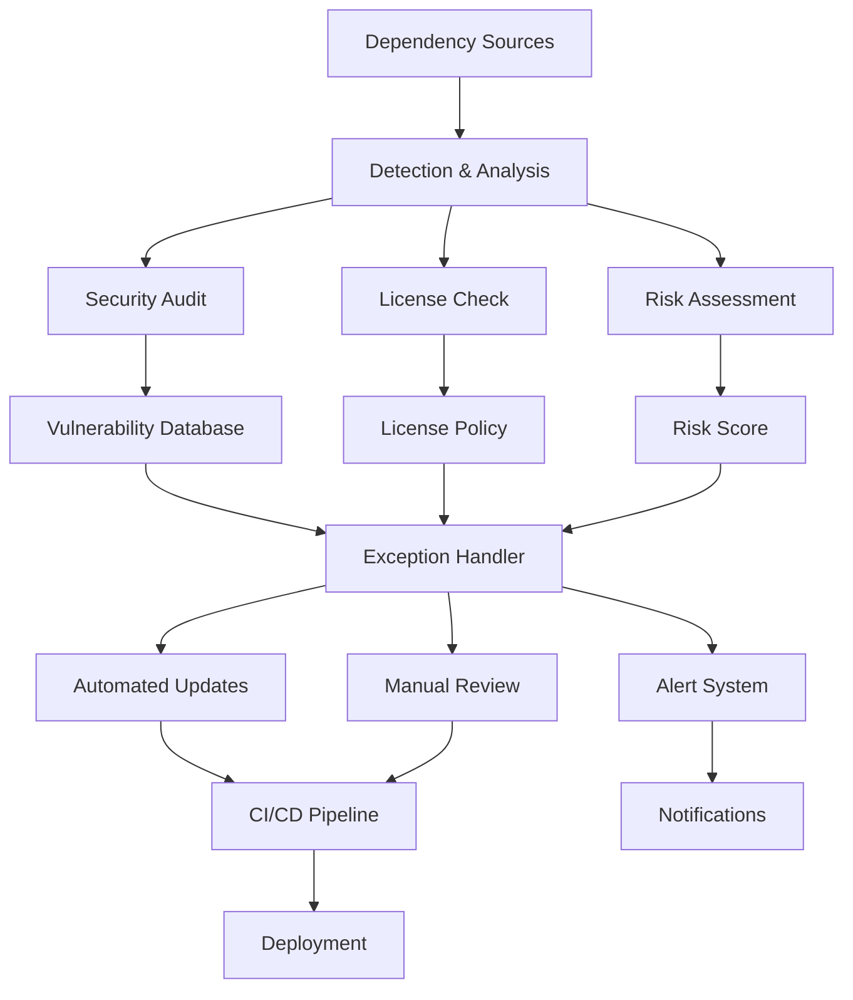

# Automated Dependency Management and Security Auditing System

This document describes the comprehensive automated dependency management and security auditing system implemented for the Rust Security Platform.

## Overview

The dependency management system provides:

- **Automated Security Auditing**: Continuous monitoring for vulnerabilities
- **Risk-Based Updates**: Intelligent prioritization of dependency updates
- **Exception Management**: Controlled handling of security risks
- **SBOM Generation**: Complete software bill of materials tracking
- **Container Security**: Base image monitoring and updates
- **Compliance**: License and policy enforcement
- **Alerting**: Real-time vulnerability notifications

## System Architecture



## Components

### 1. Dependency Detection and Monitoring

#### Supported Ecosystems
- **Rust (Cargo)**: Primary dependency management
- **Docker**: Base image updates
- **Node.js (npm)**: Frontend dependencies
- **Python (pip)**: ML and tooling dependencies
- **GitHub Actions**: CI/CD dependencies
- **Terraform**: Infrastructure dependencies

#### Detection Methods
- File change monitoring (Cargo.lock, package.json, etc.)
- Scheduled vulnerability scans
- Manual triggers via GitHub workflows

### 2. Security Auditing Tools

#### Cargo Audit Integration
```bash
# Run security audit
./scripts/security-audit.sh

# Check specific package
cargo audit --package example-crate
```

#### Cargo Deny Configuration
Comprehensive policy enforcement in `deny.toml`:
- License compliance
- Vulnerability blocking
- Supply chain security
- Multiple version management

#### Trivy Container Scanning
- Container vulnerability scanning
- Base image security assessment
- SBOM generation for containers

### 3. Risk Assessment Framework

#### Severity Classification
- **Critical**: Immediate action required, blocks deployment
- **High**: Urgent attention, escalated review
- **Medium**: Planned remediation, weekly review
- **Low**: Monitoring only, monthly review

#### Risk Scoring Factors
- CVSS score and severity
- Package criticality (core vs. dev dependencies)
- Exploit availability
- Business impact assessment
- Mitigation complexity

### 4. Exception Management

#### Exception Types
1. **Vulnerability Exceptions**: Approved security risks
2. **License Exceptions**: Legal compliance overrides
3. **Maintenance Exceptions**: Unmaintained but necessary packages

#### Exception Process
```bash
# Add vulnerability exception
./scripts/dependency-risk-manager.sh add-vuln \
    RUSTSEC-2023-0001 \
    example-crate \
    "Not exploitable in our use case" \
    "Input validation prevents exploitation" \
    security-team

# Check expired exceptions
./scripts/dependency-risk-manager.sh check-expired

# Generate risk assessment
./scripts/dependency-risk-manager.sh assess tokio
```

## Configuration Files

### 1. Dependabot Configuration (`.github/dependabot.yml`)

Enhanced configuration with security-focused grouping:

```yaml
version: 2
updates:
  - package-ecosystem: "cargo"
    directory: "/"
    schedule:
      interval: "weekly"
    groups:
      critical-security-updates:
        patterns:
          - "*security*"
          - "*crypto*"
        priority: 10
```

### 2. Renovate Configuration (`renovate.json`)

Production-grade dependency management:

```json
{
  "extends": [
    "config:base",
    "security:openssf-scorecard"
  ],
  "vulnerabilityAlerts": {
    "enabled": true,
    "schedule": ["at any time"]
  },
  "packageRules": [
    {
      "matchPackagePatterns": ["*security*"],
      "schedule": ["at any time"],
      "prPriority": 10
    }
  ]
}
```

### 3. Cargo Deny Configuration (`deny.toml`)

Comprehensive security policies:

```toml
[licenses]
allow = ["MIT", "Apache-2.0", "BSD-3-Clause"]
deny = ["GPL-3.0", "AGPL-3.0"]

[bans]
deny = [
    { name = "md5", reason = "Cryptographically broken" },
    { name = "openssl", reason = "Use rustls instead" }
]

[advisories]
vulnerability = "deny"
unmaintained = "warn"
```

### 4. Security Exception Configuration (`.security/dependency-exceptions.toml`)

Tracks approved security exceptions:

```toml
[[vulnerability_exceptions]]
advisory_id = "RUSTSEC-2023-0001"
crate_name = "example-crate"
justification = "Not exploitable in our use case"
approved_by = "security-team"
review_date = "2024-04-15"
```

## Automated Workflows

### 1. Dependency Security Workflow (`.github/workflows/dependency-security-workflow.yml`)

Comprehensive security pipeline:

- **Trigger Conditions**:
  - Dependency file changes
  - Scheduled daily/weekly scans
  - Manual triggers

- **Security Checks**:
  - Vulnerability scanning
  - License compliance
  - Container security
  - Performance impact

- **Risk Assessment**:
  - Automated risk scoring
  - Exception validation
  - Approval gates

### 2. Container Security Management

```bash
# Check for base image updates
./scripts/container-security-manager.sh check-updates

# Scan containers for vulnerabilities
./scripts/container-security-manager.sh scan

# Generate container SBOM
./scripts/container-security-manager.sh generate-sbom
```

### 3. Vulnerability Alerting

```bash
# Initialize alerting system
./scripts/vulnerability-alerting.sh init

# Run vulnerability check
./scripts/vulnerability-alerting.sh check

# Start monitoring daemon
./scripts/vulnerability-alerting.sh monitor
```

## SBOM Generation and Tracking

### Formats Supported
- **CycloneDX**: Industry standard for SBOM
- **SPDX**: Linux Foundation standard
- **Custom JSON**: Internal tracking format

### Generation Process
```bash
# Generate comprehensive SBOM
cargo cyclonedx --format json --output-file sbom-cyclonedx.json

# Generate dependency tree
cargo tree --format "{p} {l}" > dependency-tree.txt

# Container SBOM
syft packages container:latest -o cyclonedx-json
```

### SBOM Integration
- GitHub Dependency Graph
- Supply chain security monitoring
- Compliance reporting
- Vendor assessments

## Risk Management Processes

### 1. Daily Operations
- Automated vulnerability scanning
- New advisory monitoring
- Exception expiry checks
- Alert processing

### 2. Weekly Reviews
- Medium-risk vulnerability assessment
- Dependency update planning
- Exception review cycle
- Trend analysis

### 3. Monthly Assessments
- Comprehensive risk review
- Policy updates
- Tool effectiveness evaluation
- Compliance audits

### 4. Quarterly Planning
- Major version update planning
- Tool and process improvements
- Security training updates
- Vendor relationship reviews

## Auto-Merge Criteria

Dependencies are eligible for auto-merge when:

1. **Security Requirements**:
   - No high/critical vulnerabilities
   - All security checks pass
   - No policy violations

2. **Quality Gates**:
   - Build and test success
   - No performance regressions
   - License compliance

3. **Risk Factors**:
   - Patch-level updates only
   - Trusted maintainers
   - Low complexity changes

4. **Approval Workflow**:
   - Automated security review
   - Risk assessment approval
   - Team notification

## Notification and Alerting

### Alert Channels
- **GitHub Issues**: Automated issue creation
- **GitHub Discussions**: Team collaboration
- **Slack**: Real-time notifications
- **Email**: Summary reports

### Alert Priorities
- **Critical**: Immediate notification
- **High**: Within 1 hour
- **Medium**: Daily digest
- **Low**: Weekly summary

### Escalation Process
1. Initial alert to development team
2. Security team notification (high/critical)
3. Management escalation (unresolved critical)
4. Incident response activation (active exploitation)

## Compliance and Reporting

### License Compliance
- Automated license scanning
- Policy enforcement
- Exception tracking
- Legal team integration

### Security Compliance
- Vulnerability management
- Patch management
- Risk documentation
- Audit trail maintenance

### Regulatory Requirements
- GDPR compliance for data handling
- SOC 2 controls for security
- ISO 27001 alignment
- Industry-specific requirements

## Tool Integration

### GitHub Security Features
- Dependency Review
- Security Advisories
- Secret Scanning
- Code Scanning (SARIF integration)

### Third-Party Tools
- **Snyk**: Additional vulnerability data
- **FOSSA**: License compliance
- **JFrog Xray**: Artifact security
- **Aqua Trivy**: Container scanning

### Monitoring and Observability
- Prometheus metrics
- Grafana dashboards
- Alert manager integration
- Log aggregation

## Performance Considerations

### Optimization Strategies
- Incremental scans
- Parallel processing
- Caching mechanisms
- Rate limiting

### Resource Management
- CPU/memory limits
- Storage cleanup
- Network bandwidth
- API rate limits

## Troubleshooting

### Common Issues

#### False Positives
```bash
# Add vulnerability exception
./scripts/dependency-risk-manager.sh add-vuln \
    ADVISORY_ID CRATE_NAME "Justification" "Mitigation" approver
```

#### Tool Installation Issues
```bash
# Install all security tools
cargo install cargo-audit cargo-deny cargo-cyclonedx --locked
```

#### Configuration Problems
```bash
# Validate configuration
./scripts/security-audit.sh --function check_tools
```

### Log Analysis
- Workflow logs in GitHub Actions
- Local script outputs in `target/security-reports/`
- Exception tracking in `.security/`

### Performance Issues
- Enable parallel processing
- Increase resource limits
- Optimize scan frequency
- Use incremental updates

## Best Practices

### Security
1. Regular tool updates
2. Exception review cycles
3. Threat model alignment
4. Incident response readiness

### Operational
1. Clear ownership models
2. Documented processes
3. Training and awareness
4. Continuous improvement

### Technical
1. Infrastructure as code
2. Version pinning strategies
3. Rollback procedures
4. Testing frameworks

## Migration Guide

### From Manual Processes
1. Inventory current dependencies
2. Establish baseline security posture
3. Configure automated tools
4. Train team on new processes

### Tool Updates
1. Test in development environment
2. Validate configuration changes
3. Monitor for issues
4. Document changes

## Future Enhancements

### Planned Features
- ML-based risk scoring
- Predictive vulnerability analysis
- Advanced policy engines
- Integration with more ecosystems

### Research Areas
- Zero-trust dependency management
- Quantum-safe cryptography preparation
- Supply chain attack prevention
- Automated remediation

## Support and Maintenance

### Regular Maintenance
- Tool updates
- Configuration reviews
- Documentation updates
- Performance optimization

### Support Channels
- GitHub Issues for bugs
- Team documentation for processes
- Security team for exceptions
- Vendor support for tools

### Backup and Recovery
- Configuration backup
- Exception data preservation
- Historical report retention
- Disaster recovery procedures

---

For specific implementation details, see the individual script files and configuration examples in this repository.