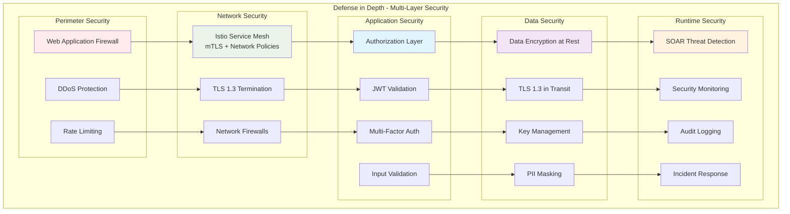
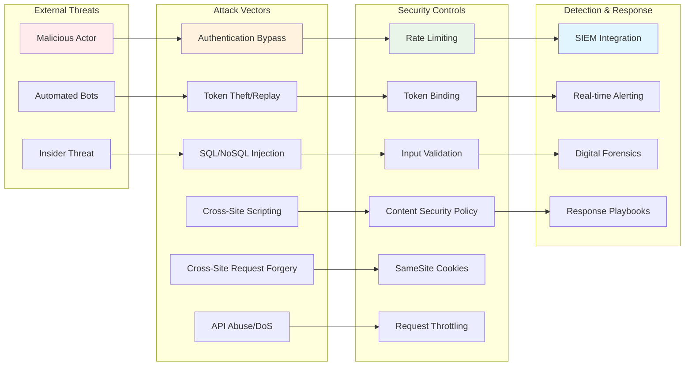

# Security Hardening Guide

## Overview

This guide provides comprehensive security hardening procedures for the Rust Security Platform, covering application-level security, infrastructure hardening, compliance requirements, and incident response procedures.

### Security Architecture Layers



### Threat Model & Attack Vectors



## Application Security Hardening

### Authentication Security

#### JWT Token Security
```rust
// Secure JWT configuration
#[derive(Clone)]
pub struct JwtConfig {
    // Use RS256 for asymmetric signing in production
    pub algorithm: Algorithm::RS256,
    pub issuer: String,
    pub audience: Vec<String>,
    pub expiration: Duration::from_secs(3600),        // 1 hour
    pub refresh_expiration: Duration::from_secs(2592000), // 30 days
    pub leeway: Duration::from_secs(60),              // Clock skew tolerance
}

// Secure token validation
pub async fn validate_jwt(token: &str, public_key: &[u8]) -> Result<Claims> {
    let validation = Validation {
        algorithms: vec![Algorithm::RS256],
        iss: Some(issuer.clone()),
        aud: Some(audiences.clone()),
        leeway: 60,
        validate_exp: true,
        validate_nbf: true,
        ..Validation::default()
    };
    
    let decoding_key = DecodingKey::from_rsa_pem(public_key)
        .map_err(|_| AuthError::InvalidKey)?;
    
    let token_data = decode::<Claims>(token, &decoding_key, &validation)
        .map_err(|_| AuthError::InvalidToken)?;
    
    // Additional security checks
    if token_data.claims.jti.is_empty() {
        return Err(AuthError::InvalidToken);
    }
    
    // Check token revocation (implement with Redis)
    if is_token_revoked(&token_data.claims.jti).await? {
        return Err(AuthError::RevokedToken);
    }
    
    Ok(token_data.claims)
}
```

#### Password Security
```rust
use argon2::{Argon2, PasswordHash, PasswordHasher, PasswordVerifier};
use rand::RngCore;

// Secure password hashing
pub struct PasswordService {
    argon2: Argon2<'static>,
}

impl PasswordService {
    pub fn new() -> Self {
        // Use production-grade Argon2 parameters
        let argon2 = Argon2::new(
            argon2::Algorithm::Argon2id,
            argon2::Version::V0x13,
            argon2::Params::new(
                65536,  // 64 MB memory cost
                3,      // 3 iterations
                4,      // 4 parallel threads
                Some(32), // 32-byte output
            ).unwrap(),
        );
        Self { argon2 }
    }
    
    pub async fn hash_password(&self, password: &str) -> Result<String> {
        let password = password.to_owned();
        let argon2 = self.argon2.clone();
        
        tokio::task::spawn_blocking(move || {
            let mut salt = [0u8; 32];
            rand::thread_rng().fill_bytes(&mut salt);
            
            let password_hash = argon2
                .hash_password(password.as_bytes(), &salt)
                .map_err(|_| AuthError::HashingFailed)?;
                
            Ok(password_hash.to_string())
        }).await?
    }
    
    pub async fn verify_password(&self, password: &str, hash: &str) -> Result<bool> {
        let password = password.to_owned();
        let hash = hash.to_owned();
        let argon2 = self.argon2.clone();
        
        tokio::task::spawn_blocking(move || {
            let parsed_hash = PasswordHash::new(&hash)
                .map_err(|_| AuthError::InvalidHash)?;
                
            Ok(argon2.verify_password(password.as_bytes(), &parsed_hash).is_ok())
        }).await?
    }
}

// Password policy enforcement
pub struct PasswordPolicy;

impl PasswordPolicy {
    pub fn validate(password: &str) -> Result<()> {
        if password.len() < 12 {
            return Err(AuthError::PasswordTooShort);
        }
        
        if password.len() > 128 {
            return Err(AuthError::PasswordTooLong);
        }
        
        let has_lower = password.chars().any(|c| c.is_lowercase());
        let has_upper = password.chars().any(|c| c.is_uppercase());
        let has_digit = password.chars().any(|c| c.is_numeric());
        let has_special = password.chars().any(|c| !c.is_alphanumeric());
        
        if !(has_lower && has_upper && has_digit && has_special) {
            return Err(AuthError::PasswordComplexityInsufficient);
        }
        
        // Check against common passwords
        if is_common_password(password) {
            return Err(AuthError::PasswordTooCommon);
        }
        
        Ok(())
    }
}
```

#### Rate Limiting and Brute Force Protection
```rust
use std::collections::HashMap;
use std::net::IpAddr;
use tokio::sync::RwLock;
use tokio::time::{Duration, Instant};

#[derive(Clone)]
pub struct RateLimiter {
    attempts: Arc<RwLock<HashMap<IpAddr, AttemptTracker>>>,
    max_attempts: u32,
    window_duration: Duration,
    lockout_duration: Duration,
}

struct AttemptTracker {
    count: u32,
    window_start: Instant,
    locked_until: Option<Instant>,
}

impl RateLimiter {
    pub fn new() -> Self {
        Self {
            attempts: Arc::new(RwLock::new(HashMap::new())),
            max_attempts: 5,
            window_duration: Duration::from_secs(900), // 15 minutes
            lockout_duration: Duration::from_secs(3600), // 1 hour
        }
    }
    
    pub async fn check_rate_limit(&self, ip: IpAddr) -> Result<()> {
        let mut attempts = self.attempts.write().await;
        let now = Instant::now();
        
        let tracker = attempts.entry(ip).or_insert_with(|| AttemptTracker {
            count: 0,
            window_start: now,
            locked_until: None,
        });
        
        // Check if currently locked out
        if let Some(locked_until) = tracker.locked_until {
            if now < locked_until {
                return Err(AuthError::RateLimited);
            } else {
                // Lockout expired, reset
                tracker.locked_until = None;
                tracker.count = 0;
                tracker.window_start = now;
            }
        }
        
        // Reset window if expired
        if now.duration_since(tracker.window_start) > self.window_duration {
            tracker.count = 0;
            tracker.window_start = now;
        }
        
        // Check if over limit
        if tracker.count >= self.max_attempts {
            tracker.locked_until = Some(now + self.lockout_duration);
            return Err(AuthError::RateLimited);
        }
        
        Ok(())
    }
    
    pub async fn record_failed_attempt(&self, ip: IpAddr) {
        let mut attempts = self.attempts.write().await;
        if let Some(tracker) = attempts.get_mut(&ip) {
            tracker.count += 1;
        }
    }
    
    pub async fn record_successful_attempt(&self, ip: IpAddr) {
        let mut attempts = self.attempts.write().await;
        if let Some(tracker) = attempts.get_mut(&ip) {
            // Reset on successful authentication
            tracker.count = 0;
            tracker.locked_until = None;
        }
    }
}
```

### Input Validation and Sanitization

#### Request Validation
```rust
use validator::{Validate, ValidationError};
use serde::{Deserialize, Serialize};

#[derive(Deserialize, Validate)]
pub struct LoginRequest {
    #[validate(email, length(max = 254))]
    pub email: String,
    
    #[validate(length(min = 12, max = 128))]
    pub password: String,
    
    #[validate(length(max = 100))]
    pub client_id: Option<String>,
    
    #[validate(url)]
    pub redirect_uri: Option<String>,
}

#[derive(Deserialize, Validate)]  
pub struct TokenRequest {
    #[validate(regex = "GRANT_TYPE_REGEX")]
    pub grant_type: String,
    
    #[validate(length(max = 100))]
    pub client_id: String,
    
    #[validate(length(max = 500))]
    pub scope: Option<String>,
}

// Custom validation
fn validate_redirect_uri(uri: &str) -> Result<(), ValidationError> {
    // Only allow HTTPS in production
    if !uri.starts_with("https://") {
        return Err(ValidationError::new("https_required"));
    }
    
    // Validate against allowed domains
    let allowed_domains = get_allowed_domains();
    let url = url::Url::parse(uri).map_err(|_| ValidationError::new("invalid_url"))?;
    
    if let Some(host) = url.host_str() {
        if !allowed_domains.iter().any(|domain| host.ends_with(domain)) {
            return Err(ValidationError::new("domain_not_allowed"));
        }
    }
    
    Ok(())
}
```

#### SQL Injection Prevention
```rust
// Always use parameterized queries with sqlx
pub async fn get_user_by_email(pool: &PgPool, email: &str) -> Result<Option<User>> {
    let user = sqlx::query_as!(
        User,
        "SELECT id, email, password_hash, created_at FROM users WHERE email = $1 AND active = true",
        email
    )
    .fetch_optional(pool)
    .await?;
    
    Ok(user)
}

// Dynamic query building (when absolutely necessary)
pub async fn search_users(
    pool: &PgPool,
    filters: &UserSearchFilters,
) -> Result<Vec<User>> {
    let mut query = QueryBuilder::new("SELECT id, email, created_at FROM users WHERE active = true");
    
    if let Some(email_prefix) = &filters.email_prefix {
        // Validate input before using in query
        if !email_prefix.chars().all(|c| c.is_alphanumeric() || c == '@' || c == '.') {
            return Err(AuthError::InvalidInput);
        }
        query.push(" AND email LIKE ");
        query.push_bind(format!("{}%", email_prefix));
    }
    
    if let Some(created_after) = filters.created_after {
        query.push(" AND created_at > ");
        query.push_bind(created_after);
    }
    
    query.push(" ORDER BY created_at DESC LIMIT 100");
    
    let users = query.build_query_as::<User>()
        .fetch_all(pool)
        .await?;
    
    Ok(users)
}
```

### Cryptographic Security

#### Key Management
```rust
use ring::{rand, signature};
use std::time::SystemTime;

pub struct KeyManager {
    signing_key: signature::RsaKeyPair,
    verification_key: Vec<u8>,
    key_id: String,
    created_at: SystemTime,
    rotation_interval: Duration,
}

impl KeyManager {
    pub async fn new() -> Result<Self> {
        let rng = rand::SystemRandom::new();
        
        // Generate 4096-bit RSA key pair
        let pkcs8_bytes = signature::RsaKeyPair::generate_pkcs8(&rng, 4096)
            .map_err(|_| AuthError::KeyGenerationFailed)?;
            
        let signing_key = signature::RsaKeyPair::from_pkcs8(&pkcs8_bytes)
            .map_err(|_| AuthError::KeyGenerationFailed)?;
            
        let verification_key = signing_key.public_key().as_ref().to_vec();
        
        let key_id = generate_key_id();
        
        Ok(Self {
            signing_key,
            verification_key,
            key_id,
            created_at: SystemTime::now(),
            rotation_interval: Duration::from_secs(86400 * 90), // 90 days
        })
    }
    
    pub fn should_rotate(&self) -> bool {
        self.created_at.elapsed()
            .map(|elapsed| elapsed > self.rotation_interval)
            .unwrap_or(true)
    }
    
    pub async fn rotate_keys(&mut self) -> Result<()> {
        // Generate new key pair
        let new_key_manager = KeyManager::new().await?;
        
        // Store old key for verification of existing tokens
        self.store_old_key_for_verification().await?;
        
        // Update with new keys
        *self = new_key_manager;
        
        // Publish new public key to JWKS endpoint
        self.update_jwks_endpoint().await?;
        
        Ok(())
    }
}

// Secure random token generation
pub fn generate_secure_token() -> String {
    let rng = rand::SystemRandom::new();
    let mut token = [0u8; 32];
    rng.fill(&mut token).expect("RNG failure");
    base64::encode_config(token, base64::URL_SAFE_NO_PAD)
}

// Key derivation for encryption keys
pub fn derive_encryption_key(password: &str, salt: &[u8]) -> Result<[u8; 32]> {
    use ring::pbkdf2;
    
    let mut key = [0u8; 32];
    pbkdf2::derive(
        pbkdf2::PBKDF2_HMAC_SHA256,
        std::num::NonZeroU32::new(100_000).unwrap(), // iterations
        salt,
        password.as_bytes(),
        &mut key,
    );
    Ok(key)
}
```

#### Secure Communication
```rust
// TLS configuration
pub fn create_tls_config() -> Result<ServerConfig> {
    let cert_file = std::fs::File::open("certs/server.crt")?;
    let key_file = std::fs::File::open("certs/server.key")?;
    
    let cert_chain = rustls_pemfile::certs(&mut BufReader::new(cert_file))
        .collect::<Result<Vec<_>, _>>()?;
        
    let private_key = rustls_pemfile::private_key(&mut BufReader::new(key_file))
        .map_err(|_| AuthError::TlsConfigError)?;
    
    let config = ServerConfig::builder()
        .with_cipher_suites(&[
            // Only allow secure cipher suites
            rustls::cipher_suite::TLS13_AES_256_GCM_SHA384,
            rustls::cipher_suite::TLS13_CHACHA20_POLY1305_SHA256,
        ])
        .with_kx_groups(&[
            // Only allow secure key exchange groups
            &rustls::kx_group::X25519,
            &rustls::kx_group::SECP384R1,
        ])
        .with_protocol_versions(&[&rustls::version::TLS13])
        .map_err(|_| AuthError::TlsConfigError)?
        .with_no_client_auth()
        .with_single_cert(cert_chain, private_key)
        .map_err(|_| AuthError::TlsConfigError)?;
    
    Ok(config)
}
```

## Infrastructure Security Hardening

### Container Security

#### Dockerfile Security Best Practices
```dockerfile
# Use specific version tags, not 'latest'
FROM rust:1.80.1-slim-bookworm as builder

# Create non-root user early
RUN groupadd -r appgroup && useradd -r -g appgroup -u 1001 appuser

# Install only necessary packages and clean up
RUN apt-get update && apt-get install -y --no-install-recommends \
    ca-certificates \
    pkg-config \
    libssl-dev \
    && rm -rf /var/lib/apt/lists/* \
    && apt-get clean

# Set working directory
WORKDIR /app

# Copy dependency files first for better layer caching
COPY Cargo.toml Cargo.lock ./
COPY auth-service/Cargo.toml ./auth-service/
COPY common/Cargo.toml ./common/

# Create dummy source files for dependency build
RUN mkdir -p auth-service/src common/src && \
    echo "fn main() {}" > auth-service/src/main.rs && \
    echo "//! dummy" > common/src/lib.rs

# Build dependencies
RUN cargo build --release --bin auth-service

# Copy actual source code
COPY . .

# Build application with security features
RUN cargo build --release --bin auth-service --features production

# Production stage
FROM debian:bookworm-slim

# Install security updates and runtime dependencies
RUN apt-get update && apt-get upgrade -y && \
    apt-get install -y --no-install-recommends \
    ca-certificates \
    curl \
    && rm -rf /var/lib/apt/lists/* \
    && apt-get clean

# Create non-root user
RUN groupadd -r appgroup && useradd -r -g appgroup -u 1001 appuser

# Create necessary directories
RUN mkdir -p /app/logs /app/config && \
    chown -R appuser:appgroup /app

# Copy application binary
COPY --from=builder --chown=appuser:appgroup /app/target/release/auth-service /usr/local/bin/auth-service
COPY --from=builder --chown=appuser:appgroup /app/config /app/config

# Switch to non-root user
USER appuser

# Set secure environment variables
ENV RUST_LOG=info
ENV RUST_BACKTRACE=0

# Expose only necessary port
EXPOSE 8080

# Health check
HEALTHCHECK --interval=30s --timeout=10s --start-period=5s --retries=3 \
    CMD curl -f http://localhost:8080/health || exit 1

# Run application
ENTRYPOINT ["/usr/local/bin/auth-service"]
```

#### Container Runtime Security
```yaml
# Kubernetes security context
apiVersion: apps/v1
kind: Deployment
metadata:
  name: auth-service
spec:
  template:
    spec:
      securityContext:
        runAsNonRoot: true
        runAsUser: 1001
        runAsGroup: 1001
        fsGroup: 1001
        seccompProfile:
          type: RuntimeDefault
      containers:
      - name: auth-service
        image: auth-service:latest
        securityContext:
          allowPrivilegeEscalation: false
          readOnlyRootFilesystem: true
          runAsNonRoot: true
          runAsUser: 1001
          runAsGroup: 1001
          capabilities:
            drop:
            - ALL
        resources:
          limits:
            memory: "4Gi"
            cpu: "2000m"
          requests:
            memory: "2Gi"
            cpu: "1000m"
        volumeMounts:
        - name: tmp
          mountPath: /tmp
        - name: cache
          mountPath: /app/.cache
      volumes:
      - name: tmp
        emptyDir: {}
      - name: cache
        emptyDir: {}
```

### Network Security

#### Network Policies
```yaml
# Deny all by default
apiVersion: networking.k8s.io/v1
kind: NetworkPolicy
metadata:
  name: default-deny-all
  namespace: rust-security
spec:
  podSelector: {}
  policyTypes:
  - Ingress
  - Egress

---
# Auth service network policy
apiVersion: networking.k8s.io/v1
kind: NetworkPolicy
metadata:
  name: auth-service-policy
  namespace: rust-security
spec:
  podSelector:
    matchLabels:
      app: auth-service
  policyTypes:
  - Ingress
  - Egress
  ingress:
  # Allow ingress from nginx ingress controller
  - from:
    - namespaceSelector:
        matchLabels:
          name: ingress-nginx
    - podSelector:
        matchLabels:
          app: nginx-ingress
    ports:
    - protocol: TCP
      port: 8080
  # Allow ingress from monitoring
  - from:
    - podSelector:
        matchLabels:
          app: prometheus
    ports:
    - protocol: TCP
      port: 8080
  egress:
  # Allow egress to PostgreSQL
  - to:
    - podSelector:
        matchLabels:
          app: postgres
    ports:
    - protocol: TCP
      port: 5432
  # Allow egress to Redis
  - to:
    - podSelector:
        matchLabels:
          app: redis
    ports:
    - protocol: TCP
      port: 6379
  # Allow DNS resolution
  - to: []
    ports:
    - protocol: UDP
      port: 53
  # Allow HTTPS outbound (for external APIs)
  - to: []
    ports:
    - protocol: TCP
      port: 443
```

#### TLS Configuration
```yaml
# Ingress with TLS
apiVersion: networking.k8s.io/v1
kind: Ingress
metadata:
  name: rust-security-ingress
  namespace: rust-security
  annotations:
    nginx.ingress.kubernetes.io/ssl-protocols: "TLSv1.2 TLSv1.3"
    nginx.ingress.kubernetes.io/ssl-ciphers: "ECDHE-RSA-AES128-GCM-SHA256,ECDHE-RSA-AES256-GCM-SHA384,ECDHE-RSA-CHACHA20-POLY1305,ECDHE-ECDSA-AES128-GCM-SHA256,ECDHE-ECDSA-AES256-GCM-SHA384,ECDHE-ECDSA-CHACHA20-POLY1305"
    nginx.ingress.kubernetes.io/ssl-redirect: "true"
    nginx.ingress.kubernetes.io/force-ssl-redirect: "true"
    nginx.ingress.kubernetes.io/hsts: "true"
    nginx.ingress.kubernetes.io/hsts-max-age: "31536000"
    nginx.ingress.kubernetes.io/hsts-include-subdomains: "true"
    nginx.ingress.kubernetes.io/proxy-body-size: "1m"
    nginx.ingress.kubernetes.io/rate-limit: "100"
    nginx.ingress.kubernetes.io/rate-limit-window: "1m"
spec:
  ingressClassName: nginx
  tls:
  - hosts:
    - auth.company.com
    secretName: auth-tls-secret
  rules:
  - host: auth.company.com
    http:
      paths:
      - path: /
        pathType: Prefix
        backend:
          service:
            name: auth-service
            port:
              number: 8080
```

### Database Security

#### PostgreSQL Hardening
```sql
-- Database security configuration

-- Enable row level security
ALTER DATABASE auth_service SET row_security = on;

-- Create security policies
CREATE POLICY user_isolation ON users
  FOR ALL TO auth_service_app
  USING (tenant_id = current_setting('app.current_tenant_id')::uuid);

-- Enable auditing
CREATE EXTENSION IF NOT EXISTS pgaudit;
ALTER SYSTEM SET pgaudit.log = 'ddl, write, role';
ALTER SYSTEM SET pgaudit.log_catalog = off;
ALTER SYSTEM SET pgaudit.log_parameter = off;

-- Connection security
ALTER SYSTEM SET ssl = on;
ALTER SYSTEM SET ssl_cert_file = '/etc/ssl/certs/server.crt';
ALTER SYSTEM SET ssl_key_file = '/etc/ssl/private/server.key';
ALTER SYSTEM SET ssl_ca_file = '/etc/ssl/certs/ca.crt';
ALTER SYSTEM SET ssl_crl_file = '/etc/ssl/crl/server.crl';

-- Password encryption
ALTER SYSTEM SET password_encryption = 'scram-sha-256';

-- Connection limits and timeouts
ALTER SYSTEM SET max_connections = 200;
ALTER SYSTEM SET idle_in_transaction_session_timeout = '10min';
ALTER SYSTEM SET statement_timeout = '30s';

-- Logging for security monitoring
ALTER SYSTEM SET log_statement = 'mod';
ALTER SYSTEM SET log_min_duration_statement = 1000;
ALTER SYSTEM SET log_connections = on;
ALTER SYSTEM SET log_disconnections = on;
ALTER SYSTEM SET log_lock_waits = on;

-- Apply changes
SELECT pg_reload_conf();
```

#### Database User Privileges
```sql
-- Create application user with minimal privileges
CREATE USER auth_service_app WITH PASSWORD 'secure_random_password';

-- Grant only necessary privileges
GRANT CONNECT ON DATABASE auth_service TO auth_service_app;
GRANT USAGE ON SCHEMA public TO auth_service_app;
GRANT SELECT, INSERT, UPDATE, DELETE ON users TO auth_service_app;
GRANT SELECT, INSERT, UPDATE, DELETE ON sessions TO auth_service_app;
GRANT SELECT ON roles TO auth_service_app;
GRANT SELECT ON permissions TO auth_service_app;

-- Grant sequence usage
GRANT USAGE, SELECT ON ALL SEQUENCES IN SCHEMA public TO auth_service_app;

-- Create read-only user for reporting
CREATE USER auth_service_reader WITH PASSWORD 'secure_random_password';
GRANT CONNECT ON DATABASE auth_service TO auth_service_reader;
GRANT USAGE ON SCHEMA public TO auth_service_reader;
GRANT SELECT ON ALL TABLES IN SCHEMA public TO auth_service_reader;

-- Revoke dangerous privileges
REVOKE ALL ON SCHEMA public FROM public;
REVOKE CREATE ON DATABASE auth_service FROM public;
```

## Compliance and Audit

### GDPR Compliance

#### Data Protection Implementation
```rust
use chrono::{DateTime, Utc};
use serde::{Deserialize, Serialize};

#[derive(Serialize, Deserialize)]
pub struct PersonalData {
    pub user_id: uuid::Uuid,
    pub email: String,
    pub created_at: DateTime<Utc>,
    pub last_login: Option<DateTime<Utc>>,
    pub consent_given: DateTime<Utc>,
    pub data_retention_until: DateTime<Utc>,
}

impl PersonalData {
    // Right to erasure (Article 17)
    pub async fn delete_user_data(&self, pool: &PgPool) -> Result<()> {
        let mut tx = pool.begin().await?;
        
        // Anonymize user data
        sqlx::query!(
            "UPDATE users SET 
             email = 'deleted-user-' || id || '@deleted.local',
             password_hash = 'DELETED',
             first_name = 'DELETED',
             last_name = 'DELETED',
             phone = NULL,
             address = NULL,
             deleted_at = NOW()
             WHERE id = $1",
            self.user_id
        )
        .execute(&mut *tx)
        .await?;
        
        // Delete associated sessions
        sqlx::query!("DELETE FROM sessions WHERE user_id = $1", self.user_id)
            .execute(&mut *tx)
            .await?;
        
        // Log deletion for audit
        sqlx::query!(
            "INSERT INTO audit_log (action, user_id, details, timestamp) 
             VALUES ('user_data_deleted', $1, 'GDPR erasure request', NOW())",
            self.user_id
        )
        .execute(&mut *tx)
        .await?;
        
        tx.commit().await?;
        Ok(())
    }
    
    // Right of access (Article 15)
    pub async fn export_user_data(&self, pool: &PgPool) -> Result<UserDataExport> {
        let user_data = sqlx::query_as!(
            UserExportData,
            "SELECT id, email, created_at, last_login, consent_given 
             FROM users WHERE id = $1",
            self.user_id
        )
        .fetch_one(pool)
        .await?;
        
        let sessions = sqlx::query_as!(
            SessionExportData,
            "SELECT id, created_at, ip_address, user_agent 
             FROM sessions WHERE user_id = $1",
            self.user_id
        )
        .fetch_all(pool)
        .await?;
        
        Ok(UserDataExport {
            user: user_data,
            sessions,
            exported_at: Utc::now(),
        })
    }
    
    // Data retention check
    pub async fn check_retention_policy(&self, pool: &PgPool) -> Result<()> {
        if Utc::now() > self.data_retention_until {
            self.delete_user_data(pool).await?;
        }
        Ok(())
    }
}

// Consent management
pub struct ConsentManager;

impl ConsentManager {
    pub async fn record_consent(
        user_id: uuid::Uuid,
        consent_type: ConsentType,
        given: bool,
        pool: &PgPool,
    ) -> Result<()> {
        sqlx::query!(
            "INSERT INTO user_consents (user_id, consent_type, given, timestamp)
             VALUES ($1, $2, $3, NOW())
             ON CONFLICT (user_id, consent_type) 
             DO UPDATE SET given = $3, timestamp = NOW()",
            user_id,
            consent_type as ConsentType,
            given
        )
        .execute(pool)
        .await?;
        
        Ok(())
    }
    
    pub async fn check_consent(
        user_id: uuid::Uuid,
        consent_type: ConsentType,
        pool: &PgPool,
    ) -> Result<bool> {
        let result = sqlx::query_scalar!(
            "SELECT given FROM user_consents 
             WHERE user_id = $1 AND consent_type = $2",
            user_id,
            consent_type as ConsentType
        )
        .fetch_optional(pool)
        .await?;
        
        Ok(result.unwrap_or(false))
    }
}
```

#### Audit Logging
```rust
use serde_json::Value;

#[derive(Serialize, Deserialize)]
pub struct AuditEvent {
    pub id: uuid::Uuid,
    pub timestamp: DateTime<Utc>,
    pub event_type: AuditEventType,
    pub user_id: Option<uuid::Uuid>,
    pub session_id: Option<String>,
    pub ip_address: Option<IpAddr>,
    pub user_agent: Option<String>,
    pub details: Value,
    pub result: AuditResult,
}

#[derive(Serialize, Deserialize)]
pub enum AuditEventType {
    Login,
    Logout,
    TokenIssued,
    TokenRevoked,
    PasswordChanged,
    UserCreated,
    UserDeleted,
    PermissionGranted,
    PermissionRevoked,
    ConfigurationChanged,
    SecurityAlert,
}

#[derive(Serialize, Deserialize)]
pub enum AuditResult {
    Success,
    Failure,
    Warning,
}

pub struct AuditLogger {
    pool: PgPool,
}

impl AuditLogger {
    pub async fn log_event(&self, event: AuditEvent) -> Result<()> {
        sqlx::query!(
            "INSERT INTO audit_log 
             (id, timestamp, event_type, user_id, session_id, ip_address, user_agent, details, result)
             VALUES ($1, $2, $3, $4, $5, $6, $7, $8, $9)",
            event.id,
            event.timestamp,
            event.event_type as AuditEventType,
            event.user_id,
            event.session_id,
            event.ip_address.map(|ip| ip.to_string()),
            event.user_agent,
            event.details,
            event.result as AuditResult,
        )
        .execute(&self.pool)
        .await?;
        
        // Also log to external SIEM if configured
        if let Some(siem_client) = &self.siem_client {
            siem_client.send_audit_event(&event).await?;
        }
        
        Ok(())
    }
    
    pub async fn search_audit_log(
        &self,
        filters: &AuditSearchFilters,
    ) -> Result<Vec<AuditEvent>> {
        let mut query = QueryBuilder::new(
            "SELECT * FROM audit_log WHERE 1=1"
        );
        
        if let Some(user_id) = filters.user_id {
            query.push(" AND user_id = ");
            query.push_bind(user_id);
        }
        
        if let Some(start_time) = filters.start_time {
            query.push(" AND timestamp >= ");
            query.push_bind(start_time);
        }
        
        if let Some(end_time) = filters.end_time {
            query.push(" AND timestamp <= ");
            query.push_bind(end_time);
        }
        
        query.push(" ORDER BY timestamp DESC LIMIT 1000");
        
        let events = query.build_query_as::<AuditEvent>()
            .fetch_all(&self.pool)
            .await?;
            
        Ok(events)
    }
}

// Audit middleware for Axum
pub async fn audit_middleware<B>(
    request: Request<B>,
    next: Next<B>,
) -> Result<Response, Error> {
    let start_time = Instant::now();
    let method = request.method().clone();
    let uri = request.uri().clone();
    
    // Extract user context
    let user_id = request.extensions().get::<UserId>().copied();
    let session_id = request.extensions().get::<SessionId>().cloned();
    let ip_address = request.extensions().get::<IpAddr>().copied();
    
    let response = next.run(request).await;
    let duration = start_time.elapsed();
    
    // Log the request
    let audit_event = AuditEvent {
        id: uuid::Uuid::new_v4(),
        timestamp: Utc::now(),
        event_type: AuditEventType::from_http_method(&method),
        user_id,
        session_id,
        ip_address,
        user_agent: None, // Extract from headers if needed
        details: json!({
            "method": method.to_string(),
            "uri": uri.to_string(),
            "status": response.status().as_u16(),
            "duration_ms": duration.as_millis(),
        }),
        result: if response.status().is_success() {
            AuditResult::Success
        } else {
            AuditResult::Failure
        },
    };
    
    // Log asynchronously to avoid blocking response
    tokio::spawn(async move {
        if let Err(e) = AUDIT_LOGGER.log_event(audit_event).await {
            error!("Failed to log audit event: {}", e);
        }
    });
    
    Ok(response)
}
```

### SOC 2 Compliance

#### Access Controls
```yaml
# RBAC configuration for SOC 2 compliance
apiVersion: rbac.authorization.k8s.io/v1
kind: Role
metadata:
  namespace: rust-security
  name: developer
rules:
- apiGroups: [""]
  resources: ["pods", "pods/log"]
  verbs: ["get", "list", "watch"]
- apiGroups: ["apps"]
  resources: ["deployments", "replicasets"]
  verbs: ["get", "list", "watch"]

---
apiVersion: rbac.authorization.k8s.io/v1
kind: Role
metadata:
  namespace: rust-security
  name: operator
rules:
- apiGroups: [""]
  resources: ["*"]
  verbs: ["*"]
- apiGroups: ["apps"]
  resources: ["*"]
  verbs: ["*"]
- apiGroups: ["networking.k8s.io"]
  resources: ["*"]
  verbs: ["*"]

---
# Bind users to roles
apiVersion: rbac.authorization.k8s.io/v1
kind: RoleBinding
metadata:
  name: developers
  namespace: rust-security
subjects:
- kind: User
  name: developer1@company.com
  apiGroup: rbac.authorization.k8s.io
roleRef:
  kind: Role
  name: developer
  apiGroup: rbac.authorization.k8s.io
```

#### Change Management
```bash
#!/bin/bash
# scripts/change-management.sh
# Implements SOC 2 change management controls

set -euo pipefail

CHANGE_ID="$1"
APPROVER="$2"
DEPLOYMENT_MANIFEST="$3"

echo "=== Change Management Process ==="
echo "Change ID: $CHANGE_ID"
echo "Approver: $APPROVER"
echo "Deployment: $DEPLOYMENT_MANIFEST"

# Validate approval
if ! validate_approval "$CHANGE_ID" "$APPROVER"; then
    echo "ERROR: Change $CHANGE_ID not approved by authorized personnel"
    exit 1
fi

# Security scan
echo "Running security scan..."
kubesec scan "$DEPLOYMENT_MANIFEST"
if [ $? -ne 0 ]; then
    echo "ERROR: Security scan failed"
    exit 1
fi

# Backup current state
echo "Creating backup..."
kubectl get all -n rust-security -o yaml > "backup-$CHANGE_ID-$(date +%Y%m%d-%H%M%S).yaml"

# Apply changes
echo "Applying changes..."
kubectl apply -f "$DEPLOYMENT_MANIFEST" --record

# Verify deployment
echo "Verifying deployment..."
if ! ./validate-services.sh; then
    echo "ERROR: Deployment verification failed"
    echo "Rolling back..."
    kubectl rollout undo deployment/auth-service -n rust-security
    exit 1
fi

# Log change completion
echo "Logging change completion..."
log_change_completion "$CHANGE_ID" "$APPROVER" "success"

echo "Change $CHANGE_ID completed successfully"
```

## Incident Response

### Security Incident Response Plan

#### Incident Classification
- **P0 (Critical)**: Active breach, data exfiltration, service compromise
- **P1 (High)**: Attempted breach, privilege escalation, service degradation
- **P2 (Medium)**: Suspicious activity, failed security controls
- **P3 (Low)**: Policy violations, minor security findings

#### Incident Response Procedures
```bash
#!/bin/bash
# scripts/incident-response.sh

INCIDENT_ID="$1"
SEVERITY="$2"

echo "=== SECURITY INCIDENT RESPONSE ==="
echo "Incident ID: $INCIDENT_ID"
echo "Severity: $SEVERITY"
echo "Started: $(date)"

case "$SEVERITY" in
    "P0"|"CRITICAL")
        echo "CRITICAL INCIDENT - Initiating immediate response"
        
        # Immediate containment
        echo "1. Isolating affected systems..."
        kubectl scale deployment/auth-service --replicas=0 -n rust-security
        
        # Preserve evidence
        echo "2. Preserving evidence..."
        kubectl logs deployment/auth-service -n rust-security > "incident-$INCIDENT_ID-auth-logs.txt"
        kubectl get events -n rust-security > "incident-$INCIDENT_ID-events.txt"
        
        # Block suspicious IPs
        echo "3. Blocking suspicious IPs..."
        # Implementation depends on firewall/WAF solution
        
        # Notify stakeholders
        echo "4. Notifying stakeholders..."
        send_alert_to_slack "#security-incidents" "CRITICAL security incident $INCIDENT_ID"
        send_email_alert "security-team@company.com" "CRITICAL INCIDENT $INCIDENT_ID"
        
        ;;
    
    "P1"|"HIGH")
        echo "HIGH SEVERITY - Enhanced monitoring and investigation"
        
        # Increase logging
        kubectl patch deployment auth-service -n rust-security \
            --type='merge' -p='{"spec":{"template":{"spec":{"containers":[{"name":"auth-service","env":[{"name":"RUST_LOG","value":"debug"}]}]}}}}'
        
        # Collect evidence
        kubectl logs --since=24h deployment/auth-service -n rust-security > "incident-$INCIDENT_ID-24h-logs.txt"
        
        # Notify security team
        send_alert_to_slack "#security-team" "High severity incident $INCIDENT_ID"
        
        ;;
        
    "P2"|"MEDIUM")
        echo "MEDIUM SEVERITY - Standard investigation"
        
        # Collect logs
        kubectl logs --since=4h deployment/auth-service -n rust-security > "incident-$INCIDENT_ID-logs.txt"
        
        # Analyze patterns
        analyze_security_logs "incident-$INCIDENT_ID-logs.txt"
        
        ;;
esac

echo "Incident response initiated for $INCIDENT_ID"
```

#### Forensics Collection
```bash
#!/bin/bash
# scripts/forensics-collection.sh

INCIDENT_ID="$1"
EVIDENCE_DIR="/evidence/$INCIDENT_ID"

mkdir -p "$EVIDENCE_DIR"

echo "=== FORENSICS COLLECTION ==="
echo "Collecting evidence for incident: $INCIDENT_ID"

# System state
kubectl get all -A > "$EVIDENCE_DIR/k8s-state.txt"
kubectl get events -A --sort-by='.firstTimestamp' > "$EVIDENCE_DIR/k8s-events.txt"

# Application logs
kubectl logs --since=24h deployment/auth-service -n rust-security > "$EVIDENCE_DIR/auth-service-logs.txt"
kubectl logs --since=24h deployment/policy-service -n rust-security > "$EVIDENCE_DIR/policy-service-logs.txt"

# Database logs
kubectl exec deployment/postgres -n rust-security -- \
    psql -U postgres -c "COPY (SELECT * FROM pg_stat_activity) TO STDOUT WITH CSV HEADER" > "$EVIDENCE_DIR/db-activity.csv"

# Network traffic (if available)
if command -v tcpdump &> /dev/null; then
    tcpdump -i any -c 1000 -w "$EVIDENCE_DIR/network-traffic.pcap" &
    TCPDUMP_PID=$!
    sleep 60
    kill $TCPDUMP_PID
fi

# System metrics
kubectl top nodes > "$EVIDENCE_DIR/node-metrics.txt"
kubectl top pods -A > "$EVIDENCE_DIR/pod-metrics.txt"

# Create evidence package
cd /evidence
tar -czf "$INCIDENT_ID-evidence.tar.gz" "$INCIDENT_ID/"
sha256sum "$INCIDENT_ID-evidence.tar.gz" > "$INCIDENT_ID-evidence.sha256"

echo "Evidence collected: $INCIDENT_ID-evidence.tar.gz"
echo "SHA256: $(cat $INCIDENT_ID-evidence.sha256)"
```

### Business Continuity

#### Disaster Recovery
```bash
#!/bin/bash
# scripts/disaster-recovery.sh

DR_SITE="$1"
RECOVERY_POINT="$2"

echo "=== DISASTER RECOVERY PROCEDURE ==="
echo "DR Site: $DR_SITE"
echo "Recovery Point: $RECOVERY_POINT"

# Step 1: Verify DR site readiness
echo "1. Verifying DR site readiness..."
kubectl --context="$DR_SITE" get nodes
if [ $? -ne 0 ]; then
    echo "ERROR: DR site not accessible"
    exit 1
fi

# Step 2: Restore database
echo "2. Restoring database to recovery point..."
restore_database_to_point "$DR_SITE" "$RECOVERY_POINT"

# Step 3: Deploy application services
echo "3. Deploying application services..."
kubectl --context="$DR_SITE" apply -f k8s/

# Step 4: Verify functionality
echo "4. Verifying functionality..."
wait_for_services_ready "$DR_SITE"

# Step 5: Update DNS (if required)
if [ "$3" = "failover" ]; then
    echo "5. Updating DNS for failover..."
    update_dns_to_dr_site "$DR_SITE"
fi

echo "Disaster recovery completed"
```

This comprehensive security hardening guide provides the foundation for deploying and maintaining a secure Rust Security Platform that meets enterprise security requirements and compliance standards.