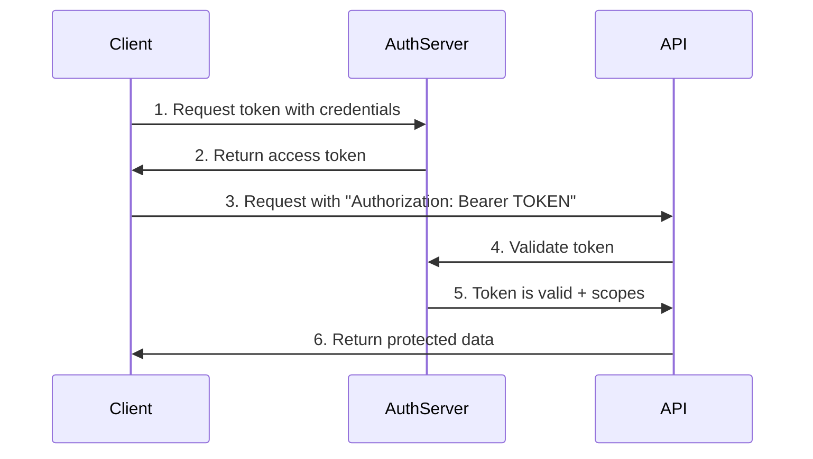

# 📚 Complete Beginner's Guide to OAuth 2.0 with Auth-Core

**Welcome!** This comprehensive tutorial will take you from zero to OAuth 2.0 expert using our auth-core library. No prior authentication experience required!

## Table of Contents

1. [What is OAuth 2.0?](#what-is-oauth-20)
2. [Why Use Auth-Core?](#why-use-auth-core)
3. [Prerequisites](#prerequisites)
4. [Your First OAuth Server](#your-first-oauth-server)
5. [Understanding Tokens](#understanding-tokens)
6. [Client Credentials Flow](#client-credentials-flow)
7. [Protecting Your API](#protecting-your-api)
8. [Working with Scopes](#working-with-scopes)
9. [Real-World Integration](#real-world-integration)
10. [Security Best Practices](#security-best-practices)
11. [Troubleshooting](#troubleshooting)
12. [Next Steps](#next-steps)

## What is OAuth 2.0?

**OAuth 2.0** is like a security guard for your API. Imagine you have a fancy building (your API) and you want to control who can enter different rooms (endpoints).

### Real-World Analogy 🏢

```
🏢 Your API Building
├── 🚪 Public Lobby (no auth needed)
├── 📚 Library (needs "read" access card) 
├── 💼 Office (needs "write" access card)
└── 🔒 Executive Suite (needs "admin" access card)
```

OAuth 2.0 provides:
- **Access Cards** (tokens) that prove identity
- **Different Permissions** (scopes) for different areas
- **Time Limits** (token expiration) for security
- **Card Issuance** (authorization server) to control access

### Why Not Just Use Passwords?

```rust
// ❌ Bad: Sharing passwords everywhere
let client = ApiClient::new("https://api.example.com")
    .with_credentials("username", "password123");

// ✅ Good: Using OAuth tokens
let client = ApiClient::new("https://api.example.com")
    .with_token(&access_token); // Token has limited scope & expires
```

**Problems with passwords:**
- 🚨 Shared across multiple services (security risk)
- 💾 Stored in multiple places
- 🔄 Hard to rotate/change
- 🎯 Give full access to everything

**Benefits of OAuth tokens:**
- ✅ Limited scope (only specific permissions)
- ⏰ Automatic expiration
- 🔄 Easy to revoke
- 📊 Auditable access logs

## Why Use Auth-Core?

Auth-Core is designed to be the **simplest** way to add OAuth 2.0 to your Rust applications:

### 🚀 **Minimal Setup**
```rust
// Just 5 lines to get started!
let server = AuthServer::minimal()
    .with_client("my_app", &std::env::var("CLIENT_SECRET")?)
    .build()?;
```

### 📈 **Progressive Complexity**
Start simple, add features as you grow:

```rust
// Level 1: Basic auth
AuthServer::minimal()

// Level 2: Add scopes  
AuthServer::minimal()
    .with_scope("read")
    .with_scope("write")

// Level 3: Multiple clients
AuthServer::minimal()
    .with_client("web_app", &std::env::var("WEB_SECRET")?)
    .with_client("mobile_app", &std::env::var("MOBILE_SECRET")?)

// Level 4: Advanced features
AuthServer::minimal()
    .with_rate_limiting(100, 60)
    .with_custom_storage(my_database)
```

### 🔒 **Security by Default**
- ✅ Timing attack protection
- ✅ Secure token generation
- ✅ Input validation
- ✅ Rate limiting ready
- ✅ OWASP compliance

## Prerequisites

### What You'll Need

1. **Rust** (latest stable version)
   ```bash
   curl --proto '=https' --tlsv1.2 -sSf https://sh.rustup.rs | sh
   ```

2. **Basic Rust Knowledge**
   - Variables and functions
   - Structs and enums
   - `Result<T, E>` error handling
   - Async/await basics

3. **HTTP Understanding**
   - GET vs POST requests
   - Headers and bodies
   - Status codes (200, 401, 403, etc.)

4. **Tools for Testing**
   ```bash
   # Install curl (probably already have it)
   curl --version
   
   # Or use httpie (more user-friendly)
   pip install httpie
   ```

### Don't Worry If You're New! 

This tutorial explains everything step-by-step. When in doubt, copy the examples and modify them gradually.

## Your First OAuth Server

Let's build your first OAuth 2.0 server in 10 minutes! 

### Step 1: Create New Project

```bash
# Create a new Rust project
cargo new my-oauth-server
cd my-oauth-server

# Add auth-core dependency
echo '[dependencies]
auth-core = { path = "../auth-core" }
tokio = { version = "1.0", features = ["full"] }' >> Cargo.toml
```

### Step 2: Write Your Server

Edit `src/main.rs`:

```rust
use auth_core::prelude::*;

#[tokio::main]
async fn main() -> Result<(), Box<dyn std::error::Error>> {
    println!("🚀 Starting your first OAuth server!");
    
    // Create the simplest possible OAuth server
    let server = AuthServer::minimal()
        .with_client("my_app", "$CLIENT_SECRET")
        .build()
        .expect("Failed to build auth server");
    
    // Start server on localhost:8080
    let listener = tokio::net::TcpListener::bind("127.0.0.1:8080").await?;
    println!("🌐 Server running at http://localhost:8080");
    println!("📖 Try: curl -X POST http://localhost:8080/oauth/token \\");
    println!("         -d 'grant_type=client_credentials&client_id=my_app&client_secret=$CLIENT_SECRET'");
    
    axum::serve(listener, server.into_router()).await?;
    
    Ok(())
}
```

### Step 3: Run Your Server

```bash
cargo run
```

You should see:
```
🚀 Starting your first OAuth server!
🌐 Server running at http://localhost:8080
📖 Try: curl -X POST http://localhost:8080/oauth/token \
         -d 'grant_type=client_credentials&client_id=my_app&client_secret=$CLIENT_SECRET'
```

### Step 4: Test It!

Open a new terminal and run:

```bash
curl -X POST http://localhost:8080/oauth/token \
  -d "grant_type=client_credentials" \
  -d "client_id=my_app" \
  -d "client_secret=$CLIENT_SECRET"
```

**Expected Response:**
```json
{
  "access_token": "auth_core_abc123...",
  "token_type": "Bearer", 
  "expires_in": 3600,
  "scope": ""
}
```

🎉 **Congratulations!** You've just created your first OAuth 2.0 server!

## Understanding Tokens

Let's understand what just happened when you got that token.

### What's in a Token Response?

```json
{
  "access_token": "auth_core_my_app_1640995200_abc123def456",
  "token_type": "Bearer",
  "expires_in": 3600,
  "scope": "read write"
}
```

**Breaking it down:**

| Field | Purpose | Example Value |
|-------|---------|---------------|
| `access_token` | The actual token | `auth_core_my_app_...` |
| `token_type` | How to use it | `Bearer` (in Authorization header) |
| `expires_in` | Seconds until expiration | `3600` (1 hour) |
| `scope` | What permissions it grants | `read write` |

### How Tokens Work



### Token Anatomy

Auth-core tokens contain information in their structure:

```
auth_core_my_app_1640995200_abc123def456
^         ^       ^          ^
|         |       |          └─ Random part (security)
|         |       └─ Timestamp (when issued)
|         └─ Client ID (who it belongs to)  
└─ Prefix (identifies as auth-core token)
```

**Why This Matters:**
- 🔍 **Debugging**: You can see which client a token belongs to
- ⏰ **Expiration**: Timestamp helps with expiration logic  
- 🛡️ **Security**: Random part prevents guessing
- 📊 **Monitoring**: Easy to track token usage by client

## Client Credentials Flow

The **Client Credentials Flow** is the simplest OAuth flow. Perfect for:
- 🤖 Service-to-service communication
- 🔧 API integrations
- 📊 Background jobs
- 🛠️ System administration

### Step-by-Step Walkthrough

Let's trace through exactly what happens:

#### 1. Client Prepares Request

```rust
// Your application code
let client = reqwest::Client::new();
let params = [
    ("grant_type", "client_credentials"),
    ("client_id", "my_app"),
    ("client_secret", &std::env::var("CLIENT_SECRET")?),
    ("scope", "read write"), // Optional: what permissions you want
];
```

#### 2. Client Sends Request

```http
POST /oauth/token HTTP/1.1
Host: localhost:8080
Content-Type: application/x-www-form-urlencoded

grant_type=client_credentials&client_id=my_app&client_secret=$CLIENT_SECRET&scope=read+write
```

#### 3. Server Validates Request

```rust
// Inside auth-core (simplified)
fn handle_token_request(request: TokenRequest) -> Result<TokenResponse> {
    // 1. Check grant_type is "client_credentials" ✅
    if request.grant_type != "client_credentials" {
        return Err("unsupported_grant_type");
    }
    
    // 2. Look up client ✅
    let client = self.clients.get(&request.client_id)
        .ok_or("invalid_client")?;
    
    // 3. Verify secret (timing-safe comparison) ✅
    if !constant_time_eq(&client.secret, &request.client_secret) {
        return Err("invalid_client");
    }
    
    // 4. Check requested scopes ✅
    let granted_scopes = validate_scopes(&request.scope, &client.allowed_scopes)?;
    
    // 5. Generate token ✅
    let token = generate_secure_token(&request.client_id, &granted_scopes);
    
    Ok(TokenResponse { access_token: token, ... })
}
```

#### 4. Server Returns Token

```json
{
  "access_token": "auth_core_my_app_1640995200_abc123def456",
  "token_type": "Bearer",
  "expires_in": 3600,
  "scope": "read write"
}
```

#### 5. Client Uses Token

```rust
// Use the token to make authenticated requests
let response = client
    .get("http://localhost:8080/api/protected")
    .bearer_auth(&token.access_token)
    .send()
    .await?;
```

### Common Mistakes and Fixes

#### ❌ **Mistake 1: Wrong Content-Type**
```bash
curl -X POST http://localhost:8080/oauth/token \
  -H "Content-Type: application/json" \
  -d '{"grant_type": "client_credentials", ...}'
```

✅ **Fix: Use form-encoded**
```bash
curl -X POST http://localhost:8080/oauth/token \
  -H "Content-Type: application/x-www-form-urlencoded" \
  -d "grant_type=client_credentials&client_id=my_app&client_secret=$CLIENT_SECRET"
```

#### ❌ **Mistake 2: Spaces in curl**
```bash
curl -d "scope=read write"  # Spaces need encoding
```

✅ **Fix: Encode spaces or quote**
```bash
curl -d "scope=read%20write"           # URL encoded
curl -d "scope=read+write"             # Plus encoding  
curl -d "scope=\"read write\""         # Quoted
```

#### ❌ **Mistake 3: Wrong Grant Type**
```bash
curl -d "grant_type=authorization_code"  # Wrong for this flow
```

✅ **Fix: Use client_credentials**
```bash
curl -d "grant_type=client_credentials"
```

### Testing Your Understanding

Try these exercises:

1. **Exercise 1**: Add a second client to your server
2. **Exercise 2**: Request a token with an invalid client_id  
3. **Exercise 3**: Request a token with an invalid client_secret
4. **Exercise 4**: Try different scopes

<details>
<summary>Solutions (click to expand)</summary>

**Exercise 1:**
```rust
let server = AuthServer::minimal()
    .with_client("my_app", "$CLIENT_SECRET")
    .with_client("second_app", "$SECOND_SECRET")  // Add this line
    .build()?;
```

**Exercise 2:**
```bash
curl -X POST http://localhost:8080/oauth/token \
  -d "grant_type=client_credentials" \
  -d "client_id=nonexistent" \
  -d "client_secret=$CLIENT_SECRET"
  
# Expected: {"error": "invalid_client"}
```

**Exercise 3:**
```bash
curl -X POST http://localhost:8080/oauth/token \
  -d "grant_type=client_credentials" \
  -d "client_id=my_app" \
  -d "client_secret=INVALID_SECRET"
  
# Expected: {"error": "invalid_client"}
```

**Exercise 4:**
```bash
curl -X POST http://localhost:8080/oauth/token \
  -d "grant_type=client_credentials" \
  -d "client_id=my_app" \
  -d "client_secret=$CLIENT_SECRET" \
  -d "scope=read"
  
# Expected: Token with "scope": "read"
```

</details>

## Protecting Your API

Now let's build something useful - an API that actually uses those tokens!

### Building a Protected API

Create a new file `src/protected_api.rs`:

```rust
use auth_core::prelude::*;
use axum::{
    extract::{Path, Query, State},
    http::{HeaderMap, StatusCode},
    response::Json,
    routing::{get, post, delete},
    Router,
};
use serde::{Deserialize, Serialize};
use std::collections::HashMap;

// Data structures
#[derive(Serialize, Deserialize, Clone)]
pub struct User {
    pub id: String,
    pub name: String,
    pub email: String,
}

#[derive(Serialize, Deserialize)]
pub struct NewUser {
    pub name: String,
    pub email: String,
}

#[derive(Clone)]
pub struct AppState {
    pub auth_server: AuthServer,
    pub users: std::sync::Arc<tokio::sync::RwLock<Vec<User>>>,
}

// Build our protected API routes
pub fn create_protected_routes() -> Router<AppState> {
    Router::new()
        .route("/users", get(list_users))           // GET /users - requires "read"
        .route("/users", post(create_user))         // POST /users - requires "write"  
        .route("/users/:id", get(get_user))         // GET /users/:id - requires "read"
        .route("/users/:id", delete(delete_user))   // DELETE /users/:id - requires "admin"
        .route("/profile", get(get_profile))        // GET /profile - any valid token
        .layer(axum::middleware::from_fn_with_state(
            (), // We'll pass the auth server here
            auth_middleware,
        ))
}

// Authentication middleware - this runs before every protected endpoint
async fn auth_middleware(
    State(state): State<AppState>,
    headers: HeaderMap,
    mut request: axum::extract::Request,
    next: axum::middleware::Next,
) -> Result<axum::response::Response, StatusCode> {
    // 1. Extract the Authorization header
    let auth_header = headers
        .get("authorization")
        .and_then(|header| header.to_str().ok())
        .ok_or(StatusCode::UNAUTHORIZED)?;

    // 2. Check it's a Bearer token
    if !auth_header.starts_with("Bearer ") {
        return Err(StatusCode::UNAUTHORIZED);
    }

    let token = &auth_header[7..]; // Remove "Bearer " prefix

    // 3. Validate the token
    match state.auth_server.validate_token(token).await {
        Ok(token_info) => {
            // 4. Add token info to request for handlers to use
            request.extensions_mut().insert(token_info);
            Ok(next.run(request).await)
        }
        Err(_) => Err(StatusCode::UNAUTHORIZED),
    }
}

// Handler functions
async fn list_users(
    State(state): State<AppState>,
    axum::Extension(token_info): axum::Extension<TokenInfo>,
    Query(params): Query<HashMap<String, String>>,
) -> Result<Json<Vec<User>>, StatusCode> {
    // Check if token has "read" scope
    if !token_info.has_scope("read") {
        return Err(StatusCode::FORBIDDEN);
    }

    let limit: usize = params
        .get("limit")
        .and_then(|s| s.parse().ok())
        .unwrap_or(10);

    let users = state.users.read().await;
    let response: Vec<User> = users.iter().take(limit).cloned().collect();

    println!("📚 Client {} listed {} users", token_info.client_id, response.len());
    
    Ok(Json(response))
}

async fn create_user(
    State(state): State<AppState>,
    axum::Extension(token_info): axum::Extension<TokenInfo>,
    Json(new_user): Json<NewUser>,
) -> Result<Json<User>, StatusCode> {
    // Check if token has "write" scope
    if !token_info.has_scope("write") {
        return Err(StatusCode::FORBIDDEN);
    }

    let user = User {
        id: uuid::Uuid::new_v4().to_string(),
        name: new_user.name,
        email: new_user.email,
    };

    state.users.write().await.push(user.clone());

    println!("✨ Client {} created user: {}", token_info.client_id, user.name);

    Ok(Json(user))
}

async fn get_user(
    State(state): State<AppState>,
    axum::Extension(token_info): axum::Extension<TokenInfo>,
    Path(user_id): Path<String>,
) -> Result<Json<User>, StatusCode> {
    // Check if token has "read" scope
    if !token_info.has_scope("read") {
        return Err(StatusCode::FORBIDDEN);
    }

    let users = state.users.read().await;
    let user = users
        .iter()
        .find(|u| u.id == user_id)
        .ok_or(StatusCode::NOT_FOUND)?;

    Ok(Json(user.clone()))
}

async fn delete_user(
    State(state): State<AppState>,
    axum::Extension(token_info): axum::Extension<TokenInfo>,
    Path(user_id): Path<String>,
) -> Result<StatusCode, StatusCode> {
    // Check if token has "admin" scope (most restrictive)
    if !token_info.has_scope("admin") {
        return Err(StatusCode::FORBIDDEN);
    }

    let mut users = state.users.write().await;
    let initial_len = users.len();
    users.retain(|u| u.id != user_id);

    if users.len() == initial_len {
        return Err(StatusCode::NOT_FOUND);
    }

    println!("🗑️ Client {} deleted user: {}", token_info.client_id, user_id);

    Ok(StatusCode::NO_CONTENT)
}

async fn get_profile(
    axum::Extension(token_info): axum::Extension<TokenInfo>,
) -> Json<serde_json::Value> {
    // This endpoint works with any valid token (no scope check)
    Json(serde_json::json!({
        "client_id": token_info.client_id,
        "scopes": token_info.scopes,
        "expires_at": token_info.expires_at,
        "message": "Hello from your OAuth-protected API!"
    }))
}
```

### Updated Main File

Update your `src/main.rs`:

```rust
mod protected_api;

use auth_core::prelude::*;
use protected_api::{AppState, create_protected_routes, User};
use std::sync::Arc;
use tokio::sync::RwLock;

#[tokio::main]
async fn main() -> Result<(), Box<dyn std::error::Error>> {
    println!("🚀 Starting OAuth server with protected API!");
    
    // Create auth server with multiple clients and scopes
    let auth_server = AuthServer::minimal()
        .with_client("web_app", "$WEB_SECRET")       // read, write
        .with_client("mobile_app", "$MOBILE_SECRET") // read only
        .with_client("admin_app", "$ADMIN_SECRET")   // read, write, admin
        .with_scope("read")
        .with_scope("write")
        .with_scope("admin")
        .build()
        .expect("Failed to build auth server");

    // Create application state with sample data
    let sample_users = vec![
        User {
            id: "user_001".to_string(),
            name: "Alice Johnson".to_string(),
            email: "alice@example.com".to_string(),
        },
        User {
            id: "user_002".to_string(),
            name: "Bob Smith".to_string(),
            email: "bob@example.com".to_string(),
        },
    ];

    let app_state = AppState {
        auth_server,
        users: Arc::new(RwLock::new(sample_users)),
    };

    // Create the complete app with OAuth routes + protected API routes
    let app = Router::new()
        // OAuth endpoints
        .nest("/oauth", auth_server.oauth_routes())
        // Protected API endpoints  
        .nest("/api", create_protected_routes())
        // Public health check
        .route("/health", axum::routing::get(|| async { "OK" }))
        .with_state(app_state);

    // Start server
    let listener = tokio::net::TcpListener::bind("127.0.0.1:8080").await?;
    
    println!("🌐 Server running at http://localhost:8080");
    println!("\n📖 Try these examples:");
    println!("1. Get token:    curl -X POST http://localhost:8080/oauth/token -d 'grant_type=client_credentials&client_id=web_app&client_secret=$WEB_SECRET&scope=read write'");
    println!("2. Get profile:  curl -H 'Authorization: Bearer YOUR_TOKEN' http://localhost:8080/api/profile");
    println!("3. List users:   curl -H 'Authorization: Bearer YOUR_TOKEN' http://localhost:8080/api/users");
    println!("4. Create user:  curl -X POST -H 'Authorization: Bearer YOUR_TOKEN' -H 'Content-Type: application/json' http://localhost:8080/api/users -d '{{\"name\":\"Charlie\",\"email\":\"charlie@example.com\"}}'");
    
    axum::serve(listener, app).await?;
    
    Ok(())
}
```

### Testing the Protected API

Now let's test the complete flow:

#### 1. Get a Token

```bash
# Get token with read and write permissions
curl -X POST http://localhost:8080/oauth/token \
  -d "grant_type=client_credentials" \
  -d "client_id=web_app" \
  -d "client_secret=$WEB_SECRET" \
  -d "scope=read write"
```

**Response:**
```json
{
  "access_token": "auth_core_web_app_1640995200_abc123def456",
  "token_type": "Bearer",
  "expires_in": 3600,
  "scope": "read write"
}
```

#### 2. Save the Token (for convenience)

```bash
# Save token to environment variable
export TOKEN="auth_core_web_app_1640995200_abc123def456"
```

#### 3. Test Different Endpoints

```bash
# ✅ Get your profile (works with any token)
curl -H "Authorization: Bearer $TOKEN" \
  http://localhost:8080/api/profile

# ✅ List users (requires "read" scope)
curl -H "Authorization: Bearer $TOKEN" \
  http://localhost:8080/api/users

# ✅ Create user (requires "write" scope)
curl -X POST \
  -H "Authorization: Bearer $TOKEN" \
  -H "Content-Type: application/json" \
  http://localhost:8080/api/users \
  -d '{"name": "Charlie Brown", "email": "charlie@example.com"}'

# ❌ Delete user (requires "admin" scope - will fail!)
curl -X DELETE \
  -H "Authorization: Bearer $TOKEN" \
  http://localhost:8080/api/users/user_001
```

The delete will fail because the `web_app` client doesn't have `admin` scope!

#### 4. Test Admin Access

```bash
# Get admin token
curl -X POST http://localhost:8080/oauth/token \
  -d "grant_type=client_credentials" \
  -d "client_id=admin_app" \
  -d "client_secret=$ADMIN_SECRET" \
  -d "scope=read write admin"

# Save admin token
export ADMIN_TOKEN="auth_core_admin_app_..."

# ✅ Now delete will work
curl -X DELETE \
  -H "Authorization: Bearer $ADMIN_TOKEN" \
  http://localhost:8080/api/users/user_001
```

### Understanding What Just Happened

1. **Token Request**: Client authenticates with credentials
2. **Scope Validation**: Server checks what permissions client can have
3. **Token Generation**: Server creates token with approved scopes
4. **API Request**: Client includes token in Authorization header
5. **Token Validation**: Middleware validates token and extracts info
6. **Scope Enforcement**: Each endpoint checks for required scopes
7. **Request Processing**: If authorized, endpoint processes request

**Key Security Points:**
- 🔐 Tokens are validated on every request
- 🎯 Scopes provide fine-grained permissions  
- ⏰ Tokens automatically expire
- 🚫 Invalid tokens get 401 Unauthorized
- 🛡️ Missing scopes get 403 Forbidden

## Working with Scopes

**Scopes** are like permissions or roles. They define what a token can do.

### Common Scope Patterns

| Scope | Purpose | Example Actions |
|-------|---------|-----------------|
| `read` | View/retrieve data | GET /users, GET /posts |
| `write` | Create/modify data | POST /users, PUT /posts |  
| `delete` | Remove data | DELETE /users/:id |
| `admin` | Administrative access | GET /admin/stats, POST /admin/settings |
| `profile` | User profile access | GET /me, PUT /me |
| `email` | Email address access | Access user's email |

### Implementing Scope Hierarchies

Sometimes you want scopes to imply other scopes:

```rust
impl TokenInfo {
    pub fn has_scope_or_higher(&self, required: &str) -> bool {
        match required {
            "read" => self.has_scope("read") || self.has_scope("write") || self.has_scope("admin"),
            "write" => self.has_scope("write") || self.has_scope("admin"),
            "admin" => self.has_scope("admin"),
            _ => self.has_scope(required),
        }
    }
}

// Usage in your API
if !token_info.has_scope_or_higher("read") {
    return Err(StatusCode::FORBIDDEN);
}
```

### Scope Best Practices

#### ✅ **Do: Use Descriptive Names**
```rust
.with_scope("users:read")
.with_scope("users:write")
.with_scope("posts:publish")
.with_scope("admin:system")
```

#### ✅ **Do: Principle of Least Privilege**
```rust
// Give clients only what they need
.with_client_scopes("mobile_app", &["posts:read", "profile:read"])
.with_client_scopes("admin_dashboard", &["posts:write", "users:admin"])
```

#### ❌ **Don't: Use Overly Broad Scopes**
```rust
// Too broad - what does "all" mean?
.with_scope("all")
.with_scope("everything") 
.with_scope("*")
```

#### ❌ **Don't: Make Scopes Too Granular**
```rust
// Too granular - maintenance nightmare
.with_scope("users:read:name")
.with_scope("users:read:email")
.with_scope("users:read:phone")
.with_scope("users:read:address")
```

### Real-World Scope Example

Let's build a blog API with proper scopes:

```rust
let server = AuthServer::minimal()
    // Public reading client (like a mobile app)
    .with_client_scopes("mobile_app", &["posts:read", "comments:read"])
    
    // Author client (can write their own content)
    .with_client_scopes("author_app", &[
        "posts:read", "posts:write", 
        "comments:read", "comments:write",
        "profile:read", "profile:write"
    ])
    
    // Editor client (can moderate content)  
    .with_client_scopes("editor_app", &[
        "posts:read", "posts:write", "posts:publish",
        "comments:read", "comments:moderate",
        "users:read"
    ])
    
    // Admin client (full access)
    .with_client_scopes("admin_app", &[
        "posts:*", "comments:*", "users:*", "system:*"
    ])
    
    .build()?;
```

**Corresponding API endpoints:**

```rust
Router::new()
    .route("/posts", get(list_posts))                    // posts:read
    .route("/posts", post(create_post))                  // posts:write
    .route("/posts/:id/publish", post(publish_post))     // posts:publish
    .route("/comments", get(list_comments))              // comments:read
    .route("/comments", post(create_comment))            // comments:write
    .route("/comments/:id/moderate", post(moderate))     // comments:moderate
    .route("/users", get(list_users))                    // users:read
    .route("/admin/stats", get(system_stats))            // system:read
```

## Real-World Integration

Let's build a complete real-world example: a **Document Management API**.

### Project Structure

```
document-api/
├── Cargo.toml
├── src/
│   ├── main.rs
│   ├── auth.rs          # Authentication setup
│   ├── documents.rs     # Document endpoints  
│   ├── users.rs         # User management
│   └── models.rs        # Data structures
└── README.md
```

### Complete Example: Document API

**Cargo.toml:**
```toml
[package]
name = "document-api"
version = "0.1.0"
edition = "2021"

[dependencies]
auth-core = { path = "../auth-core" }
axum = { version = "0.7", features = ["macros"] }
tokio = { version = "1.0", features = ["full"] }
serde = { version = "1.0", features = ["derive"] }
uuid = { version = "1.0", features = ["v4"] }
chrono = { version = "0.4", features = ["serde"] }
```

**src/models.rs:**
```rust
use serde::{Deserialize, Serialize};
use chrono::{DateTime, Utc};

#[derive(Debug, Clone, Serialize, Deserialize)]
pub struct Document {
    pub id: String,
    pub title: String,
    pub content: String,
    pub owner: String,
    pub created_at: DateTime<Utc>,
    pub updated_at: DateTime<Utc>,
    pub is_public: bool,
}

#[derive(Debug, Deserialize)]
pub struct CreateDocumentRequest {
    pub title: String,
    pub content: String,
    pub is_public: Option<bool>,
}

#[derive(Debug, Deserialize)]
pub struct UpdateDocumentRequest {
    pub title: Option<String>,
    pub content: Option<String>,
    pub is_public: Option<bool>,
}

#[derive(Debug, Clone, Serialize)]
pub struct User {
    pub id: String,
    pub name: String,
    pub email: String,
    pub role: UserRole,
}

#[derive(Debug, Clone, Serialize, Deserialize)]
#[serde(rename_all = "lowercase")]
pub enum UserRole {
    User,
    Editor,  
    Admin,
}
```

**src/auth.rs:**
```rust
use auth_core::prelude::*;

pub fn create_auth_server() -> Result<AuthServer, AuthError> {
    AuthServer::minimal()
        // Regular users - can manage their own documents
        .with_client_scopes("user_app", &[
            "documents:read",
            "documents:write", 
            "profile:read"
        ])
        
        // Editors - can read all documents, edit public ones
        .with_client_scopes("editor_app", &[
            "documents:read",
            "documents:write",
            "documents:moderate",
            "users:read"
        ])
        
        // Admins - full access
        .with_client_scopes("admin_app", &[
            "documents:*",
            "users:*", 
            "system:*"
        ])
        
        // Read-only API access (for public websites, etc.)
        .with_client_scopes("readonly_api", &[
            "documents:read:public"  // Only public documents
        ])
        
        .build()
}
```

**src/documents.rs:**
```rust
use axum::{
    extract::{Path, Query, State},
    http::StatusCode,
    response::Json,
    routing::{get, post, put, delete},
    Router,
};
use serde_json::Value;
use std::collections::HashMap;
use uuid::Uuid;
use chrono::Utc;

use crate::models::*;
use auth_core::TokenInfo;

type DocumentStore = std::sync::Arc<tokio::sync::RwLock<Vec<Document>>>;

#[derive(Clone)]
pub struct DocumentState {
    pub documents: DocumentStore,
}

pub fn document_routes() -> Router<DocumentState> {
    Router::new()
        .route("/", get(list_documents).post(create_document))
        .route("/:id", get(get_document).put(update_document).delete(delete_document))
        .route("/:id/publish", post(publish_document))
        .route("/search", get(search_documents))
}

// List documents with filtering based on permissions
async fn list_documents(
    State(state): State<DocumentState>,
    axum::Extension(token): axum::Extension<TokenInfo>,
    Query(params): Query<HashMap<String, String>>,
) -> Result<Json<Vec<Document>>, StatusCode> {
    
    let documents = state.documents.read().await;
    let limit: usize = params.get("limit").and_then(|s| s.parse().ok()).unwrap_or(20);
    
    let filtered_docs: Vec<Document> = documents
        .iter()
        .filter(|doc| {
            // Apply permission-based filtering
            if token.has_scope("documents:read:all") {
                true  // Admin can see everything
            } else if token.has_scope("documents:read") {
                // Users can see their own docs + public docs
                doc.owner == token.client_id || doc.is_public
            } else if token.has_scope("documents:read:public") {
                // Read-only API can only see public docs
                doc.is_public
            } else {
                false
            }
        })
        .take(limit)
        .cloned()
        .collect();
    
    Ok(Json(filtered_docs))
}

async fn get_document(
    State(state): State<DocumentState>,
    axum::Extension(token): axum::Extension<TokenInfo>,
    Path(doc_id): Path<String>,
) -> Result<Json<Document>, StatusCode> {
    
    let documents = state.documents.read().await;
    let document = documents
        .iter()
        .find(|d| d.id == doc_id)
        .ok_or(StatusCode::NOT_FOUND)?;
    
    // Check permissions
    let can_access = if token.has_scope("documents:read:all") {
        true  // Admin access
    } else if document.is_public && token.has_scope("documents:read:public") {
        true  // Public document, read-only access
    } else if document.owner == token.client_id && token.has_scope("documents:read") {
        true  // Own document
    } else {
        false
    };
    
    if !can_access {
        return Err(StatusCode::FORBIDDEN);
    }
    
    Ok(Json(document.clone()))
}

async fn create_document(
    State(state): State<DocumentState>,
    axum::Extension(token): axum::Extension<TokenInfo>,
    Json(request): Json<CreateDocumentRequest>,
) -> Result<Json<Document>, StatusCode> {
    
    // Check write permission
    if !token.has_scope("documents:write") {
        return Err(StatusCode::FORBIDDEN);
    }
    
    let now = Utc::now();
    let document = Document {
        id: Uuid::new_v4().to_string(),
        title: request.title,
        content: request.content,
        owner: token.client_id.clone(),
        created_at: now,
        updated_at: now,
        is_public: request.is_public.unwrap_or(false),
    };
    
    state.documents.write().await.push(document.clone());
    
    println!("📄 Document '{}' created by {}", document.title, token.client_id);
    
    Ok(Json(document))
}

async fn update_document(
    State(state): State<DocumentState>,
    axum::Extension(token): axum::Extension<TokenInfo>,
    Path(doc_id): Path<String>,
    Json(request): Json<UpdateDocumentRequest>,
) -> Result<Json<Document>, StatusCode> {
    
    let mut documents = state.documents.write().await;
    let document = documents
        .iter_mut()
        .find(|d| d.id == doc_id)
        .ok_or(StatusCode::NOT_FOUND)?;
    
    // Check permissions
    let can_edit = if token.has_scope("documents:moderate") {
        true  // Editors can edit any document
    } else if document.owner == token.client_id && token.has_scope("documents:write") {
        true  // Own document
    } else {
        false
    };
    
    if !can_edit {
        return Err(StatusCode::FORBIDDEN);
    }
    
    // Apply updates
    if let Some(title) = request.title {
        document.title = title;
    }
    if let Some(content) = request.content {
        document.content = content;
    }
    if let Some(is_public) = request.is_public {
        document.is_public = is_public;
    }
    document.updated_at = Utc::now();
    
    println!("📝 Document '{}' updated by {}", document.title, token.client_id);
    
    Ok(Json(document.clone()))
}

async fn delete_document(
    State(state): State<DocumentState>,
    axum::Extension(token): axum::Extension<TokenInfo>,
    Path(doc_id): Path<String>,
) -> Result<StatusCode, StatusCode> {
    
    let mut documents = state.documents.write().await;
    let doc_index = documents
        .iter()
        .position(|d| d.id == doc_id)
        .ok_or(StatusCode::NOT_FOUND)?;
    
    let document = &documents[doc_index];
    
    // Check permissions - only owner or admin can delete
    let can_delete = if token.has_scope("documents:admin") {
        true  // Admin can delete any document
    } else if document.owner == token.client_id && token.has_scope("documents:write") {
        true  // Own document
    } else {
        false
    };
    
    if !can_delete {
        return Err(StatusCode::FORBIDDEN);
    }
    
    let title = document.title.clone();
    documents.remove(doc_index);
    
    println!("🗑️ Document '{}' deleted by {}", title, token.client_id);
    
    Ok(StatusCode::NO_CONTENT)
}

async fn publish_document(
    State(state): State<DocumentState>,
    axum::Extension(token): axum::Extension<TokenInfo>,
    Path(doc_id): Path<String>,
) -> Result<Json<Document>, StatusCode> {
    
    // Publishing requires moderate permission
    if !token.has_scope("documents:moderate") {
        return Err(StatusCode::FORBIDDEN);
    }
    
    let mut documents = state.documents.write().await;
    let document = documents
        .iter_mut()
        .find(|d| d.id == doc_id)
        .ok_or(StatusCode::NOT_FOUND)?;
    
    document.is_public = true;
    document.updated_at = Utc::now();
    
    println!("📢 Document '{}' published by {}", document.title, token.client_id);
    
    Ok(Json(document.clone()))
}

async fn search_documents(
    State(state): State<DocumentState>,
    axum::Extension(token): axum::Extension<TokenInfo>,
    Query(params): Query<HashMap<String, String>>,
) -> Result<Json<Vec<Document>>, StatusCode> {
    
    if !token.has_scope("documents:read") && !token.has_scope("documents:read:public") {
        return Err(StatusCode::FORBIDDEN);
    }
    
    let query = params.get("q").ok_or(StatusCode::BAD_REQUEST)?;
    let documents = state.documents.read().await;
    
    let results: Vec<Document> = documents
        .iter()
        .filter(|doc| {
            // Permission check
            let can_see = if token.has_scope("documents:read:all") {
                true
            } else if token.has_scope("documents:read") {
                doc.owner == token.client_id || doc.is_public
            } else {
                doc.is_public
            };
            
            // Content match
            let matches = doc.title.to_lowercase().contains(&query.to_lowercase()) ||
                         doc.content.to_lowercase().contains(&query.to_lowercase());
            
            can_see && matches
        })
        .take(50)
        .cloned()
        .collect();
    
    Ok(Json(results))
}
```

**src/main.rs:**
```rust
mod auth;
mod documents;
mod models;

use auth::create_auth_server;
use documents::{document_routes, DocumentState};
use axum::{middleware, routing::get, Router};
use std::sync::Arc;
use tokio::sync::RwLock;
use chrono::Utc;
use models::Document;

#[tokio::main]
async fn main() -> Result<(), Box<dyn std::error::Error>> {
    println!("🚀 Starting Document Management API");
    
    let auth_server = create_auth_server()?;
    
    // Create sample documents
    let sample_docs = vec![
        Document {
            id: "doc_001".to_string(),
            title: "Getting Started Guide".to_string(),
            content: "This is a public guide for new users...".to_string(),
            owner: "system".to_string(),
            created_at: Utc::now(),
            updated_at: Utc::now(),
            is_public: true,
        },
        Document {
            id: "doc_002".to_string(),
            title: "Private Notes".to_string(),
            content: "These are my private research notes...".to_string(),
            owner: "user_app".to_string(),
            created_at: Utc::now(),
            updated_at: Utc::now(),
            is_public: false,
        },
    ];
    
    let doc_state = DocumentState {
        documents: Arc::new(RwLock::new(sample_docs)),
    };
    
    let app = Router::new()
        // OAuth endpoints
        .nest("/oauth", auth_server.oauth_routes())
        
        // Protected document API
        .nest(
            "/api/documents", 
            document_routes()
                .layer(middleware::from_fn_with_state(
                    auth_server.clone(),
                    auth_middleware,
                ))
        )
        
        // Public health check
        .route("/health", get(|| async { "Document API v1.0" }))
        
        .with_state(doc_state);

    let listener = tokio::net::TcpListener::bind("127.0.0.1:8080").await?;
    
    println!("🌐 Server running at http://localhost:8080");
    println!("\n📖 API Endpoints:");
    println!("  POST /oauth/token                 - Get access token");
    println!("  GET  /api/documents               - List documents");
    println!("  POST /api/documents               - Create document"); 
    println!("  GET  /api/documents/:id           - Get document");
    println!("  PUT  /api/documents/:id           - Update document");
    println!("  DELETE /api/documents/:id         - Delete document");
    println!("  POST /api/documents/:id/publish   - Publish document");
    println!("  GET  /api/documents/search?q=...  - Search documents");
    
    println!("\n🔑 Test Clients:");
    println!("  user_app:     documents:read, documents:write, profile:read");
    println!("  editor_app:   documents:read, documents:write, documents:moderate");
    println!("  admin_app:    documents:*, users:*, system:*");
    println!("  readonly_api: documents:read:public");
    
    axum::serve(listener, app).await?;
    
    Ok(())
}

// Auth middleware (shared across the app)
async fn auth_middleware(
    State(auth_server): State<auth_core::AuthServer>,
    headers: axum::http::HeaderMap,
    mut request: axum::extract::Request,
    next: axum::middleware::Next,
) -> Result<axum::response::Response, axum::http::StatusCode> {
    
    let auth_header = headers
        .get("authorization")
        .and_then(|h| h.to_str().ok())
        .ok_or(axum::http::StatusCode::UNAUTHORIZED)?;

    if !auth_header.starts_with("Bearer ") {
        return Err(axum::http::StatusCode::UNAUTHORIZED);
    }

    let token = &auth_header[7..];
    
    match auth_server.validate_token(token).await {
        Ok(token_info) => {
            request.extensions_mut().insert(token_info);
            Ok(next.run(request).await)
        }
        Err(_) => Err(axum::http::StatusCode::UNAUTHORIZED),
    }
}
```

### Testing the Document API

Now you can test the complete document management system:

```bash
# 1. Get tokens for different clients
curl -X POST http://localhost:8080/oauth/token \
  -d "grant_type=client_credentials&client_id=user_app&client_secret=$USER_SECRET"

curl -X POST http://localhost:8080/oauth/token \
  -d "grant_type=client_credentials&client_id=editor_app&client_secret=$EDITOR_SECRET"

# 2. List documents (shows different results based on permissions)
curl -H "Authorization: Bearer USER_TOKEN" http://localhost:8080/api/documents
curl -H "Authorization: Bearer EDITOR_TOKEN" http://localhost:8080/api/documents

# 3. Create a document
curl -X POST http://localhost:8080/api/documents \
  -H "Authorization: Bearer USER_TOKEN" \
  -H "Content-Type: application/json" \
  -d '{"title": "My Article", "content": "This is my article content...", "is_public": false}'

# 4. Search documents  
curl -H "Authorization: Bearer USER_TOKEN" \
  "http://localhost:8080/api/documents/search?q=guide"

# 5. Publish document (only editors can do this)
curl -X POST http://localhost:8080/api/documents/doc_002/publish \
  -H "Authorization: Bearer EDITOR_TOKEN"
```

This example demonstrates:
- ✅ **Multi-tier permissions** (user, editor, admin)
- ✅ **Resource ownership** (users can only edit their own docs)
- ✅ **Public vs private content**
- ✅ **Role-based functionality** (publishing, moderation)
- ✅ **Search with permission filtering**

## Security Best Practices

### 1. Token Storage and Transmission

#### ✅ **Do: Use HTTPS in Production**
```rust
// Never run OAuth in production without TLS
let server = AuthServer::minimal()
    .require_https(true)  // Reject HTTP requests
    .build()?;
```

#### ✅ **Do: Secure Token Storage**
```rust
// Client-side: Store in secure, httpOnly cookie or secure storage
// Never in localStorage or regular cookies
```

#### ❌ **Don't: Log Tokens**
```rust
// ❌ DON'T DO THIS
println!("Token: {}", token);  // Tokens in logs are security risk

// ✅ DO THIS  
println!("Token issued for client: {}", client_id);
```

### 2. Client Security

#### ✅ **Do: Use Strong Client Secrets**
```rust
// Generate cryptographically secure secrets
let client_secret = auth_core::generate_secure_secret(32);

// Use at least 32 characters
let server = AuthServer::minimal()
    .with_client("my_app", "abc123def456ghi789jkl012mno345pqr678")  // ✅ Good
    .with_client("bad_app", "password")                              // ❌ Bad
    .build()?;
```

#### ✅ **Do: Rotate Credentials Regularly**
```rust
// Schedule regular credential rotation
async fn rotate_client_credentials(client_id: &str) {
    let new_secret = generate_secure_secret(32);
    auth_server.update_client_secret(client_id, &new_secret).await?;
    
    // Notify client of new credentials securely
    notify_client_securely(client_id, &new_secret).await?;
}
```

### 3. Token Security  

#### ✅ **Do: Use Short Expiration Times**
```rust
let server = AuthServer::minimal()
    .with_token_ttl(3600)    // 1 hour max for most use cases
    .with_token_ttl(300)     // 5 minutes for high-security scenarios
    .build()?;
```

#### ✅ **Do: Implement Token Revocation**
```rust
// Allow tokens to be revoked
async fn revoke_token(token: &str) -> Result<()> {
    auth_server.revoke_token(token).await?;
    Ok(())
}

// Revoke all tokens for a client
async fn revoke_client_tokens(client_id: &str) -> Result<()> {
    auth_server.revoke_client_tokens(client_id).await?;
    Ok(())
}
```

### 4. Rate Limiting

#### ✅ **Do: Implement Rate Limiting**
```rust
let server = AuthServer::minimal()
    .with_rate_limit(100, 60)  // 100 requests per minute per client
    .with_burst_limit(20)       // Allow bursts of 20 requests
    .build()?;
```

#### ✅ **Do: Different Limits for Different Endpoints**
```rust
// More restrictive for token endpoints
app.nest("/oauth", oauth_routes.layer(
    RateLimitLayer::new(10, Duration::from_secs(60))  // 10 per minute
))

// Less restrictive for API endpoints  
app.nest("/api", api_routes.layer(
    RateLimitLayer::new(1000, Duration::from_secs(60))  // 1000 per minute
))
```

### 5. Input Validation

#### ✅ **Do: Validate All Inputs**
```rust
use validator::{Validate, ValidationError};

#[derive(Deserialize, Validate)]
struct TokenRequest {
    #[validate(length(min = 1, max = 64))]
    client_id: String,
    
    #[validate(length(min = 8, max = 256))]
    client_secret: String,
    
    #[validate(custom = "validate_grant_type")]
    grant_type: String,
    
    #[validate(custom = "validate_scope")]
    scope: Option<String>,
}

fn validate_grant_type(grant_type: &str) -> Result<(), ValidationError> {
    match grant_type {
        "client_credentials" => Ok(()),
        _ => Err(ValidationError::new("invalid_grant_type")),
    }
}
```

### 6. Monitoring and Logging

#### ✅ **Do: Log Security Events**
```rust
use tracing::{info, warn, error};

// Log successful authentications
info!(
    client_id = %client_id,
    scopes = %scopes.join(","),
    "Token issued"
);

// Log failed attempts
warn!(
    client_id = %client_id,
    reason = "invalid_secret",
    "Authentication failed"
);

// Log security incidents
error!(
    client_id = %client_id,
    pattern = "brute_force",
    attempts = %attempt_count,
    "Security incident detected"
);
```

#### ✅ **Do: Monitor for Anomalies**
```rust
// Track unusual patterns
async fn detect_anomalies(client_id: &str, request: &TokenRequest) {
    let recent_requests = get_recent_requests(client_id).await;
    
    if recent_requests.len() > 100 {  // Too many requests
        alert_security_team("high_request_volume", client_id).await;
    }
    
    if request.from_unusual_location() {  // Geographic anomaly
        require_additional_verification(client_id).await;
    }
}
```

### 7. Production Deployment

#### ✅ **Do: Use Environment Variables**
```rust
use std::env;

let server = AuthServer::minimal()
    .with_client(
        &env::var("OAUTH_CLIENT_ID")?,
        &env::var("OAUTH_CLIENT_SECRET")?
    )
    .with_token_ttl(
        env::var("TOKEN_TTL")?.parse()?
    )
    .build()?;
```

#### ✅ **Do: Health Checks**
```rust
// Implement comprehensive health checks
async fn health_check() -> Json<serde_json::Value> {
    Json(serde_json::json!({
        "status": "healthy",
        "version": env!("CARGO_PKG_VERSION"),
        "uptime": get_uptime(),
        "active_tokens": auth_server.active_token_count().await,
        "last_db_check": check_database_connectivity().await,
        "memory_usage": get_memory_usage(),
    }))
}
```

## Troubleshooting

### Common Issues and Solutions

#### 🚨 **"Invalid Client" Error**

**Problem:** Getting `{"error": "invalid_client"}` response

**Causes:**
1. Wrong `client_id`
2. Wrong `client_secret`  
3. Client not registered in auth server

**Solutions:**
```bash
# 1. Verify client is registered
curl -X POST http://localhost:8080/oauth/token \
  -d "grant_type=client_credentials" \
  -d "client_id=EXACT_CLIENT_ID_FROM_CODE" \
  -d "client_secret=EXACT_SECRET_FROM_CODE"

# 2. Check for typos in your server code
let server = AuthServer::minimal()
    .with_client("my_app", &std::env::var("CLIENT_SECRET")?)  // Make sure these match exactly
    .build()?;

# 3. Enable debug logging
RUST_LOG=debug cargo run
```

#### 🚨 **"Unsupported Grant Type" Error**

**Problem:** Getting `{"error": "unsupported_grant_type"}`

**Cause:** Using wrong `grant_type` parameter

**Solution:**
```bash
# ❌ Wrong
curl -d "grant_type=authorization_code"

# ✅ Correct for client credentials flow
curl -d "grant_type=client_credentials"
```

#### 🚨 **401 Unauthorized on API Calls**

**Problem:** Getting 401 when calling protected endpoints

**Causes:**
1. Missing Authorization header
2. Wrong token format
3. Expired token
4. Invalid token

**Solutions:**
```bash
# 1. Check header format
curl -H "Authorization: Bearer YOUR_TOKEN_HERE" http://localhost:8080/api/profile

# 2. Verify token is valid
curl -X POST http://localhost:8080/oauth/introspect \
  -d "token=YOUR_TOKEN" \
  -d "client_id=my_app" \
  -d "client_secret=$CLIENT_SECRET"

# 3. Get fresh token
curl -X POST http://localhost:8080/oauth/token \
  -d "grant_type=client_credentials&client_id=my_app&client_secret=$CLIENT_SECRET"
```

#### 🚨 **403 Forbidden on API Calls**

**Problem:** Getting 403 when calling protected endpoints

**Cause:** Token is valid but lacks required scope

**Solution:**
```bash
# Check what scopes your token has
curl -X POST http://localhost:8080/oauth/introspect \
  -d "token=YOUR_TOKEN" \
  -d "client_id=my_app" \
  -d "client_secret=$CLIENT_SECRET"

# Request token with needed scopes
curl -X POST http://localhost:8080/oauth/token \
  -d "grant_type=client_credentials" \
  -d "client_id=my_app" \
  -d "client_secret=$CLIENT_SECRET" \
  -d "scope=read write admin"  # Add required scopes
```

#### 🚨 **Server Won't Start**

**Problem:** `cargo run` fails with compilation errors

**Common Fixes:**

```bash
# 1. Update dependencies
cargo update

# 2. Clear target directory
cargo clean

# 3. Check Rust version (need 1.70+)
rustc --version

# 4. Check if port is in use
lsof -i :8080
```

### Debug Mode

Enable detailed logging to troubleshoot issues:

```bash
# Enable all debug logs
RUST_LOG=debug cargo run

# Enable only auth-core logs  
RUST_LOG=auth_core=debug cargo run

# Enable logs with timestamps
RUST_LOG=debug cargo run 2>&1 | ts '[%Y-%m-%d %H:%M:%S]'
```

### Testing Tools

#### **HTTPie** (More User-Friendly than curl)

```bash
# Install
pip install httpie

# Get token
http POST localhost:8080/oauth/token grant_type=client_credentials client_id=my_app client_secret=$CLIENT_SECRET

# Use token
http GET localhost:8080/api/profile Authorization:"Bearer YOUR_TOKEN"

# Create resource
http POST localhost:8080/api/users Authorization:"Bearer YOUR_TOKEN" name="John Doe" email="john@example.com"
```

#### **Postman Collection**

Create a Postman collection for easy testing:

```json
{
  "info": { "name": "Auth-Core API Tests" },
  "item": [
    {
      "name": "Get Token",
      "request": {
        "method": "POST",
        "header": [{"key": "Content-Type", "value": "application/x-www-form-urlencoded"}],
        "body": {
          "mode": "urlencoded",
          "urlencoded": [
            {"key": "grant_type", "value": "client_credentials"},
            {"key": "client_id", "value": "{{client_id}}"},
            {"key": "client_secret", "value": "{{client_secret}}"}
          ]
        },
        "url": "{{base_url}}/oauth/token"
      }
    }
  ],
  "variable": [
    {"key": "base_url", "value": "http://localhost:8080"},
    {"key": "client_id", "value": "my_app"},
    {"key": "client_secret", "value": "{{client_secret}}"}
  ]
}
```

## Next Steps

Congratulations! You've learned the fundamentals of OAuth 2.0 with auth-core. Here's where to go next:

### 🎓 **Level Up Your Skills**

1. **Authorization Code Flow**
   - Learn the flow for web applications
   - Implement redirect handling
   - Add PKCE for security

2. **Advanced Scopes**
   - Dynamic scope assignment
   - Hierarchical permissions
   - Resource-specific scopes

3. **Token Management**
   - Refresh tokens
   - Token revocation
   - Token introspection

4. **Security Hardening**
   - Rate limiting strategies
   - Anomaly detection
   - Security headers

### 🏗️ **Build Real Projects**

1. **Blog API** - Multi-user content management
2. **File Sharing** - Document permissions and sharing
3. **Microservices** - Service-to-service authentication
4. **Mobile Backend** - API for mobile applications

### 📚 **Learn More**

- [OAuth 2.0 RFC 6749](https://tools.ietf.org/html/rfc6749)
- [OAuth 2.0 Security Best Practices](https://tools.ietf.org/html/draft-ietf-oauth-security-topics)
- [JWT Specification](https://tools.ietf.org/html/rfc7519)
- [PKCE Extension](https://tools.ietf.org/html/rfc7636)

### 🤝 **Join the Community**

- 💬 [Discord Community](https://discord.gg/rust-security)
- 📖 [GitHub Repository](https://github.com/rust-security/auth-service)
- 🐛 [Report Issues](https://github.com/rust-security/auth-service/issues)
- 📧 [Email Support](mailto:support@rust-security.dev)

### 🎯 **Quick Wins**

Try these exercises to reinforce your learning:

1. Add a new scope to your server and test it
2. Implement a simple rate limiter
3. Add logging to track authentication events
4. Create a health check endpoint
5. Build a simple client library for your API

---

## 🎉 You Did It!

You've successfully learned how to:
- ✅ Understand OAuth 2.0 concepts and flows
- ✅ Build OAuth servers with auth-core
- ✅ Protect APIs with token authentication  
- ✅ Implement scope-based permissions
- ✅ Handle security best practices
- ✅ Debug and troubleshoot issues

**Happy coding!** 🚀

---

*This tutorial is part of the [Rust Security](https://github.com/rust-security) project. Found a bug or have a suggestion? [Let us know!](https://github.com/rust-security/auth-service/issues)*