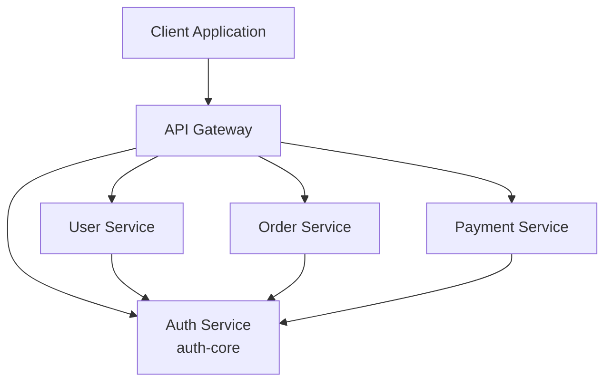
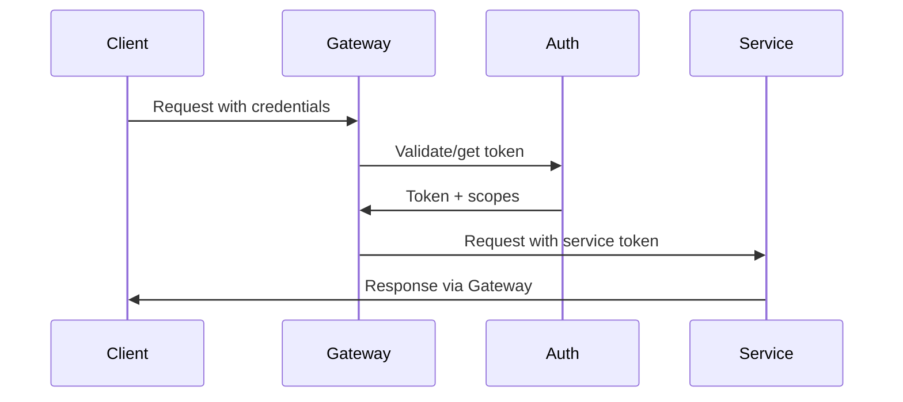

# 🎯 Common Use Cases and Implementation Patterns

This guide covers real-world scenarios where OAuth 2.0 authentication is needed and how to implement them effectively with auth-core.

## Table of Contents

1. [Microservices Authentication](#microservices-authentication)
2. [API Gateway Integration](#api-gateway-integration)
3. [Mobile App Backend](#mobile-app-backend)
4. [Multi-Tenant SaaS](#multi-tenant-saas)
5. [Third-Party API Access](#third-party-api-access)
6. [Content Management Systems](#content-management-systems)
7. [IoT Device Management](#iot-device-management)
8. [Background Job Processing](#background-job-processing)
9. [Enterprise SSO Integration](#enterprise-sso-integration)
10. [Development and Testing](#development-and-testing)

---

## 1. Microservices Authentication

**Scenario**: You have multiple services that need to communicate securely with each other.

### Architecture Pattern



### Implementation

**Auth Service (Central Authority)**:
```rust
use auth_core::prelude::*;

#[tokio::main]
async fn main() -> Result<(), Box<dyn std::error::Error>> {
    let auth_server = AuthServer::minimal()
        // API Gateway - can access all services
        .with_client_scopes("api_gateway", "gateway_secret", &[
            "users:read", "users:write",
            "orders:read", "orders:write", 
            "payments:read", "payments:write"
        ])
        
        // User Service - only user operations
        .with_client_scopes("user_service", "user_service_secret", &[
            "users:read", "users:write",
            "orders:read"  // Can read orders for user data
        ])
        
        // Order Service - order operations + user lookup
        .with_client_scopes("order_service", "order_service_secret", &[
            "orders:read", "orders:write",
            "users:read",  // Can read user data
            "payments:read"  // Can check payment status
        ])
        
        // Payment Service - payment operations only
        .with_client_scopes("payment_service", "payment_service_secret", &[
            "payments:read", "payments:write"
        ])
        
        .with_token_ttl(300) // 5 minutes for service-to-service
        .build()?;

    // Start auth service on port 8001
    let listener = tokio::net::TcpListener::bind("0.0.0.0:8001").await?;
    axum::serve(listener, auth_server.into_router()).await?;
    
    Ok(())
}
```

**User Service (Protected Microservice)**:
```rust
use axum::{
    extract::{Path, State},
    http::{HeaderMap, StatusCode}, 
    response::Json,
    routing::{get, post},
    Router,
};
use serde::{Deserialize, Serialize};

#[derive(Clone)]
struct ServiceState {
    auth_client: AuthClient,
}

#[derive(Serialize, Deserialize)]
struct User {
    id: String,
    name: String,
    email: String,
}

async fn main() -> Result<(), Box<dyn std::error::Error>> {
    let auth_client = AuthClient::new("http://auth-service:8001")
        .with_credentials("user_service", "user_service_secret");
    
    let state = ServiceState { auth_client };
    
    let app = Router::new()
        .route("/users", get(list_users).post(create_user))
        .route("/users/:id", get(get_user))
        .layer(axum::middleware::from_fn_with_state(
            state.clone(),
            validate_service_token
        ))
        .with_state(state);
    
    let listener = tokio::net::TcpListener::bind("0.0.0.0:8002").await?;
    axum::serve(listener, app).await?;
    
    Ok(())
}

// Middleware to validate incoming service tokens
async fn validate_service_token(
    State(state): State<ServiceState>,
    headers: HeaderMap,
    mut request: axum::extract::Request,
    next: axum::middleware::Next,
) -> Result<axum::response::Response, StatusCode> {
    
    let auth_header = headers
        .get("authorization")
        .and_then(|h| h.to_str().ok())
        .ok_or(StatusCode::UNAUTHORIZED)?;

    if !auth_header.starts_with("Bearer ") {
        return Err(StatusCode::UNAUTHORIZED);
    }

    let token = &auth_header[7..];
    
    // Validate token with auth service
    match state.auth_client.introspect_token(token).await {
        Ok(token_info) if token_info.active => {
            request.extensions_mut().insert(token_info);
            Ok(next.run(request).await)
        }
        _ => Err(StatusCode::UNAUTHORIZED)
    }
}

async fn list_users(
    axum::Extension(token_info): axum::Extension<TokenInfo>
) -> Result<Json<Vec<User>>, StatusCode> {
    // Check required scope
    if !token_info.has_scope("users:read") {
        return Err(StatusCode::FORBIDDEN);
    }
    
    // Implementation...
    Ok(Json(vec![]))
}
```

**Service-to-Service Communication**:
```rust
// Order Service calling User Service
async fn get_user_for_order(user_id: &str) -> Result<User, ServiceError> {
    // Get our service token
    let token = auth_client.get_service_token(&["users:read"]).await?;
    
    // Call user service
    let response = http_client
        .get(&format!("http://user-service:8002/users/{}", user_id))
        .bearer_auth(&token.access_token)
        .send()
        .await?;
    
    if response.status() == 200 {
        Ok(response.json::<User>().await?)
    } else {
        Err(ServiceError::UserNotFound)
    }
}
```

### Benefits
- ✅ **Zero Trust**: Every service call is authenticated
- ✅ **Least Privilege**: Services only get needed permissions  
- ✅ **Auditability**: All service communication is logged
- ✅ **Scalability**: Stateless token validation

### Docker Compose Example
```yaml
version: '3.8'
services:
  auth-service:
    build: ./auth-service
    ports:
      - "8001:8001"
    environment:
      - RUST_LOG=info
      
  user-service:
    build: ./user-service
    ports:
      - "8002:8002"
    depends_on:
      - auth-service
    environment:
      - AUTH_SERVICE_URL=http://auth-service:8001
      
  order-service:
    build: ./order-service
    ports:
      - "8003:8003"
    depends_on:
      - auth-service
      - user-service
```

---

## 2. API Gateway Integration

**Scenario**: Centralized entry point that authenticates clients and routes to internal services.

### Architecture



### Implementation

**Gateway with Built-in Auth**:
```rust
use axum::{
    extract::{Path, State},
    http::{HeaderMap, Method, Uri},
    response::Response,
    Router,
};
use tower::ServiceBuilder;
use tower_http::{
    cors::CorsLayer,
    timeout::TimeoutLayer,
};

#[derive(Clone)]
struct GatewayState {
    auth_server: AuthServer,
    service_discovery: ServiceRegistry,
}

async fn main() -> Result<(), Box<dyn std::error::Error>> {
    let auth_server = AuthServer::minimal()
        // Client applications
        .with_client_scopes("web_app", "web_secret", &["api:read", "api:write"])
        .with_client_scopes("mobile_app", "mobile_secret", &["api:read"])
        
        // Internal service tokens
        .with_client_scopes("gateway_to_users", "internal_secret_1", &["users:*"])
        .with_client_scopes("gateway_to_orders", "internal_secret_2", &["orders:*"])
        .build()?;

    let service_registry = ServiceRegistry::new()
        .register("users", "http://user-service:8002")
        .register("orders", "http://order-service:8003")
        .register("payments", "http://payment-service:8004");

    let state = GatewayState {
        auth_server,
        service_discovery: service_registry,
    };

    let app = Router::new()
        // OAuth endpoints
        .nest("/oauth", auth_server.oauth_routes())
        
        // Proxied API routes
        .route("/api/*path", 
            axum::routing::any(proxy_handler)
                .layer(axum::middleware::from_fn_with_state(
                    state.clone(),
                    auth_middleware
                ))
        )
        
        .layer(
            ServiceBuilder::new()
                .layer(TimeoutLayer::new(Duration::from_secs(30)))
                .layer(CorsLayer::permissive())
                .into_inner()
        )
        .with_state(state);

    let listener = tokio::net::TcpListener::bind("0.0.0.0:8000").await?;
    println!("🌐 API Gateway listening on :8000");
    
    axum::serve(listener, app).await?;
    Ok(())
}

async fn proxy_handler(
    State(state): State<GatewayState>,
    method: Method,
    uri: Uri,
    headers: HeaderMap,
    body: axum::body::Body,
    axum::Extension(token_info): axum::Extension<TokenInfo>,
) -> Result<Response, StatusCode> {
    
    // Extract service name from path: /api/users/123 -> "users"
    let path_parts: Vec<&str> = uri.path().trim_start_matches("/api/").split('/').collect();
    let service_name = path_parts.get(0).ok_or(StatusCode::NOT_FOUND)?;
    
    // Get service URL
    let service_url = state.service_discovery
        .get_service_url(service_name)
        .ok_or(StatusCode::NOT_FOUND)?;
    
    // Check if client has permission for this service
    let required_scope = match service_name {
        "users" => "api:read",
        "orders" => if method == Method::GET { "api:read" } else { "api:write" },
        "payments" => "api:write", // Payments always require write
        _ => return Err(StatusCode::NOT_FOUND),
    };
    
    if !token_info.has_scope(required_scope) {
        return Err(StatusCode::FORBIDDEN);
    }
    
    // Get service-to-service token
    let service_token = state.auth_server
        .get_service_token(&format!("gateway_to_{}", service_name), &[&format!("{}:*", service_name)])
        .await
        .map_err(|_| StatusCode::INTERNAL_SERVER_ERROR)?;
    
    // Proxy the request
    let client = reqwest::Client::new();
    let url = format!("{}{}", service_url, uri.path().trim_start_matches("/api"));
    
    let response = client
        .request(method, &url)
        .bearer_auth(&service_token.access_token)
        .headers(headers)
        .body(body)
        .send()
        .await
        .map_err(|_| StatusCode::BAD_GATEWAY)?;
    
    // Convert response
    Ok(Response::builder()
        .status(response.status())
        .body(response.bytes().await.unwrap().into())
        .unwrap())
}
```

### Benefits
- ✅ **Single Entry Point**: All API access through gateway
- ✅ **Centralized Auth**: One place to manage authentication
- ✅ **Rate Limiting**: Apply limits at gateway level
- ✅ **Monitoring**: Single point for observability

---

## 3. Mobile App Backend

**Scenario**: REST API backend for mobile applications with user accounts.

### Implementation

**Mobile-Optimized Auth Server**:
```rust
let auth_server = AuthServer::minimal()
    // Different clients for different platforms
    .with_client_scopes("ios_app", "ios_secret_12345", &[
        "profile:read", "profile:write",
        "posts:read", "posts:write",
        "media:upload"
    ])
    
    .with_client_scopes("android_app", "android_secret_67890", &[
        "profile:read", "profile:write", 
        "posts:read", "posts:write",
        "media:upload"
    ])
    
    // Web dashboard - admin features
    .with_client_scopes("admin_web", "admin_secret_abcde", &[
        "profile:*", "posts:*", "media:*", "admin:*"
    ])
    
    // Longer token lifetime for mobile
    .with_token_ttl(86400) // 24 hours
    .build()?;
```

**Mobile API Endpoints**:
```rust
use axum::{
    extract::{Multipart, Path, Query},
    response::Json,
    routing::{get, post, put},
    Router,
};

// User profile management
async fn get_profile(
    axum::Extension(token_info): axum::Extension<TokenInfo>
) -> Result<Json<UserProfile>, StatusCode> {
    if !token_info.has_scope("profile:read") {
        return Err(StatusCode::FORBIDDEN);
    }
    
    let profile = get_user_profile(&token_info.user_id).await?;
    Ok(Json(profile))
}

async fn update_profile(
    axum::Extension(token_info): axum::Extension<TokenInfo>,
    Json(update): Json<ProfileUpdate>
) -> Result<Json<UserProfile>, StatusCode> {
    if !token_info.has_scope("profile:write") {
        return Err(StatusCode::FORBIDDEN);
    }
    
    let updated_profile = update_user_profile(&token_info.user_id, update).await?;
    Ok(Json(updated_profile))
}

// Social features
async fn create_post(
    axum::Extension(token_info): axum::Extension<TokenInfo>,
    Json(post_data): Json<CreatePostRequest>
) -> Result<Json<Post>, StatusCode> {
    if !token_info.has_scope("posts:write") {
        return Err(StatusCode::FORBIDDEN);
    }
    
    let post = create_user_post(&token_info.user_id, post_data).await?;
    Ok(Json(post))
}

// Media upload
async fn upload_media(
    axum::Extension(token_info): axum::Extension<TokenInfo>,
    mut multipart: Multipart,
) -> Result<Json<MediaUploadResponse>, StatusCode> {
    if !token_info.has_scope("media:upload") {
        return Err(StatusCode::FORBIDDEN);
    }
    
    while let Some(field) = multipart.next_field().await.unwrap() {
        let name = field.name().unwrap().to_string();
        let data = field.bytes().await.unwrap();
        
        if name == "file" {
            let media_url = save_media_file(&token_info.user_id, data).await?;
            return Ok(Json(MediaUploadResponse { url: media_url }));
        }
    }
    
    Err(StatusCode::BAD_REQUEST)
}

// Mobile app routes
fn mobile_api_routes() -> Router<AppState> {
    Router::new()
        .route("/profile", get(get_profile).put(update_profile))
        .route("/posts", get(get_user_posts).post(create_post))
        .route("/posts/:id", get(get_post).put(update_post).delete(delete_post))
        .route("/media/upload", post(upload_media))
        .route("/feed", get(get_user_feed))
        .route("/notifications", get(get_notifications))
}
```

**Mobile Client Code Example (Pseudo-code)**:
```typescript
// Mobile app authentication
class AuthService {
  private token: string | null = null;
  
  async authenticate(): Promise<boolean> {
    const response = await fetch('/oauth/token', {
      method: 'POST',
      headers: { 'Content-Type': 'application/x-www-form-urlencoded' },
      body: 'grant_type=client_credentials&client_id=ios_app&client_secret=ios_secret_12345'
    });
    
    if (response.ok) {
      const data = await response.json();
      this.token = data.access_token;
      // Store securely in keychain/keystore
      await SecureStore.setItemAsync('auth_token', this.token);
      return true;
    }
    
    return false;
  }
  
  async apiCall(endpoint: string, options: RequestInit = {}): Promise<Response> {
    return fetch(endpoint, {
      ...options,
      headers: {
        ...options.headers,
        'Authorization': `Bearer ${this.token}`,
      },
    });
  }
}
```

### Benefits
- ✅ **Mobile-Optimized**: Longer token lifetimes, efficient endpoints
- ✅ **Platform Separation**: Different clients for iOS/Android
- ✅ **Media Handling**: Secure file upload capabilities
- ✅ **Social Features**: Posts, feeds, notifications

---

## 4. Multi-Tenant SaaS

**Scenario**: SaaS application where each customer (tenant) has isolated data and users.

### Architecture

```rust
use auth_core::prelude::*;

// Multi-tenant auth server
async fn create_tenant_auth() -> Result<AuthServer, AuthError> {
    let server = AuthServer::minimal();
    
    // Each tenant gets their own client credentials
    for tenant in get_all_tenants().await? {
        server = server.with_client_scopes(
            &format!("tenant_{}", tenant.id),
            &tenant.api_secret,
            &[
                "tenant:read", "tenant:write",
                "users:read", "users:write",
                "billing:read"
            ]
        );
        
        // Admin client for each tenant
        server = server.with_client_scopes(
            &format!("tenant_{}_admin", tenant.id), 
            &tenant.admin_secret,
            &[
                "tenant:*", "users:*", "billing:*", "admin:*"
            ]
        );
    }
    
    server.build()
}
```

**Tenant-Aware Middleware**:
```rust
async fn tenant_middleware(
    State(state): State<AppState>,
    headers: HeaderMap,
    mut request: axum::extract::Request,
    next: axum::middleware::Next,
) -> Result<axum::response::Response, StatusCode> {
    
    // Validate token first
    let token_info = validate_token(&headers).await?;
    
    // Extract tenant ID from client ID
    let tenant_id = if token_info.client_id.starts_with("tenant_") {
        let parts: Vec<&str> = token_info.client_id.split('_').collect();
        parts.get(1).ok_or(StatusCode::UNAUTHORIZED)?.to_string()
    } else {
        return Err(StatusCode::UNAUTHORIZED);
    };
    
    // Verify tenant exists and is active
    let tenant = state.tenant_store
        .get_tenant(&tenant_id)
        .await
        .ok_or(StatusCode::NOT_FOUND)?;
        
    if !tenant.is_active {
        return Err(StatusCode::FORBIDDEN);
    }
    
    // Add tenant context to request
    request.extensions_mut().insert(TenantContext {
        tenant_id,
        tenant,
        token_info,
    });
    
    Ok(next.run(request).await)
}
```

**Tenant-Scoped API Endpoints**:
```rust
// Get users for current tenant only
async fn list_tenant_users(
    axum::Extension(ctx): axum::Extension<TenantContext>
) -> Result<Json<Vec<User>>, StatusCode> {
    
    if !ctx.token_info.has_scope("users:read") {
        return Err(StatusCode::FORBIDDEN);
    }
    
    // Query is automatically scoped to tenant
    let users = ctx.tenant
        .user_store
        .list_users()
        .await?;
    
    Ok(Json(users))
}

// Create user in current tenant
async fn create_tenant_user(
    axum::Extension(ctx): axum::Extension<TenantContext>,
    Json(user_data): Json<CreateUserRequest>
) -> Result<Json<User>, StatusCode> {
    
    if !ctx.token_info.has_scope("users:write") {
        return Err(StatusCode::FORBIDDEN);
    }
    
    // Enforce tenant resource limits
    if ctx.tenant.user_count >= ctx.tenant.user_limit {
        return Err(StatusCode::PAYMENT_REQUIRED);
    }
    
    let user = ctx.tenant
        .user_store
        .create_user(user_data)
        .await?;
    
    Ok(Json(user))
}

// Billing endpoint (admin only)
async fn get_tenant_billing(
    axum::Extension(ctx): axum::Extension<TenantContext>
) -> Result<Json<BillingInfo>, StatusCode> {
    
    if !ctx.token_info.has_scope("billing:read") {
        return Err(StatusCode::FORBIDDEN);
    }
    
    let billing = ctx.tenant
        .billing_store
        .get_billing_info()
        .await?;
    
    Ok(Json(billing))
}
```

### Benefits
- ✅ **Data Isolation**: Each tenant's data is completely separate
- ✅ **Resource Limits**: Per-tenant quotas and limits
- ✅ **Billing Integration**: Tenant-aware usage tracking
- ✅ **Admin Separation**: Tenant admins can't see other tenants

---

## 5. Third-Party API Access

**Scenario**: Allow third-party developers to access your API.

### Developer Portal Integration

```rust
// OAuth server for external developers
let auth_server = AuthServer::minimal()
    // Different scopes for different access levels
    .with_scopes(&[
        "api:read:basic",      // Basic read access
        "api:read:extended",   // Extended data access
        "api:write:basic",     // Basic write operations
        "api:write:extended",  // Full write access
        "webhooks:manage",     // Webhook management
        "analytics:read"       // Usage analytics
    ])
    
    // Developer registration creates clients dynamically
    .with_dynamic_client_registration(true)
    .build()?;

// Developer app management
async fn register_developer_app(
    developer_id: &str,
    app_name: &str,
    requested_scopes: &[&str]
) -> Result<ClientCredentials, RegistrationError> {
    
    // Validate developer account
    let developer = get_developer_account(developer_id).await?;
    if !developer.is_verified {
        return Err(RegistrationError::DeveloperNotVerified);
    }
    
    // Check scope permissions
    let allowed_scopes = get_developer_allowed_scopes(&developer).await?;
    let granted_scopes: Vec<&str> = requested_scopes
        .iter()
        .filter(|scope| allowed_scopes.contains(*scope))
        .cloned()
        .collect();
    
    // Generate client credentials
    let client_id = format!("dev_{}_{}", developer_id, generate_id());
    let client_secret = generate_secure_secret(32);
    
    // Register with auth server
    auth_server.register_client(
        &client_id,
        &client_secret,
        &granted_scopes
    ).await?;
    
    // Store in developer database
    store_developer_app(DeveloperApp {
        client_id: client_id.clone(),
        client_secret: client_secret.clone(),
        developer_id: developer_id.to_string(),
        app_name: app_name.to_string(),
        granted_scopes,
        created_at: Utc::now(),
        is_active: true,
    }).await?;
    
    Ok(ClientCredentials {
        client_id,
        client_secret,
    })
}
```

**Rate Limiting by Developer**:
```rust
async fn developer_rate_limit_middleware(
    State(state): State<AppState>,
    headers: HeaderMap,
    mut request: axum::extract::Request,
    next: axum::middleware::Next,
) -> Result<axum::response::Response, StatusCode> {
    
    let token_info = validate_token(&headers).await?;
    
    // Extract developer ID from client ID
    let developer_id = if token_info.client_id.starts_with("dev_") {
        let parts: Vec<&str> = token_info.client_id.split('_').collect();
        parts.get(1).ok_or(StatusCode::UNAUTHORIZED)?.to_string()
    } else {
        return Err(StatusCode::UNAUTHORIZED);
    };
    
    // Get developer's rate limit
    let developer = state.developer_store
        .get_developer(&developer_id)
        .await
        .ok_or(StatusCode::NOT_FOUND)?;
    
    let limit = match developer.tier {
        DeveloperTier::Free => RateLimit::new(1000, Duration::from_secs(3600)), // 1k/hour
        DeveloperTier::Pro => RateLimit::new(10000, Duration::from_secs(3600)),  // 10k/hour
        DeveloperTier::Enterprise => RateLimit::new(100000, Duration::from_secs(3600)), // 100k/hour
    };
    
    // Apply rate limit
    if !state.rate_limiter.check_limit(&developer_id, &limit).await {
        return Err(StatusCode::TOO_MANY_REQUESTS);
    }
    
    // Add developer context
    request.extensions_mut().insert(DeveloperContext {
        developer_id,
        developer,
        token_info,
    });
    
    Ok(next.run(request).await)
}
```

**Usage Analytics**:
```rust
async fn api_analytics_middleware(
    axum::Extension(ctx): axum::Extension<DeveloperContext>,
    request: axum::extract::Request,
    next: axum::middleware::Next,
) -> axum::response::Response {
    
    let start_time = Instant::now();
    let method = request.method().clone();
    let path = request.uri().path().to_string();
    
    let response = next.run(request).await;
    
    let duration = start_time.elapsed();
    let status = response.status();
    
    // Record API usage
    tokio::spawn(async move {
        record_api_usage(ApiUsageRecord {
            developer_id: ctx.developer_id,
            client_id: ctx.token_info.client_id,
            method: method.to_string(),
            path,
            status_code: status.as_u16(),
            duration_ms: duration.as_millis() as u32,
            timestamp: Utc::now(),
        }).await;
    });
    
    response
}
```

### Benefits
- ✅ **Developer-Friendly**: Self-service app registration
- ✅ **Tiered Access**: Different limits for different tiers
- ✅ **Analytics**: Detailed usage tracking
- ✅ **Monetization**: Usage-based billing support

---

## 6. Content Management Systems

**Scenario**: CMS with different user roles and content permissions.

### Role-Based Access Control

```rust
let auth_server = AuthServer::minimal()
    // Content roles
    .with_client_scopes("author_app", "author_secret", &[
        "content:read", "content:write:own",
        "media:upload", "drafts:manage"
    ])
    
    .with_client_scopes("editor_app", "editor_secret", &[
        "content:read", "content:write", "content:publish",
        "media:read", "media:write", "users:read"
    ])
    
    .with_client_scopes("admin_app", "admin_secret", &[
        "content:*", "media:*", "users:*", 
        "settings:*", "analytics:*"
    ])
    
    // Public API (read-only)
    .with_client_scopes("public_api", "public_secret", &[
        "content:read:published"
    ])
    
    .build()?;
```

**Content Permission Logic**:
```rust
async fn get_article(
    Path(article_id): Path<String>,
    axum::Extension(token_info): axum::Extension<TokenInfo>
) -> Result<Json<Article>, StatusCode> {
    
    let article = get_article_by_id(&article_id).await
        .ok_or(StatusCode::NOT_FOUND)?;
    
    // Check permissions based on article status and user role
    let can_access = match article.status {
        ArticleStatus::Published => {
            // Published articles: anyone with read access
            token_info.has_scope("content:read") || 
            token_info.has_scope("content:read:published")
        },
        ArticleStatus::Draft => {
            // Drafts: only authors (own), editors, or admins
            if token_info.has_scope("content:read") {
                true // Editors and admins
            } else if token_info.has_scope("content:write:own") {
                article.author_id == token_info.user_id // Own drafts only
            } else {
                false
            }
        },
        ArticleStatus::Archived => {
            // Archived: only editors and admins
            token_info.has_scope("content:read") && 
            !token_info.has_scope_only("content:write:own")
        }
    };
    
    if !can_access {
        return Err(StatusCode::FORBIDDEN);
    }
    
    Ok(Json(article))
}

async fn publish_article(
    Path(article_id): Path<String>,
    axum::Extension(token_info): axum::Extension<TokenInfo>
) -> Result<Json<Article>, StatusCode> {
    
    // Only editors and admins can publish
    if !token_info.has_scope("content:publish") {
        return Err(StatusCode::FORBIDDEN);
    }
    
    let mut article = get_article_by_id(&article_id).await
        .ok_or(StatusCode::NOT_FOUND)?;
    
    // Validate article is ready for publishing
    if article.title.is_empty() || article.content.is_empty() {
        return Err(StatusCode::BAD_REQUEST);
    }
    
    // Publish the article
    article.status = ArticleStatus::Published;
    article.published_at = Some(Utc::now());
    article.published_by = Some(token_info.user_id.clone());
    
    save_article(&article).await?;
    
    // Clear CDN cache
    invalidate_content_cache(&article_id).await;
    
    Ok(Json(article))
}
```

**Media Management**:
```rust
async fn upload_media(
    mut multipart: Multipart,
    axum::Extension(token_info): axum::Extension<TokenInfo>
) -> Result<Json<MediaFile>, StatusCode> {
    
    if !token_info.has_scope("media:upload") && !token_info.has_scope("media:write") {
        return Err(StatusCode::FORBIDDEN);
    }
    
    while let Some(field) = multipart.next_field().await.unwrap() {
        let name = field.name().unwrap().to_string();
        let filename = field.file_name().unwrap_or("unknown").to_string();
        let content_type = field.content_type().unwrap_or("application/octet-stream").to_string();
        let data = field.bytes().await.unwrap();
        
        if name == "file" {
            // Validate file type and size
            validate_media_file(&content_type, data.len())?;
            
            // Save file
            let media_file = save_media_file(MediaFile {
                id: generate_id(),
                filename,
                content_type,
                size: data.len(),
                uploaded_by: token_info.user_id.clone(),
                uploaded_at: Utc::now(),
                alt_text: None,
            }, data).await?;
            
            return Ok(Json(media_file));
        }
    }
    
    Err(StatusCode::BAD_REQUEST)
}
```

### Benefits
- ✅ **Role Separation**: Clear permissions for different user types
- ✅ **Content Workflow**: Draft → Review → Publish workflow
- ✅ **Media Management**: Secure file upload and management
- ✅ **Public API**: Read-only access for frontend applications

---

## 7. IoT Device Management

**Scenario**: Managing IoT devices with device authentication and command authorization.

### Device Registration

```rust
let auth_server = AuthServer::minimal()
    // Device types
    .with_client_scopes("sensor_device", "sensor_secret_template", &[
        "telemetry:send", "config:read"
    ])
    
    .with_client_scopes("actuator_device", "actuator_secret_template", &[
        "commands:receive", "status:send", "config:read"
    ])
    
    // Management systems
    .with_client_scopes("device_manager", "manager_secret", &[
        "devices:read", "devices:write", "devices:control",
        "telemetry:read", "commands:send"
    ])
    
    .with_client_scopes("monitoring_system", "monitor_secret", &[
        "telemetry:read", "devices:read", "alerts:read"
    ])
    
    .build()?;

// Device registration endpoint
async fn register_device(
    Json(request): Json<DeviceRegistrationRequest>,
    axum::Extension(token_info): axum::Extension<TokenInfo>
) -> Result<Json<DeviceCredentials>, StatusCode> {
    
    // Only device managers can register devices
    if !token_info.has_scope("devices:write") {
        return Err(StatusCode::FORBIDDEN);
    }
    
    // Generate device-specific credentials
    let device_id = format!("device_{}_{}", request.device_type, generate_id());
    let device_secret = generate_secure_secret(32);
    
    // Determine scopes based on device type
    let scopes = match request.device_type.as_str() {
        "sensor" => vec!["telemetry:send", "config:read"],
        "actuator" => vec!["commands:receive", "status:send", "config:read"],
        "gateway" => vec!["telemetry:send", "telemetry:relay", "config:read"],
        _ => return Err(StatusCode::BAD_REQUEST),
    };
    
    // Register with auth server
    auth_server.register_client(&device_id, &device_secret, &scopes).await?;
    
    // Store device metadata
    let device = Device {
        id: device_id.clone(),
        device_type: request.device_type,
        name: request.name,
        location: request.location,
        registered_at: Utc::now(),
        last_seen: None,
        is_active: true,
    };
    
    store_device(&device).await?;
    
    Ok(Json(DeviceCredentials {
        device_id,
        device_secret,
        scopes,
    }))
}
```

**Device Communication**:
```rust
// Telemetry endpoint for sensors
async fn receive_telemetry(
    Json(telemetry): Json<TelemetryData>,
    axum::Extension(token_info): axum::Extension<TokenInfo>
) -> Result<StatusCode, StatusCode> {
    
    if !token_info.has_scope("telemetry:send") {
        return Err(StatusCode::FORBIDDEN);
    }
    
    // Extract device ID from client ID
    let device_id = token_info.client_id.clone();
    
    // Update device last seen
    update_device_last_seen(&device_id, Utc::now()).await;
    
    // Validate telemetry data
    validate_telemetry(&telemetry)?;
    
    // Store telemetry
    let record = TelemetryRecord {
        device_id,
        timestamp: telemetry.timestamp.unwrap_or_else(Utc::now),
        data: telemetry.data,
        received_at: Utc::now(),
    };
    
    store_telemetry(&record).await?;
    
    // Process real-time rules
    tokio::spawn(async move {
        process_telemetry_rules(&record).await;
    });
    
    Ok(StatusCode::ACCEPTED)
}

// Command endpoint for actuators
async fn send_device_command(
    Path(device_id): Path<String>,
    Json(command): Json<DeviceCommand>,
    axum::Extension(token_info): axum::Extension<TokenInfo>
) -> Result<Json<CommandResponse>, StatusCode> {
    
    if !token_info.has_scope("commands:send") {
        return Err(StatusCode::FORBIDDEN);
    }
    
    // Verify device exists and can receive commands
    let device = get_device(&device_id).await
        .ok_or(StatusCode::NOT_FOUND)?;
        
    if !device.can_receive_commands() {
        return Err(StatusCode::BAD_REQUEST);
    }
    
    // Create command record
    let command_record = CommandRecord {
        id: generate_id(),
        device_id: device_id.clone(),
        command: command.clone(),
        sent_by: token_info.user_id.clone(),
        sent_at: Utc::now(),
        status: CommandStatus::Pending,
    };
    
    store_command(&command_record).await?;
    
    // Send command to device (via WebSocket, MQTT, etc.)
    send_command_to_device(&device_id, &command).await?;
    
    Ok(Json(CommandResponse {
        command_id: command_record.id,
        status: CommandStatus::Pending,
        sent_at: command_record.sent_at,
    }))
}
```

**Device Status Monitoring**:
```rust
async fn get_device_status(
    Path(device_id): Path<String>,
    axum::Extension(token_info): axum::Extension<TokenInfo>
) -> Result<Json<DeviceStatus>, StatusCode> {
    
    if !token_info.has_scope("devices:read") {
        return Err(StatusCode::FORBIDDEN);
    }
    
    let device = get_device(&device_id).await
        .ok_or(StatusCode::NOT_FOUND)?;
        
    let latest_telemetry = get_latest_telemetry(&device_id).await;
    let pending_commands = get_pending_commands(&device_id).await;
    
    let status = DeviceStatus {
        device_id: device.id,
        name: device.name,
        is_online: is_device_online(&device),
        last_seen: device.last_seen,
        latest_telemetry,
        pending_commands: pending_commands.len(),
        battery_level: extract_battery_level(&latest_telemetry),
        signal_strength: extract_signal_strength(&latest_telemetry),
    };
    
    Ok(Json(status))
}
```

### Benefits
- ✅ **Device Authentication**: Each device has unique credentials
- ✅ **Command Authorization**: Control who can send commands
- ✅ **Telemetry Collection**: Secure data ingestion
- ✅ **Device Lifecycle**: Registration to decommissioning

---

## 8. Background Job Processing

**Scenario**: Secure job queue system with different worker permissions.

### Job Queue Authentication

```rust
let auth_server = AuthServer::minimal()
    // Job submitters
    .with_client_scopes("web_app", "web_secret", &[
        "jobs:submit:email", "jobs:submit:export"
    ])
    
    .with_client_scopes("api_service", "api_secret", &[
        "jobs:submit:*", "jobs:status:read"
    ])
    
    // Workers with different capabilities
    .with_client_scopes("email_worker", "email_worker_secret", &[
        "jobs:process:email", "jobs:update_status"
    ])
    
    .with_client_scopes("export_worker", "export_worker_secret", &[
        "jobs:process:export", "jobs:update_status", "storage:write"
    ])
    
    .with_client_scopes("cleanup_worker", "cleanup_worker_secret", &[
        "jobs:process:cleanup", "jobs:update_status", "storage:delete"
    ])
    
    // Job monitoring
    .with_client_scopes("job_monitor", "monitor_secret", &[
        "jobs:read", "jobs:stats", "workers:status"
    ])
    
    .build()?;
```

**Job Submission**:
```rust
async fn submit_job(
    Json(job_request): Json<JobRequest>,
    axum::Extension(token_info): axum::Extension<TokenInfo>
) -> Result<Json<JobResponse>, StatusCode> {
    
    // Check if client can submit this type of job
    let required_scope = format!("jobs:submit:{}", job_request.job_type);
    if !token_info.has_scope(&required_scope) && !token_info.has_scope("jobs:submit:*") {
        return Err(StatusCode::FORBIDDEN);
    }
    
    // Validate job parameters
    validate_job_request(&job_request)?;
    
    // Create job record
    let job = Job {
        id: generate_job_id(),
        job_type: job_request.job_type,
        parameters: job_request.parameters,
        submitted_by: token_info.client_id.clone(),
        submitted_at: Utc::now(),
        status: JobStatus::Queued,
        priority: job_request.priority.unwrap_or(Priority::Normal),
        retry_count: 0,
        max_retries: 3,
    };
    
    // Queue the job
    queue_job(&job).await?;
    
    Ok(Json(JobResponse {
        job_id: job.id,
        status: job.status,
        submitted_at: job.submitted_at,
    }))
}
```

**Worker Implementation**:
```rust
struct JobWorker {
    worker_type: String,
    auth_client: AuthClient,
    job_queue: JobQueue,
}

impl JobWorker {
    async fn run(&self) -> Result<(), WorkerError> {
        // Get worker token
        let token = self.auth_client.get_service_token(&[
            &format!("jobs:process:{}", self.worker_type),
            "jobs:update_status"
        ]).await?;
        
        loop {
            // Poll for jobs
            let job = self.job_queue
                .poll_job(&self.worker_type)
                .await?;
                
            if let Some(job) = job {
                self.process_job(job, &token).await?;
            } else {
                // No jobs available, wait
                tokio::time::sleep(Duration::from_secs(5)).await;
            }
        }
    }
    
    async fn process_job(&self, mut job: Job, token: &Token) -> Result<(), WorkerError> {
        println!("Processing job {} of type {}", job.id, job.job_type);
        
        // Update job status to processing
        self.update_job_status(&job.id, JobStatus::Processing, token).await?;
        
        let result = match job.job_type.as_str() {
            "email" => self.process_email_job(&job).await,
            "export" => self.process_export_job(&job).await,
            "cleanup" => self.process_cleanup_job(&job).await,
            _ => Err(WorkerError::UnsupportedJobType),
        };
        
        match result {
            Ok(_) => {
                self.update_job_status(&job.id, JobStatus::Completed, token).await?;
                println!("Job {} completed successfully", job.id);
            }
            Err(e) => {
                job.retry_count += 1;
                if job.retry_count < job.max_retries {
                    self.update_job_status(&job.id, JobStatus::Queued, token).await?;
                    self.job_queue.requeue_job(&job).await?;
                } else {
                    self.update_job_status(&job.id, JobStatus::Failed, token).await?;
                }
                println!("Job {} failed: {:?}", job.id, e);
            }
        }
        
        Ok(())
    }
    
    async fn update_job_status(&self, job_id: &str, status: JobStatus, token: &Token) -> Result<(), WorkerError> {
        let client = reqwest::Client::new();
        
        let response = client
            .put(&format!("http://job-api:8000/jobs/{}/status", job_id))
            .bearer_auth(&token.access_token)
            .json(&UpdateJobStatusRequest { status })
            .send()
            .await?;
            
        if !response.status().is_success() {
            return Err(WorkerError::StatusUpdateFailed);
        }
        
        Ok(())
    }
}
```

**Job Monitoring**:
```rust
async fn get_job_stats(
    axum::Extension(token_info): axum::Extension<TokenInfo>
) -> Result<Json<JobStats>, StatusCode> {
    
    if !token_info.has_scope("jobs:stats") {
        return Err(StatusCode::FORBIDDEN);
    }
    
    let stats = JobStats {
        total_jobs: count_jobs_by_status(None).await,
        queued_jobs: count_jobs_by_status(Some(JobStatus::Queued)).await,
        processing_jobs: count_jobs_by_status(Some(JobStatus::Processing)).await,
        completed_jobs: count_jobs_by_status(Some(JobStatus::Completed)).await,
        failed_jobs: count_jobs_by_status(Some(JobStatus::Failed)).await,
        worker_status: get_worker_status().await,
        job_types: get_job_type_distribution().await,
    };
    
    Ok(Json(stats))
}

async fn get_worker_status() -> Vec<WorkerStatus> {
    // Implementation to check worker health
    vec![]
}
```

### Benefits
- ✅ **Worker Isolation**: Each worker type has specific permissions
- ✅ **Job Security**: Only authorized clients can submit jobs
- ✅ **Monitoring**: Comprehensive job and worker monitoring
- ✅ **Fault Tolerance**: Retry logic and error handling

---

## Development and Testing

### Local Development Setup

**Docker Compose for Development**:
```yaml
version: '3.8'
services:
  auth-service:
    build: ./auth-service
    ports:
      - "8001:8001"
    environment:
      - RUST_LOG=debug
      - AUTH_TOKEN_TTL=3600
    volumes:
      - ./config:/app/config
      
  api-service:
    build: ./api-service  
    ports:
      - "8002:8002"
    depends_on:
      - auth-service
    environment:
      - AUTH_SERVICE_URL=http://auth-service:8001
      - RUST_LOG=info
      
  redis:
    image: redis:7-alpine
    ports:
      - "6379:6379"
      
  postgres:
    image: postgres:15
    ports:
      - "5432:5432"
    environment:
      - POSTGRES_DB=authdb
      - POSTGRES_USER=auth
      - POSTGRES_PASSWORD=authpass
    volumes:
      - postgres_data:/var/lib/postgresql/data

volumes:
  postgres_data:
```

**Test Configuration**:
```rust
// Test helper for setting up auth server
pub fn create_test_auth_server() -> AuthServer {
    AuthServer::minimal()
        .with_client_scopes("test_client", "test_secret", &["test:*"])
        .with_client_scopes("limited_client", "limited_secret", &["read:only"])
        .with_token_ttl(300) // Short TTL for tests
        .build()
        .expect("Failed to create test auth server")
}

// Integration test example
#[tokio::test]
async fn test_full_oauth_flow() {
    let auth_server = create_test_auth_server();
    
    // Start test server
    let listener = tokio::net::TcpListener::bind("127.0.0.1:0").await.unwrap();
    let addr = listener.local_addr().unwrap();
    
    tokio::spawn(async move {
        axum::serve(listener, auth_server.into_router()).await.unwrap();
    });
    
    let client = reqwest::Client::new();
    
    // 1. Get token
    let token_response = client
        .post(format!("http://{}/oauth/token", addr))
        .form(&[
            ("grant_type", "client_credentials"),
            ("client_id", "test_client"), 
            ("client_secret", "test_secret"),
            ("scope", "test:read test:write")
        ])
        .send()
        .await
        .unwrap();
        
    assert_eq!(token_response.status(), 200);
    
    let token_data: serde_json::Value = token_response.json().await.unwrap();
    let access_token = token_data["access_token"].as_str().unwrap();
    
    // 2. Use token
    let api_response = client
        .get(format!("http://{}/api/test", addr))
        .bearer_auth(access_token)
        .send()
        .await
        .unwrap();
        
    assert_eq!(api_response.status(), 200);
}
```

### Testing Patterns

**Scope Testing**:
```rust
#[tokio::test] 
async fn test_scope_enforcement() {
    let server = create_test_auth_server();
    
    // Get limited token
    let limited_token = get_test_token(&server, "limited_client", &["read:only"]).await;
    
    // Should succeed for read
    let read_response = test_api_call(&server, &limited_token, "GET", "/api/data").await;
    assert_eq!(read_response.status(), 200);
    
    // Should fail for write
    let write_response = test_api_call(&server, &limited_token, "POST", "/api/data").await;
    assert_eq!(write_response.status(), 403);
}
```

**Performance Testing**:
```rust
#[tokio::test]
async fn test_token_generation_performance() {
    let server = create_test_auth_server();
    let client = reqwest::Client::new();
    
    let start = Instant::now();
    let mut handles = vec![];
    
    // Generate 100 tokens concurrently
    for _ in 0..100 {
        let client = client.clone();
        let handle = tokio::spawn(async move {
            client
                .post("http://localhost:8001/oauth/token")
                .form(&[
                    ("grant_type", "client_credentials"),
                    ("client_id", "test_client"),
                    ("client_secret", "test_secret"),
                ])
                .send()
                .await
        });
        handles.push(handle);
    }
    
    let results = futures::future::join_all(handles).await;
    let duration = start.elapsed();
    
    let success_count = results.iter()
        .filter(|r| r.as_ref().unwrap().as_ref().unwrap().status() == 200)
        .count();
        
    assert_eq!(success_count, 100);
    assert!(duration < Duration::from_secs(5)); // Should be fast
    
    println!("Generated 100 tokens in {:?}", duration);
}
```

This comprehensive guide provides real-world patterns and implementations for the most common OAuth 2.0 use cases, making auth-core accessible for various application architectures and requirements.