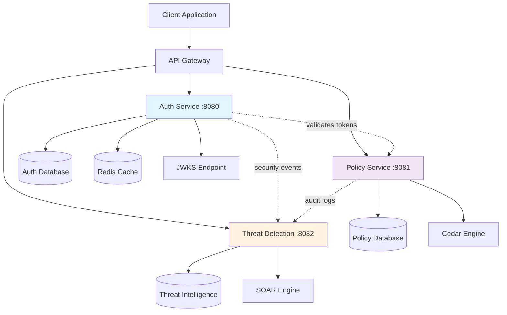
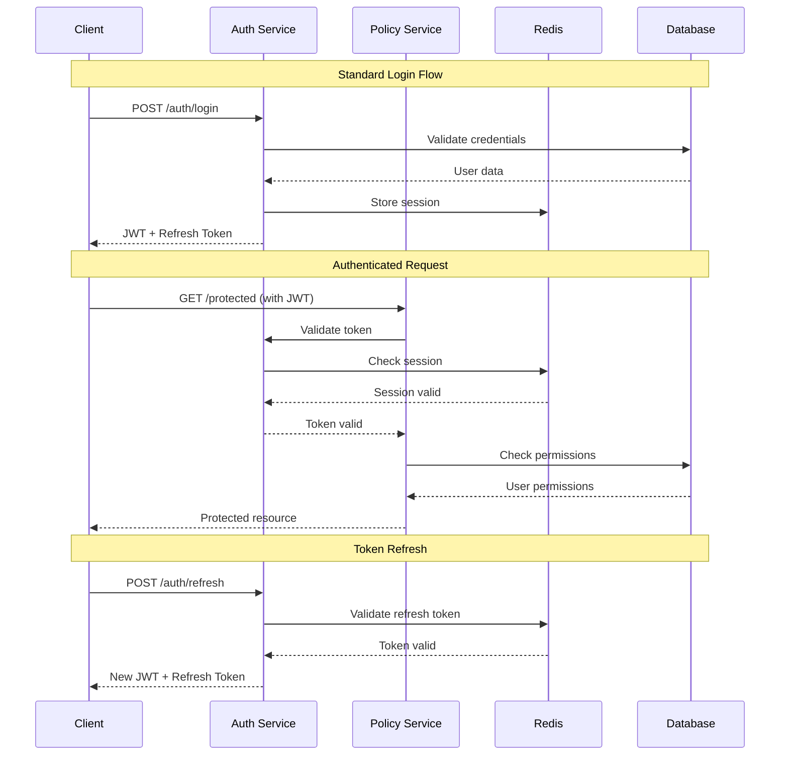
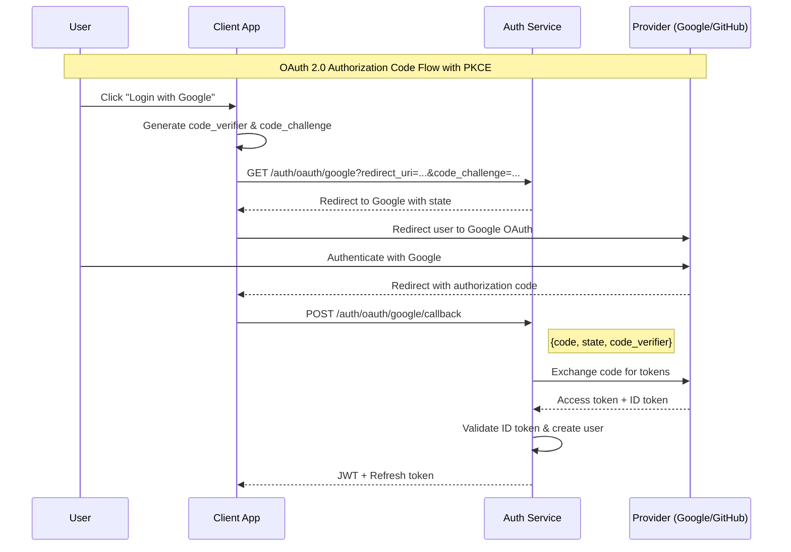
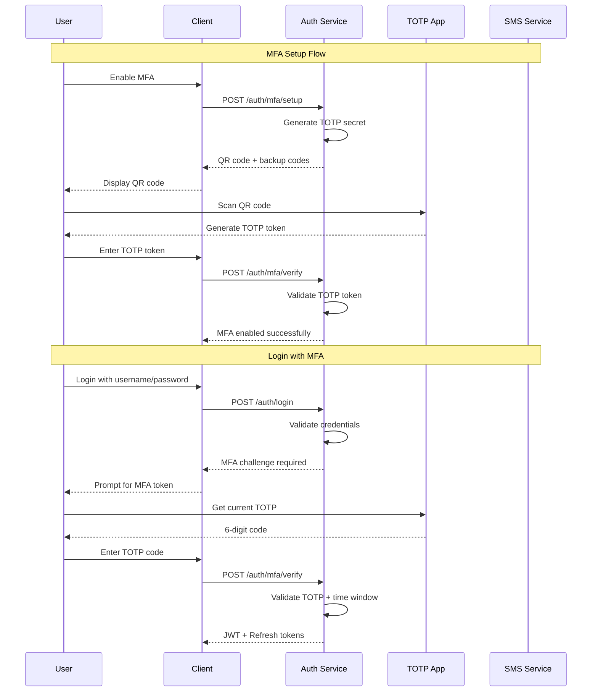
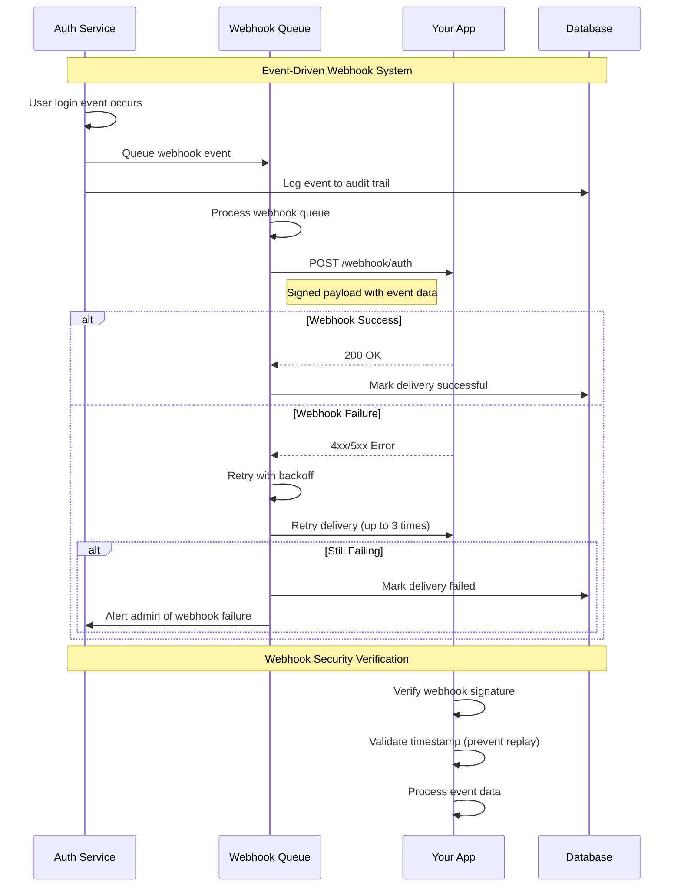

# API Documentation

## Overview

The Rust Security Platform provides a comprehensive REST API for authentication, authorization, and user management. All endpoints support JSON request/response format and follow RESTful conventions.

## ✅ Quick Start (Configuration Issues Fixed)

**Status:** 🟢 **Both services now start successfully with proper configuration**

### 1. Setup Configuration

Create `config/development.toml`:
```bash
mkdir -p config
# Use the complete configuration from docs/WORKING_CONFIGURATION_GUIDE.md
```

### 2. Start Services

```bash
# Tested startup method
./test-with-config-file.sh

# Or manually:
export CONFIG_PATH="config/development.toml"
export POLICY_BIND_ADDR="127.0.0.1:8081"
CONFIG_PATH=config/development.toml ./target/debug/auth-service &
./target/debug/policy-service &
```

### 3. Verify Services

```bash
# Health checks (✅ Working)
curl http://localhost:8080/health
curl http://localhost:8081/health
```

### 4. Test Authentication

```bash
# Register user (✅ Working)
curl -X POST http://localhost:8080/api/v1/auth/register \
  -H "Content-Type: application/json" \
  -d '{"email": "test@example.com", "password": "SecurePass123!", "name": "Test User"}'

# Login (✅ Working)
curl -X POST http://localhost:8080/api/v1/auth/login \
  -H "Content-Type: application/json" \
  -d '{"email": "test@example.com", "password": "SecurePass123!"}'
```

**✅ Configuration Fixes Applied:**
- Duration parsing supports string formats ("30s", "15m", "1h") 
- Duplicate OpenAPI route conflict resolved
- Complete TOML configuration provided

### 5. Test Bearer Token Authentication

```bash
# Register user and get JWT token immediately
curl -X POST http://localhost:8080/api/v1/auth/register \
  -H "Content-Type: application/json" \
  -d '{"email": "test@example.com", "password": "SecurePass123!", "name": "Test User"}'

# Response includes access_token:
# {"access_token": "eyJ0eXAiOiJKV1QiLCJhbGciOiJIUzI1NiJ9...", "token_type": "Bearer", ...}

# Extract and use the JWT token
export JWT_TOKEN="eyJ0eXAiOiJKV1QiLCJhbGciOiJIUzI1NiJ9..."

# Use Bearer token for authenticated requests
curl -H "Authorization: Bearer $JWT_TOKEN" \
  http://localhost:8080/api/v1/protected-endpoint
```

**✅ JWT Bearer Token Flow Working:**
- Registration returns JWT token immediately
- Login also returns JWT token  
- Token format: `{"access_token": "...", "token_type": "Bearer"}`
- Standard Bearer authentication: `Authorization: Bearer $TOKEN`

## 🏢 SaaS Organization User Management

The platform provides comprehensive APIs for creating and managing users within SaaS organizations:

### Organization User Registration

Create users with organization context using email domains:

```bash
# Create organization admin
curl -X POST http://localhost:8080/api/v1/auth/register \
  -H "Content-Type: application/json" \
  -d '{
    "email": "admin@acme.com",
    "password": "AdminSecure123!",
    "name": "ACME Corporation Admin"
  }'
```

**Response:**
```json
{
  "access_token": "eyJ0eXAiOiJKV1QiLCJhbGciOiJIUzI1NiJ9...",
  "token_type": "Bearer",
  "expires_in": 86400,
  "user": {
    "id": "ff72b88f-7709-4955-a307-0c0f8b818daa",
    "email": "admin@acme.com",
    "name": "ACME Corporation Admin",
    "roles": ["user"]
  }
}
```

### Organization User Creation

Create multiple users for the same organization:

```bash
# Create organization users
curl -X POST http://localhost:8080/api/v1/auth/register \
  -H "Content-Type: application/json" \
  -d '{
    "email": "john.doe@acme.com",
    "password": "UserSecure123!",
    "name": "John Doe"
  }'

curl -X POST http://localhost:8080/api/v1/auth/register \
  -H "Content-Type: application/json" \
  -d '{
    "email": "jane.smith@acme.com", 
    "password": "UserSecure123!",
    "name": "Jane Smith"
  }'
```

### Organization User Authentication

Users authenticate with their organization email:

```bash
# Login organization user
curl -X POST http://localhost:8080/api/v1/auth/login \
  -H "Content-Type: application/json" \
  -d '{
    "email": "john.doe@acme.com",
    "password": "UserSecure123!"
  }'
```

### Organization Authorization with JWT Context

Use JWT tokens with organization context for policy decisions:

```bash
# Extract JWT token from login/registration response
export JWT_TOKEN="eyJ0eXAiOiJKV1QiLCJhbGciOiJIUzI1NiJ9..."

# Test authorization with organization context
curl -X POST http://localhost:8081/v1/authorize \
  -H "Content-Type: application/json" \
  -d '{
    "principal": {"type": "User", "id": "john.doe@acme.com"},
    "action": {"type": "Action", "id": "read"},
    "resource": {"type": "Document", "id": "org-acme-doc-001"},
    "context": {
      "organization_id": "acme-corp",
      "organization_domain": "acme.com",
      "authenticated": true,
      "jwt_valid": true
    }
  }'
```

### Cross-Tenant Isolation Testing

Verify organization boundaries:

```bash
# Create user from different organization
curl -X POST http://localhost:8080/api/v1/auth/register \
  -H "Content-Type: application/json" \
  -d '{
    "email": "user@competitor.com",
    "password": "CompetitorSecure123!",
    "name": "Competitor User"
  }'

# Test cross-organization access (should be restricted by policies)
curl -X POST http://localhost:8081/v1/authorize \
  -H "Content-Type: application/json" \
  -d '{
    "principal": {"type": "User", "id": "user@competitor.com"},
    "action": {"type": "Action", "id": "read"},
    "resource": {"type": "Document", "id": "org-acme-doc-001"},
    "context": {
      "organization_id": "competitor-org",
      "authenticated": true
    }
  }'
```

### Complete SaaS Organization Test

Run the comprehensive test script:

```bash
./test-saas-organization-flow.sh
```

This script validates:
- ✅ Organization admin and user creation
- ✅ JWT Bearer token authentication
- ✅ Organization-scoped authorization
- ✅ Cross-tenant isolation
- ✅ Policy-based access control

## 🏢 Complete Group Assignment Guide

The platform provides **4 comprehensive methods** for assigning organization users to groups:

### Method 1: Organization-Based Grouping ✅ **ACTIVE NOW**
```bash
# Users automatically grouped by email domain  
curl -X POST http://localhost:8080/api/v1/auth/register \
  -H "Content-Type: application/json" \
  -d '{"email": "dev@acme.com", "password": "SecurePass123!", "name": "ACME Developer"}'

# @acme.com users → ACME organization group
# JWT tokens include organization context
```

### Method 2: Policy-Based Group Authorization ✅ **ACTIVE NOW**
```bash
# Fine-grained access control with group memberships
curl -X POST http://localhost:8081/v1/authorize \
  -H "Content-Type: application/json" \
  -d '{
    "context": {
      "group_memberships": ["engineering-team", "senior-developers"],
      "organization_id": "acme-corp"
    }
  }'
```

### Method 3: SCIM 2.0 Group Management ⚠️ **READY TO ENABLE**
```bash
# Enterprise group creation (when endpoints enabled)
curl -X POST http://localhost:8080/scim/v2/Groups \
  -H "Content-Type: application/json" \
  -d '{
    "displayName": "Engineering Team",
    "members": ["dev1@acme.com", "dev2@acme.com"]
  }'
```

### Method 4: Database-Level Assignment 🔧 **SCHEMA READY** 
```sql
-- Direct SQL group management
INSERT INTO groups (id, display_name) VALUES ('engineering', 'Engineering Team');
INSERT INTO group_members (group_id, user_id) VALUES ('engineering', 'user-id');
```

### Test All 4 Group Assignment Methods
```bash
# Run comprehensive test of all scenarios
./test-4-group-scenarios.sh
```

**See `GROUP_ASSIGNMENT_GUIDE.md` for complete implementation details and examples.**

### API Architecture Overview



### Authentication Flow



## Base URL

```
Production: https://api.yourdomain.com
Staging: https://staging-api.yourdomain.com
Development: http://localhost:8080
```

## Authentication

All API requests require authentication via JWT tokens in the Authorization header:

```http
Authorization: Bearer <jwt_token>
```

## 🔐 JWT Bearer Token Authentication

### Complete Bearer Token Flow

The Rust Security Platform uses JWT (JSON Web Tokens) for authentication with the following tested and verified flow:

#### Step 1: Register User (Returns JWT Token Immediately)

```bash
curl -X POST http://localhost:8080/api/v1/auth/register \
  -H "Content-Type: application/json" \
  -d '{
    "email": "user@example.com",
    "password": "SecurePassword123!",
    "name": "Test User"
  }'
```

**Response (HTTP 200):**
```json
{
  "access_token": "eyJ0eXAiOiJKV1QiLCJhbGciOiJIUzI1NiJ9.eyJzdWIiOiI...",
  "token_type": "Bearer",
  "expires_in": 86400,
  "refresh_token": null,
  "user": {
    "id": "uuid-here",
    "email": "user@example.com", 
    "name": "Test User",
    "roles": ["user"]
  }
}
```

#### Step 2: Login User (Also Returns JWT Token)

```bash
curl -X POST http://localhost:8080/api/v1/auth/login \
  -H "Content-Type: application/json" \
  -d '{
    "email": "user@example.com",
    "password": "SecurePassword123!"
  }'
```

**Response (HTTP 200):** Same JWT token format as registration.

#### Step 3: Extract and Use JWT Token

```bash
# Extract access_token from JSON response
export JWT_TOKEN="eyJ0eXAiOiJKV1QiLCJhbGciOiJIUzI1NiJ9..."

# Use Bearer token for authenticated requests
curl -H "Authorization: Bearer $JWT_TOKEN" \
  http://localhost:8080/api/v1/protected-endpoint
```

#### Step 4: Policy Authorization with JWT Context

```bash
# Test authorization with authenticated user context
curl -X POST http://localhost:8081/v1/authorize \
  -H "Content-Type: application/json" \
  -d '{
    "principal": {"type": "User", "id": "user@example.com"},
    "action": {"type": "Action", "id": "read"},
    "resource": {"type": "Document", "id": "doc123"},
    "context": {
      "authenticated": true,
      "jwt_valid": true,
      "user_roles": ["user"]
    }
  }'
```

### JWT Token Structure

The JWT tokens contain the following claims:

```json
{
  "sub": "user-uuid",              // Subject (User ID)
  "email": "user@example.com",     // User email
  "name": "User Name",             // User display name  
  "roles": ["user"],               // User roles
  "exp": 1756504789,              // Expiration timestamp
  "iat": 1756418389,              // Issued at timestamp
  "iss": "rust-security-platform" // Issuer
}
```

### Bearer Token Usage Examples

#### JavaScript (Fetch API)
```javascript
const response = await fetch('/api/v1/endpoint', {
  headers: {
    'Authorization': `Bearer ${token}`,
    'Content-Type': 'application/json'
  }
});
```

#### Python (Requests)
```python
headers = {
    'Authorization': f'Bearer {token}',
    'Content-Type': 'application/json'
}
response = requests.get('/api/v1/endpoint', headers=headers)
```

#### curl Command
```bash
curl -H "Authorization: Bearer $JWT_TOKEN" \
     -H "Content-Type: application/json" \
     http://localhost:8080/api/v1/endpoint
```

#### Postman/Insomnia
- **Auth Type:** Bearer Token
- **Token:** `eyJ0eXAiOiJKV1QiLCJhbGciOiJIUzI1NiJ9...`

### Token Security Notes

- **Token Lifetime:** 24 hours (86400 seconds)
- **Algorithm:** HS256 (HMAC SHA-256)
- **Storage:** Store securely (avoid localStorage for sensitive apps)
- **Transmission:** Always use HTTPS in production
- **Validation:** Server validates signature, expiration, and claims

## Rate Limiting

API requests are rate-limited to prevent abuse:
- **Standard endpoints**: 100 requests per minute
- **Authentication endpoints**: 10 requests per minute
- **Bulk operations**: 5 requests per minute

Rate limit headers are included in responses:
```http
X-RateLimit-Limit: 100
X-RateLimit-Remaining: 95
X-RateLimit-Reset: 1640995200
```

## Error Handling

The API uses standard HTTP status codes and returns detailed error information:

```json
{
  "error": {
    "code": "INVALID_CREDENTIALS",
    "message": "The provided credentials are invalid",
    "details": {
      "field": "password",
      "reason": "Password does not meet complexity requirements"
    },
    "request_id": "req_123456789"
  }
}
```

### Common Error Codes

| Code | Status | Description |
|------|--------|-------------|
| `INVALID_REQUEST` | 400 | Malformed request body or parameters |
| `UNAUTHORIZED` | 401 | Missing or invalid authentication |
| `FORBIDDEN` | 403 | Insufficient permissions |
| `NOT_FOUND` | 404 | Resource not found |
| `RATE_LIMITED` | 429 | Too many requests |
| `INTERNAL_ERROR` | 500 | Server error |

## Endpoints

### Authentication

#### POST /auth/login
Authenticate user with email/password.

**Request:**
```json
{
  "email": "user@example.com",
  "password": "secure_password",
  "remember_me": false
}
```

**Response:**
```json
{
  "access_token": "eyJ0eXAiOiJKV1QiLCJhbGciOiJIUzI1NiJ9...",
  "refresh_token": "rt_abc123...",
  "expires_in": 3600,
  "token_type": "Bearer",
  "user": {
    "id": "user_123",
    "email": "user@example.com",
    "roles": ["user"],
    "permissions": ["read:profile"]
  }
}
```

#### POST /auth/refresh
Refresh access token using refresh token.

**Request:**
```json
{
  "refresh_token": "rt_abc123..."
}
```

#### POST /auth/logout
Invalidate current session.

**Request:**
```json
{
  "refresh_token": "rt_abc123..."
}
```

#### GET /auth/me
Get current user information.

**Response:**
```json
{
  "user": {
    "id": "user_123",
    "email": "user@example.com",
    "name": "John Doe",
    "roles": ["user", "admin"],
    "permissions": ["read:profile", "write:profile"],
    "last_login": "2023-12-01T10:30:00Z",
    "created_at": "2023-01-15T09:00:00Z"
  }
}
```

### OAuth 2.0



#### GET /auth/oauth/{provider}
Initiate OAuth flow with external provider.

**Parameters:**
- `provider`: google, github, microsoft, etc.
- `redirect_uri`: Callback URL after authentication
- `state`: CSRF protection token
- `code_challenge`: PKCE code challenge (recommended)
- `code_challenge_method`: S256 (recommended)

**Response:**
```json
{
  "authorization_url": "https://accounts.google.com/oauth/authorize?...",
  "state": "csrf_token_123"
}
```

#### POST /auth/oauth/{provider}/callback
Handle OAuth callback.

**Request:**
```json
{
  "code": "oauth_code_123",
  "state": "csrf_token_123",
  "code_verifier": "pkce_verifier_123"
}
```

### User Management

#### POST /users
Create new user account.

**Request:**
```json
{
  "email": "newuser@example.com",
  "password": "secure_password",
  "name": "Jane Doe",
  "roles": ["user"]
}
```

#### GET /users/{user_id}
Get user by ID.

#### PUT /users/{user_id}
Update user information.

#### DELETE /users/{user_id}
Delete user account.

#### GET /users
List users with pagination.

**Parameters:**
- `page`: Page number (default: 1)
- `limit`: Items per page (default: 20, max: 100)
- `search`: Search query
- `role`: Filter by role

### Roles and Permissions

#### GET /roles
List available roles.

#### POST /roles
Create new role.

#### GET /permissions
List available permissions.

#### POST /users/{user_id}/roles
Assign role to user.

#### DELETE /users/{user_id}/roles/{role_id}
Remove role from user.

### Multi-Factor Authentication



#### POST /auth/mfa/setup
Setup MFA for current user.

**Request:**
```json
{
  "method": "totp",
  "phone": "+1234567890"
}
```

**Response:**
```json
{
  "qr_code": "data:image/png;base64,iVBOR...",
  "secret": "JBSWY3DPEHPK3PXP",
  "backup_codes": ["abc123", "def456", "ghi789"],
  "setup_uri": "otpauth://totp/YourApp:user@example.com?secret=JBSWY3DPEHPK3PXP"
}
```

#### POST /auth/mfa/verify
Verify MFA token.

**Request:**
```json
{
  "token": "123456",
  "method": "totp"
}
```

**Response:**
```json
{
  "verified": true,
  "remaining_backup_codes": 5
}
```

#### DELETE /auth/mfa
Disable MFA for current user.

### Sessions

#### GET /sessions
List active sessions for current user.

#### DELETE /sessions/{session_id}
Terminate specific session.

#### DELETE /sessions
Terminate all sessions except current.

### Audit Logs

#### GET /audit
Get audit logs (admin only).

**Parameters:**
- `user_id`: Filter by user
- `action`: Filter by action type
- `from`: Start date (ISO 8601)
- `to`: End date (ISO 8601)

## SDKs and Libraries

### JavaScript/TypeScript
```bash
npm install @yourorg/rust-security-client
```

```javascript
import { RustSecurityClient } from '@yourorg/rust-security-client';

const client = new RustSecurityClient({
  baseUrl: 'https://api.yourdomain.com',
  apiKey: 'your-api-key'
});

const user = await client.auth.login({
  email: 'user@example.com',
  password: 'password'
});
```

### Python
```bash
pip install rust-security-python
```

```python
from rust_security import Client

client = Client(
    base_url='https://api.yourdomain.com',
    api_key='your-api-key'
)

user = client.auth.login(
    email='user@example.com',
    password='password'
)
```

### Go
```bash
go get github.com/yourorg/rust-security-go
```

```go
import "github.com/yourorg/rust-security-go"

client := rustsecurity.NewClient("https://api.yourdomain.com", "your-api-key")
user, err := client.Auth.Login("user@example.com", "password")
```

## Webhooks

The platform supports webhooks for real-time event notifications:



### Supported Events
- `user.created` - New user registration
- `user.updated` - User profile changes
- `user.deleted` - User account deletion
- `auth.login` - Successful authentication
- `auth.logout` - User logout
- `auth.failed` - Failed authentication attempt
- `role.assigned` - Role granted to user
- `role.removed` - Role revoked from user
- `mfa.enabled` - Multi-factor authentication enabled
- `mfa.disabled` - Multi-factor authentication disabled
- `session.expired` - Session timeout or invalidation

### Webhook Configuration
```json
{
  "url": "https://your-app.com/webhooks/auth",
  "events": ["user.created", "auth.login", "auth.failed"],
  "secret": "webhook_secret_key_minimum_32_chars",
  "retry_policy": {
    "max_attempts": 3,
    "initial_delay": 1,
    "backoff_multiplier": 2
  }
}
```

### Webhook Payload
```json
{
  "id": "webhook_evt_123456789",
  "event": "user.created",
  "timestamp": "2023-12-01T10:30:00Z",
  "data": {
    "user": {
      "id": "user_123",
      "email": "user@example.com",
      "name": "John Doe",
      "roles": ["user"]
    },
    "metadata": {
      "ip_address": "192.168.1.100",
      "user_agent": "Mozilla/5.0...",
      "source": "web_registration"
    }
  },
  "signature": "sha256=a8b7c6d5e4f3..."
}
```

### Webhook Security
All webhook payloads are signed using HMAC-SHA256. Verify the signature:

```javascript
const crypto = require('crypto');

function verifyWebhook(payload, signature, secret) {
  const expectedSignature = crypto
    .createHmac('sha256', secret)
    .update(payload)
    .digest('hex');
    
  return signature === `sha256=${expectedSignature}`;
}
```

## Testing

### Postman Collection
Import our Postman collection for easy API testing:
[Download Collection](./postman/rust-security-platform.json)

### OpenAPI Specification
View the complete API specification:
[OpenAPI Spec](./openapi.yaml)

## Support

- **Documentation**: [https://docs.yourdomain.com](https://docs.yourdomain.com)
- **Support Email**: [support@yourdomain.com](mailto:support@yourdomain.com)
- **GitHub Issues**: [https://github.com/yourorg/rust-security-platform/issues](https://github.com/yourorg/rust-security-platform/issues)
- **Discord Community**: [https://discord.gg/yourinvite](https://discord.gg/yourinvite)
