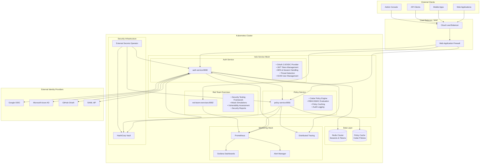
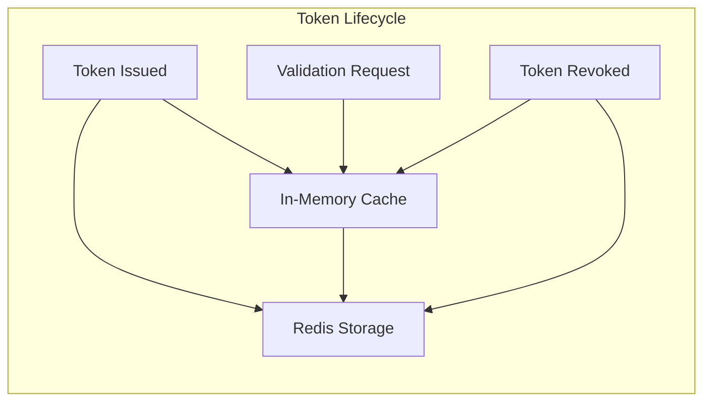
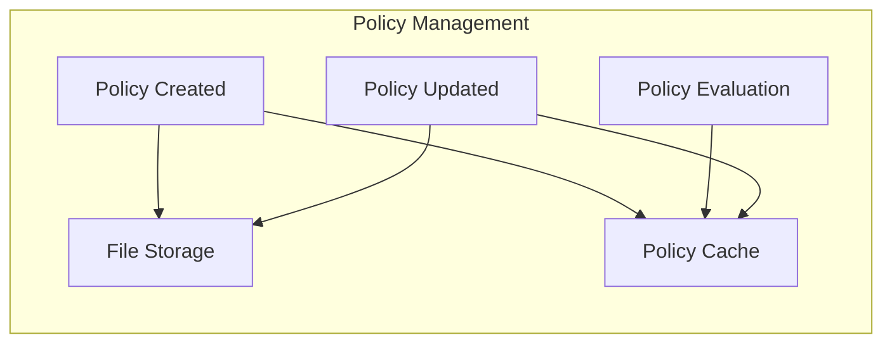
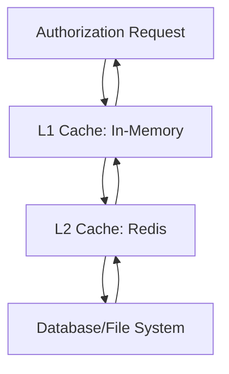
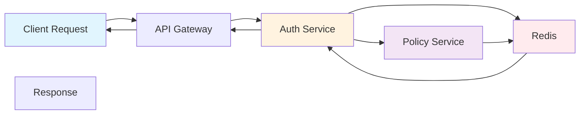

# Rust Security Platform - Architecture Overview

## Executive Summary

The Rust Security Platform is an enterprise-grade authentication and authorization system built with Rust, designed for high-performance, security-first applications. The platform provides comprehensive OAuth 2.0/OIDC capabilities, advanced threat detection, and policy-based access control through a microservices architecture.

## Value Proposition

### For Security Architects
- **Zero-Trust Architecture**: Identity-centric security with continuous verification
- **Advanced Threat Detection**: ML-powered behavioral analysis and anomaly detection
- **Compliance Ready**: SOC 2, HIPAA, PCI DSS, and GDPR compliance features
- **Comprehensive Audit Trail**: Detailed security logging and forensic capabilities

### For Integration Engineers
- **Standards-Compliant**: Full OAuth 2.0, OIDC, SCIM 2.0 support
- **High-Performance**: Sub-10ms token validation, 10,000+ req/sec throughput
- **Developer-Friendly**: OpenAPI documentation, SDKs, and integration examples
- **Cloud-Native**: Kubernetes-ready with Istio service mesh integration

### for DevOps Teams
- **Production-Ready**: Battle-tested components with comprehensive monitoring
- **Horizontal Scaling**: Stateless design supporting unlimited scaling
- **Operational Excellence**: Health checks, metrics, distributed tracing
- **Security by Default**: Secure configurations and automated security controls

## High-Level Architecture



## Core Services

### Auth Service (Port 8080)
**Primary authentication and authorization service**

**Core Capabilities:**
- OAuth 2.0 Authorization Server (RFC 6749)
- OpenID Connect Provider (OIDC Core 1.0)
- JSON Web Token (JWT) lifecycle management
- Multi-Factor Authentication (TOTP, WebAuthn)
- Session management with Redis backend
- SCIM 2.0 user/group provisioning
- Advanced threat detection and behavioral analysis
- Rate limiting and DDoS protection

**Key Endpoints:**
```
# OAuth 2.0 / OIDC
GET  /oauth/authorize          # Authorization endpoint
POST /oauth/token              # Token endpoint  
POST /oauth/introspect         # Token introspection
POST /oauth/revoke             # Token revocation
GET  /.well-known/openid_configuration  # OIDC discovery

# Authentication
POST /api/v1/auth/register     # User registration
POST /api/v1/auth/login        # User authentication
GET  /api/v1/auth/me           # User profile
POST /api/v1/auth/logout       # Session termination

# Multi-Factor Authentication
POST /mfa/totp/setup           # TOTP setup
POST /mfa/totp/verify          # TOTP verification
POST /mfa/webauthn/register    # WebAuthn registration
POST /mfa/webauthn/verify      # WebAuthn verification

# SCIM 2.0
GET    /scim/v2/Users          # List users
POST   /scim/v2/Users          # Create user
GET    /scim/v2/Users/{id}     # Get user
PUT    /scim/v2/Users/{id}     # Update user
DELETE /scim/v2/Users/{id}     # Delete user

# Administration
GET  /admin/health             # Health check
GET  /admin/metrics            # Prometheus metrics
GET  /admin/status             # Service status
```

### Policy Service (Port 8081)
**Centralized authorization policy engine**

**Core Capabilities:**
- Cedar Policy Language evaluation
- Role-Based Access Control (RBAC)
- Attribute-Based Access Control (ABAC)  
- Policy caching with intelligent invalidation
- Real-time policy updates
- Comprehensive audit logging
- Policy testing and validation

**Key Endpoints:**
```
# Policy Evaluation
POST /api/v1/policies/evaluate     # Evaluate authorization request
POST /api/v1/policies/batch        # Batch policy evaluation

# Policy Management
GET    /api/v1/policies            # List policies
POST   /api/v1/policies            # Create policy
GET    /api/v1/policies/{id}       # Get policy
PUT    /api/v1/policies/{id}       # Update policy  
DELETE /api/v1/policies/{id}       # Delete policy

# Entity Management
GET    /api/v1/entities            # List entities
POST   /api/v1/entities            # Create entity
GET    /api/v1/entities/{id}       # Get entity
PUT    /api/v1/entities/{id}       # Update entity
DELETE /api/v1/entities/{id}       # Delete entity

# Administration
GET  /health                       # Health check
GET  /metrics                      # Prometheus metrics
GET  /openapi.json                 # API specification
```

### Red Team Exercises (Port 8082)
**Security testing and vulnerability assessment framework**

**Core Capabilities:**
- Automated security testing scenarios
- OAuth/OIDC attack simulations
- Token manipulation testing
- Session hijacking scenarios
- Rate limiting bypass attempts
- MFA bypass testing
- Comprehensive security reporting
- CI/CD integration for security testing

## Data Architecture

### Token Storage Strategy


**Token Types:**
- **Access Tokens**: Short-lived (1 hour), JWT format, cached in Redis
- **Refresh Tokens**: Long-lived (30 days), opaque, Redis with TTL
- **Authorization Codes**: Short-lived (10 minutes), opaque, Redis
- **ID Tokens**: OIDC identity tokens, JWT format, stateless validation

### Policy Storage


**Policy Storage:**
- **Cedar Policies**: File-based storage with Git versioning
- **Policy Cache**: In-memory cache with TTL and invalidation
- **Entity Store**: JSON file storage for entity definitions
- **Audit Logs**: Structured logging to external systems

## Security Architecture

### Defense in Depth

#### 1. Network Security
- **Istio mTLS**: Automatic mutual TLS between all services
- **Network Policies**: Kubernetes network segmentation
- **Load Balancer**: Cloud-native with DDoS protection
- **WAF**: Application firewall with OWASP Top 10 protection

#### 2. Application Security
- **Input Validation**: Comprehensive sanitization and validation
- **SQL Injection Prevention**: Parameterized queries and ORM
- **XSS Protection**: Content Security Policy and output encoding
- **CSRF Protection**: Synchronizer tokens and SameSite cookies

#### 3. Authentication Security
- **Multi-Factor Authentication**: TOTP and WebAuthn support
- **Password Security**: Argon2 hashing with proper salting
- **Session Security**: Secure session management with Redis
- **Token Security**: JWT with RS256 signing and key rotation

#### 4. Authorization Security
- **Principle of Least Privilege**: Default deny with explicit allow
- **Policy-Based Access Control**: Cedar policy engine
- **Real-time Policy Updates**: Dynamic authorization changes
- **Audit Logging**: Comprehensive access decision logging

### Threat Detection

#### Real-time Monitoring
```rust
// Behavioral Analysis Engine
pub struct BehavioralAnalyzer {
    pub baseline_learning: bool,
    pub anomaly_sensitivity: f32,
    pub temporal_analysis: bool,
    pub geo_anomaly_detection: bool,
}

// Threat Detection Patterns
pub enum ThreatPattern {
    CredentialStuffing,
    TokenReplay,
    SessionHijacking,
    PrivilegeEscalation,
    DataExfiltration,
    BruteForce,
    AccountTakeover,
}
```

#### Security Metrics
- **Authentication Failures**: Failed login attempts per user/IP
- **Token Anomalies**: Unusual token usage patterns
- **Geographic Anomalies**: Impossible travel scenarios
- **Rate Limit Violations**: Suspicious request patterns
- **Policy Violations**: Unauthorized access attempts

## Performance Architecture

### Scalability Design

#### Horizontal Scaling
- **Stateless Services**: No server-side session state
- **Load Distribution**: Consistent request routing
- **Database Sharding**: Redis cluster for high throughput
- **Cache Partitioning**: Distributed policy cache

#### Performance Targets
```yaml
Service Level Objectives:
  Availability: 99.9%
  Latency:
    Token Validation: <10ms (P95)
    Policy Evaluation: <5ms (P95)
    Authentication: <100ms (P95)
  Throughput:
    Token Operations: >10,000 req/sec
    Policy Evaluations: >50,000 req/sec
```

### Caching Strategy

#### Multi-Level Caching


**Cache Hierarchies:**
- **L1 Cache**: In-memory, per-instance, sub-millisecond access
- **L2 Cache**: Redis cluster, shared across instances, ~1ms access
- **L3 Cache**: Database/filesystem, persistent storage, ~10ms access

## Integration Architecture

### OAuth 2.0 Integration
**Complete OAuth 2.0 Authorization Server implementation**

```typescript
// Client Registration
interface OAuthClient {
  client_id: string;
  client_secret?: string;
  redirect_uris: string[];
  grant_types: GrantType[];
  response_types: ResponseType[];
  scope: string;
  client_name: string;
  client_uri?: string;
  policy_uri?: string;
  tos_uri?: string;
  token_endpoint_auth_method: AuthMethod;
}

// Authorization Request
interface AuthorizationRequest {
  response_type: 'code' | 'token' | 'id_token';
  client_id: string;
  redirect_uri: string;
  scope?: string;
  state?: string;
  code_challenge?: string;
  code_challenge_method?: 'S256' | 'plain';
  nonce?: string;
}
```

### OIDC Integration
**OpenID Connect Provider with full discovery support**

```json
{
  "issuer": "https://auth.company.com",
  "authorization_endpoint": "https://auth.company.com/oauth/authorize",
  "token_endpoint": "https://auth.company.com/oauth/token",
  "userinfo_endpoint": "https://auth.company.com/oauth/userinfo",
  "jwks_uri": "https://auth.company.com/.well-known/jwks.json",
  "registration_endpoint": "https://auth.company.com/oauth/register",
  "introspection_endpoint": "https://auth.company.com/oauth/introspect",
  "revocation_endpoint": "https://auth.company.com/oauth/revoke",
  "response_types_supported": ["code", "id_token", "code id_token"],
  "grant_types_supported": ["authorization_code", "refresh_token", "client_credentials"],
  "subject_types_supported": ["public"],
  "id_token_signing_alg_values_supported": ["RS256"],
  "scopes_supported": ["openid", "profile", "email", "phone"],
  "claims_supported": ["sub", "name", "email", "email_verified"],
  "code_challenge_methods_supported": ["S256"]
}
```

### SCIM 2.0 Integration
**Complete SCIM 2.0 implementation for user/group management**

```json
{
  "schemas": ["urn:ietf:params:scim:schemas:core:2.0:User"],
  "id": "user123",
  "userName": "john.doe@company.com",
  "name": {
    "formatted": "John Doe",
    "familyName": "Doe",
    "givenName": "John"
  },
  "emails": [
    {
      "value": "john.doe@company.com",
      "type": "work",
      "primary": true
    }
  ],
  "groups": [
    {
      "value": "group456",
      "display": "Engineering"
    }
  ],
  "active": true,
  "meta": {
    "resourceType": "User",
    "created": "2025-01-28T10:30:00Z",
    "lastModified": "2025-01-28T10:30:00Z",
    "version": "1"
  }
}
```

## Monitoring & Observability

### Metrics Collection
**Comprehensive Prometheus metrics for all services**

```yaml
# Auth Service Metrics
auth_requests_total{method, endpoint, status}
auth_request_duration_seconds{method, endpoint}
auth_tokens_active_total{type}
auth_sessions_active_total
auth_mfa_verifications_total{method, status}
auth_policy_evaluations_total{decision}

# Policy Service Metrics  
policy_evaluations_total{policy, decision}
policy_evaluation_duration_seconds{policy}
policy_cache_hits_total{policy}
policy_cache_misses_total{policy}
policy_updates_total{policy}

# Security Metrics
security_threats_detected_total{type, severity}
security_anomalies_total{type}
security_rate_limits_exceeded_total{endpoint}
security_failed_authentications_total{reason}
```

### Distributed Tracing
**End-to-end request tracing with Jaeger**



### Alerting Strategy
**Multi-level alerting with proper escalation**

```yaml
# Critical Alerts (Page immediately)
- High authentication failure rates (>10% in 5 minutes)
- Service availability <99% (5 minute window)
- Security threats detected (severity: critical)
- Token validation errors >5% (1 minute window)

# Warning Alerts (Slack notification)
- Response time >P95 thresholds (10 minute window)
- Cache miss ratio >20% (15 minute window)  
- Policy evaluation errors >1% (5 minute window)
- Failed MFA attempts spike (>50 in 10 minutes)

# Info Alerts (Dashboard notification)
- Unusual traffic patterns detected
- New client registrations
- Policy updates applied
- Scheduled maintenance windows
```

This architecture overview provides the foundation for understanding the Rust Security Platform's comprehensive design. The next sections will detail specific components, integration patterns, and operational procedures.