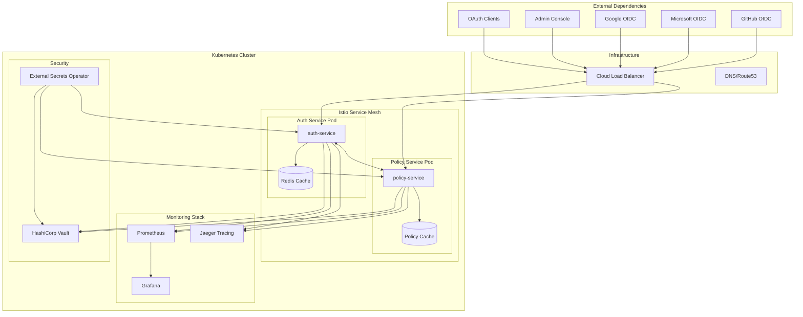
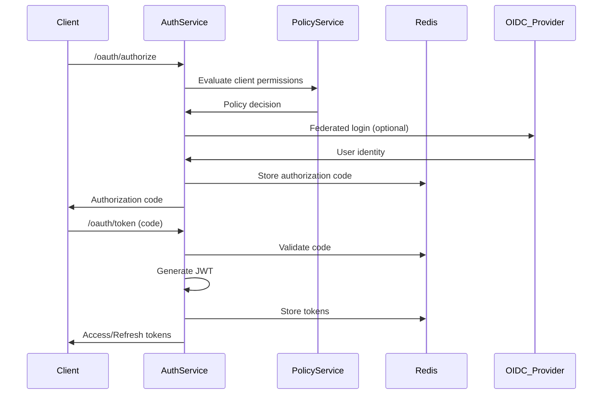
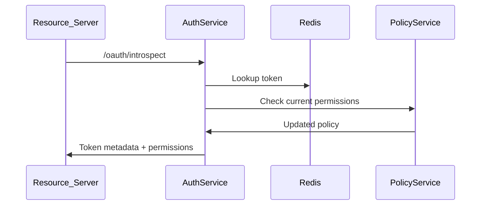
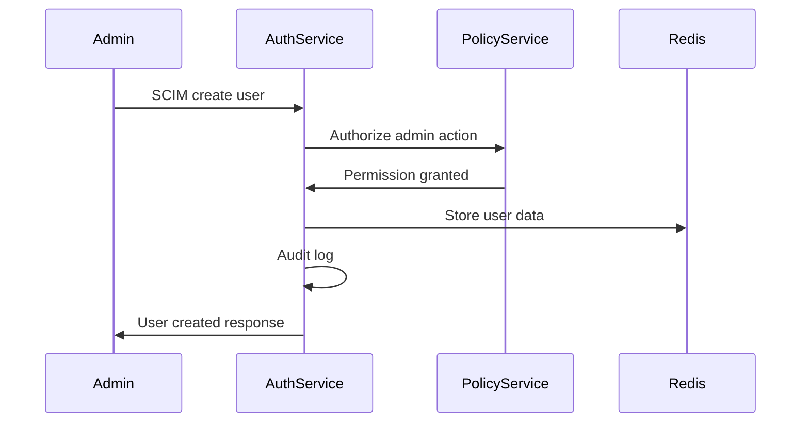

# System Architecture Documentation

## High-Level Architecture Overview

## Service Architecture

### Auth Service (Primary Authentication & Authorization)

**Responsibilities:**
- OAuth 2.0/OIDC provider functionality
- JWT token issuance and validation
- SCIM user/group management
- Multi-factor authentication (TOTP, WebAuthn)
- Session management
- Rate limiting and backpressure control
- Security monitoring and threat detection

**Key Components:**
- OAuth endpoints (`/oauth/*`)
- OIDC discovery (`/.well-known/*`)
- Token introspection (`/oauth/introspect`)
- Admin endpoints (`/admin/*`)
- SCIM v2.0 endpoints (`/scim/*`)
- WebAuthn/MFA endpoints (`/mfa/*`)

**Data Flow:**
1. Client authentication requests → OAuth flows
2. Token issuance → Redis storage + JWT signing
3. Policy evaluation → Policy service calls
4. Security events → Monitoring pipeline

### Policy Service (Authorization Policies)

**Responsibilities:**
- Policy evaluation and enforcement
- RBAC/ABAC rule processing  
- Policy caching and invalidation
- Audit logging for access decisions
- Integration with external policy engines

**Key Components:**
- Policy evaluation engine
- Cache management with TTL
- Policy update notifications
- Audit trail generation

## Data Flows

### 1. OAuth Authorization Code Flow

### 2. Token Introspection Flow

### 3. SCIM User Management Flow

## External Dependencies

### Identity Providers (OIDC)
- **Google**: `accounts.google.com`
- **Microsoft**: `login.microsoftonline.com`
- **GitHub**: `github.com/login/oauth`

**Integration Pattern:**
- OIDC Discovery for configuration
- PKCE for enhanced security
- Token binding for session security
- Circuit breakers for resilience

### Redis Cache
- **Purpose**: Token storage, session management, rate limiting
- **Configuration**: Cluster mode with persistence
- **Security**: TLS encryption, AUTH password
- **Monitoring**: Connection pool metrics, latency tracking

### Kubernetes Platform
- **Istio Service Mesh**: mTLS, traffic management, observability
- **Network Policies**: Micro-segmentation, egress control
- **Pod Security**: Non-root containers, read-only filesystems
- **Secrets Management**: External Secrets Operator + Vault

### Monitoring & Observability

#### Prometheus Metrics
- Business metrics: tokens issued/revoked, auth failures
- System metrics: request latency, error rates, resource usage
- Security metrics: threat detection, anomaly alerts

#### Grafana Dashboards
- **Auth Service**: OAuth flows, token lifecycle, SCIM operations
- **Policy Service**: Policy evaluations, cache performance
- **Infrastructure**: Resource utilization, network traffic
- **Security**: Failed authentications, suspicious patterns

#### Distributed Tracing (Jaeger)
- End-to-end request tracing
- Cross-service correlation
- Performance bottleneck identification
- Error propagation analysis

## Security Architecture

### Defense in Depth Layers

1. **Network Security**
   - Istio mTLS between services
   - Network policies for segmentation
   - WAF at load balancer

2. **Authentication & Authorization**
   - Multi-factor authentication
   - PKCE for OAuth flows
   - Token binding
   - Fine-grained RBAC/ABAC

3. **Data Protection**
   - JWT signing with rotated keys
   - Secrets zeroization
   - PII masking in logs
   - TLS 1.3 for all connections

4. **Runtime Security**
   - Rate limiting and backpressure
   - Input validation
   - Security monitoring
   - Anomaly detection

### Threat Model Considerations

**High-Risk Scenarios:**
- Token theft/replay attacks → Token binding, short TTLs
- Credential stuffing → Rate limiting, MFA enforcement  
- OIDC provider compromise → Certificate pinning, validation
- Admin privilege escalation → Strict RBAC, audit logging
- Data exfiltration → PII classification, access controls

## Deployment Architecture

### Container Strategy
- **Base Images**: Distroless for minimal attack surface
- **Multi-stage builds**: Separate build/runtime environments
- **Security scanning**: Container vulnerability assessment
- **Image signing**: Cosign for supply chain security

### Kubernetes Configuration
- **Resource limits**: CPU/memory constraints
- **Health probes**: Readiness/liveness checks
- **Auto-scaling**: HPA based on metrics
- **Pod disruption budgets**: High availability

### Service Mesh (Istio)
- **Traffic management**: Circuit breakers, timeouts, retries
- **Security policies**: AuthorizationPolicies, PeerAuthentication
- **Observability**: Metrics, logs, traces collection
- **Progressive delivery**: Canary deployments

## Operational Considerations

### Scaling Patterns
- **Horizontal scaling**: Stateless service design
- **Database sharding**: Redis cluster for high throughput  
- **Cache partitioning**: Policy cache distribution
- **Load balancing**: Weighted routing for canary deployments

### Disaster Recovery
- **Multi-region deployment**: Active-passive configuration
- **Data backup**: Redis persistence, policy snapshots
- **Secret rotation**: Automated key management
- **Runbook procedures**: Incident response playbooks

### Monitoring & Alerting
- **SLO/SLI definitions**: 99.9% availability, <100ms P95 latency
- **Alert thresholds**: Error rate spikes, dependency failures
- **On-call procedures**: Escalation paths, communication channels
- **Post-incident reviews**: Continuous improvement process