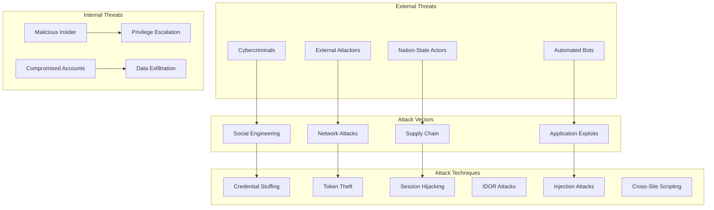
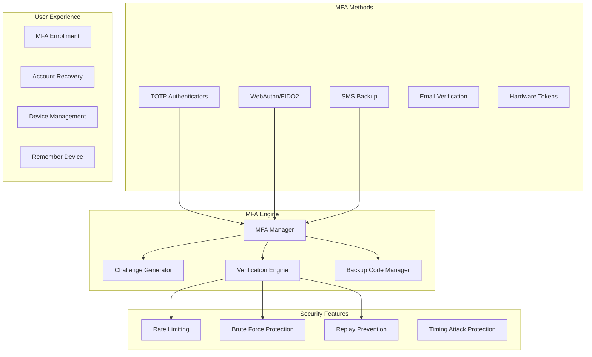
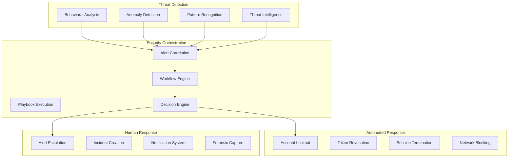

# Security Architecture - Advanced Security Features

## Security-First Design Philosophy

The Rust Security Platform implements a comprehensive security architecture based on zero-trust principles, defense-in-depth strategies, and continuous security monitoring. Every component is designed with security as the primary consideration.

## Threat Model & Risk Assessment

### Threat Landscape Analysis



### High-Risk Scenarios & Mitigations

#### 1. OAuth Token Compromise
**Risk**: Access token theft leading to unauthorized resource access
```rust
// Token Binding Implementation
pub struct TokenBinding {
    pub certificate_thumbprint: Option<String>,
    pub jwk_thumbprint: Option<String>,
    pub tls_unique: Option<String>,
    pub ip_address_binding: bool,
    pub device_fingerprint: Option<String>,
}

pub struct BoundToken {
    pub access_token: String,
    pub binding_id: String,
    pub binding_method: TokenBindingMethod,
    pub created_at: DateTime<Utc>,
    pub expires_at: DateTime<Utc>,
}

impl TokenBinding {
    pub fn validate_binding(
        &self,
        token: &BoundToken,
        request_context: &RequestContext
    ) -> Result<(), TokenBindingError> {
        // Validate certificate thumbprint
        if let Some(expected) = &self.certificate_thumbprint {
            if !request_context.certificate_thumbprint.as_ref()
                .map_or(false, |actual| actual == expected) {
                return Err(TokenBindingError::CertificateMismatch);
            }
        }
        
        // Validate IP address binding
        if self.ip_address_binding {
            let bound_ip = extract_ip_from_binding(&token.binding_id)?;
            if bound_ip != request_context.client_ip {
                return Err(TokenBindingError::IpMismatch);
            }
        }
        
        // Validate device fingerprint
        if let Some(expected_fingerprint) = &self.device_fingerprint {
            if !request_context.device_fingerprint.as_ref()
                .map_or(false, |actual| actual == expected_fingerprint) {
                return Err(TokenBindingError::DeviceMismatch);
            }
        }
        
        Ok(())
    }
}
```

#### 2. Privilege Escalation Prevention
**Risk**: Users gaining unauthorized elevated privileges
```rust
// Dynamic Policy Evaluation with Context
pub struct PolicyEvaluationContext {
    pub request_time: DateTime<Utc>,
    pub client_ip: IpAddr,
    pub user_agent: String,
    pub geolocation: Option<Geolocation>,
    pub risk_score: f64,
    pub authentication_strength: AuthStrength,
    pub device_trust_level: TrustLevel,
}

pub struct DynamicAuthorizationEngine {
    pub base_policies: PolicySet,
    pub risk_policies: RiskBasedPolicySet,
    pub temporal_policies: TemporalPolicySet,
    pub behavioral_analyzer: BehavioralAnalyzer,
}

impl DynamicAuthorizationEngine {
    pub async fn evaluate_with_risk_context(
        &self,
        request: &AuthorizationRequest,
        context: &PolicyEvaluationContext
    ) -> Result<AuthorizationDecision, PolicyError> {
        // Base policy evaluation
        let base_decision = self.base_policies.evaluate(request).await?;
        
        if base_decision.decision == Decision::Deny {
            return Ok(base_decision);
        }
        
        // Risk-based policy evaluation
        let risk_decision = self.risk_policies
            .evaluate_with_risk(request, context.risk_score)
            .await?;
            
        // Temporal constraint evaluation
        let temporal_decision = self.temporal_policies
            .evaluate_time_constraints(request, context.request_time)
            .await?;
            
        // Behavioral analysis
        let behavioral_anomaly = self.behavioral_analyzer
            .detect_anomaly(&request.principal, context)
            .await?;
            
        // Combine decisions with risk weighting
        let final_decision = self.combine_decisions(vec![
            (base_decision, 1.0),
            (risk_decision, context.risk_score),
            (temporal_decision, 0.8),
        ], behavioral_anomaly);
        
        Ok(final_decision)
    }
}
```

## Advanced Authentication Security

### Multi-Factor Authentication (MFA) Architecture



#### WebAuthn/FIDO2 Implementation
```rust
pub struct WebAuthnManager {
    pub webauthn: Webauthn,
    pub credential_store: Arc<CredentialStore>,
    pub challenge_store: Arc<ChallengeStore>,
    pub user_verification_policy: UserVerificationPolicy,
}

#[derive(Debug, Clone, Serialize, Deserialize)]
pub struct WebAuthnCredential {
    pub credential_id: Vec<u8>,
    pub public_key: Vec<u8>,
    pub counter: u32,
    pub user_id: String,
    pub credential_name: String,
    pub created_at: DateTime<Utc>,
    pub last_used: Option<DateTime<Utc>>,
    pub aaguid: String,
    pub backup_eligible: bool,
    pub backup_state: bool,
}

impl WebAuthnManager {
    pub async fn start_registration(
        &self,
        user_id: &str,
        user_name: &str,
        display_name: &str,
    ) -> Result<CreationChallengeResponse, WebAuthnError> {
        let user = User::new(user_id.to_string(), user_name, display_name);
        
        let (ccr, reg_state) = self.webauthn
            .start_passkey_registration(
                user_id.parse()?,
                &user_name,
                &display_name,
                Some(UserVerificationPolicy::Required),
            )?;
            
        // Store challenge for verification
        self.challenge_store
            .store_registration_challenge(user_id, &reg_state)
            .await?;
            
        Ok(ccr)
    }
    
    pub async fn finish_registration(
        &self,
        user_id: &str,
        credential_name: &str,
        reg: RegisterPublicKeyCredential,
    ) -> Result<WebAuthnCredential, WebAuthnError> {
        // Retrieve stored challenge
        let reg_state = self.challenge_store
            .get_registration_challenge(user_id)
            .await?
            .ok_or(WebAuthnError::ChallengeNotFound)?;
            
        // Verify registration
        let passkey = self.webauthn
            .finish_passkey_registration(&reg, &reg_state)?;
            
        // Create credential record
        let credential = WebAuthnCredential {
            credential_id: passkey.cred_id().clone(),
            public_key: serde_json::to_vec(&passkey)?,
            counter: passkey.counter(),
            user_id: user_id.to_string(),
            credential_name: credential_name.to_string(),
            created_at: Utc::now(),
            last_used: None,
            aaguid: passkey.aaguid().to_string(),
            backup_eligible: passkey.backup_eligible(),
            backup_state: passkey.backup_state(),
        };
        
        // Store credential
        self.credential_store
            .store_credential(&credential)
            .await?;
            
        Ok(credential)
    }
}
```

#### TOTP Implementation with Enhanced Security
```rust
pub struct TOTPManager {
    pub secret_generator: Arc<SecureRandom>,
    pub qr_generator: Arc<QRGenerator>,
    pub backup_code_generator: Arc<BackupCodeGenerator>,
    pub rate_limiter: Arc<RateLimiter>,
}

#[derive(Debug, Clone, Serialize, Deserialize)]
pub struct TOTPSecret {
    pub user_id: String,
    pub secret: SecretString,
    pub algorithm: TOTPAlgorithm,
    pub digits: u32,
    pub step: u64,
    pub issuer: String,
    pub account_name: String,
    pub created_at: DateTime<Utc>,
    pub verified: bool,
    pub backup_codes: Vec<BackupCode>,
}

impl TOTPManager {
    pub async fn generate_secret(
        &self,
        user_id: &str,
        account_name: &str,
    ) -> Result<TOTPSecret, TOTPError> {
        // Generate cryptographically secure secret
        let secret_bytes = self.secret_generator.generate_bytes(32)?;
        let secret = SecretString::new(base32::encode(
            base32::Alphabet::Rfc4648 { padding: false },
            &secret_bytes
        ));
        
        // Generate backup codes
        let backup_codes = self.backup_code_generator
            .generate_codes(user_id, 10)
            .await?;
        
        let totp_secret = TOTPSecret {
            user_id: user_id.to_string(),
            secret,
            algorithm: TOTPAlgorithm::SHA256,
            digits: 6,
            step: 30,
            issuer: "Rust Security Platform".to_string(),
            account_name: account_name.to_string(),
            created_at: Utc::now(),
            verified: false,
            backup_codes,
        };
        
        Ok(totp_secret)
    }
    
    pub async fn verify_code(
        &self,
        user_id: &str,
        provided_code: &str,
    ) -> Result<TOTPVerificationResult, TOTPError> {
        // Rate limiting check
        self.rate_limiter
            .check_rate_limit(&format!("totp:{}", user_id))
            .await?;
        
        // Retrieve user's TOTP secret
        let totp_secret = self.get_user_secret(user_id).await?;
        
        // Create TOTP instance
        let totp = TOTP::new(
            totp_secret.algorithm.into(),
            totp_secret.digits as usize,
            1, // Window of 1 step (30 seconds)
            totp_secret.secret.expose_secret().as_bytes(),
        )?;
        
        // Verify code with time window tolerance
        let current_time = SystemTime::now()
            .duration_since(UNIX_EPOCH)?
            .as_secs();
            
        // Check current time step and adjacent steps for clock drift
        for time_step in [current_time - 30, current_time, current_time + 30] {
            let expected_code = totp.generate(time_step);
            
            if constant_time_eq::constant_time_eq(
                provided_code.as_bytes(),
                expected_code.as_bytes()
            ) {
                return Ok(TOTPVerificationResult {
                    success: true,
                    time_step_used: time_step,
                    code_reuse_detected: self.check_code_reuse(
                        user_id, 
                        &expected_code,
                        time_step
                    ).await?,
                });
            }
        }
        
        // Check backup codes if TOTP fails
        if self.verify_backup_code(user_id, provided_code).await? {
            return Ok(TOTPVerificationResult {
                success: true,
                backup_code_used: true,
                remaining_backup_codes: self.count_remaining_backup_codes(user_id).await?,
            });
        }
        
        // Record failed attempt
        self.record_failed_attempt(user_id).await?;
        
        Ok(TOTPVerificationResult {
            success: false,
            failure_reason: "Invalid TOTP code".to_string(),
        })
    }
}
```

## SOAR (Security Orchestration, Automation and Response)

### Threat Detection & Response Engine



#### Advanced Behavioral Analysis
```rust
pub struct BehavioralAnalysisEngine {
    pub user_profiler: Arc<UserProfiler>,
    pub device_profiler: Arc<DeviceProfiler>,
    pub location_analyzer: Arc<LocationAnalyzer>,
    pub temporal_analyzer: Arc<TemporalAnalyzer>,
    pub anomaly_scorer: Arc<AnomalyScorer>,
}

#[derive(Debug, Clone, Serialize, Deserialize)]
pub struct UserBehaviorProfile {
    pub user_id: String,
    pub baseline_established: bool,
    pub typical_locations: Vec<GeoLocation>,
    pub typical_devices: Vec<DeviceFingerprint>,
    pub typical_access_patterns: AccessPatternProfile,
    pub risk_factors: Vec<RiskFactor>,
    pub last_updated: DateTime<Utc>,
}

#[derive(Debug, Clone, Serialize, Deserialize)]
pub struct AccessPatternProfile {
    pub typical_hours: Vec<HourRange>,
    pub typical_days: Vec<Weekday>,
    pub typical_resources: Vec<ResourceAccessPattern>,
    pub typical_scopes: HashSet<String>,
    pub request_frequency: FrequencyPattern,
}

impl BehavioralAnalysisEngine {
    pub async fn analyze_authentication_attempt(
        &self,
        user_id: &str,
        auth_context: &AuthenticationContext,
    ) -> Result<BehavioralAssessment, BehavioralError> {
        // Get user's behavioral baseline
        let profile = self.user_profiler
            .get_or_create_profile(user_id)
            .await?;
            
        let mut anomaly_score = 0.0;
        let mut risk_factors = Vec::new();
        
        // Geographic anomaly analysis
        if let Some(location) = &auth_context.geolocation {
            let geo_anomaly = self.location_analyzer
                .analyze_location_anomaly(&profile, location)
                .await?;
                
            if geo_anomaly.is_anomalous {
                anomaly_score += geo_anomaly.severity_score;
                risk_factors.push(RiskFactor::GeographicAnomaly {
                    expected_locations: profile.typical_locations.clone(),
                    actual_location: location.clone(),
                    travel_time_impossible: geo_anomaly.impossible_travel,
                });
            }
        }
        
        // Device fingerprint analysis
        if let Some(device) = &auth_context.device_fingerprint {
            let device_anomaly = self.device_profiler
                .analyze_device_anomaly(&profile, device)
                .await?;
                
            if device_anomaly.is_new_device {
                anomaly_score += device_anomaly.risk_score;
                risk_factors.push(RiskFactor::NewDevice {
                    device_fingerprint: device.clone(),
                    similarity_to_known_devices: device_anomaly.similarity_score,
                });
            }
        }
        
        // Temporal pattern analysis
        let temporal_anomaly = self.temporal_analyzer
            .analyze_temporal_patterns(&profile, auth_context.timestamp)
            .await?;
            
        if temporal_anomaly.is_unusual_time {
            anomaly_score += temporal_anomaly.anomaly_score;
            risk_factors.push(RiskFactor::UnusualTiming {
                typical_hours: profile.typical_access_patterns.typical_hours.clone(),
                actual_hour: auth_context.timestamp.hour(),
                deviation_score: temporal_anomaly.deviation_score,
            });
        }
        
        // Calculate final risk score
        let risk_score = self.anomaly_scorer
            .calculate_composite_score(anomaly_score, &risk_factors)
            .await?;
        
        Ok(BehavioralAssessment {
            user_id: user_id.to_string(),
            risk_score,
            risk_factors,
            recommendation: self.generate_security_recommendation(risk_score),
            requires_additional_verification: risk_score > 0.7,
            timestamp: Utc::now(),
        })
    }
    
    fn generate_security_recommendation(&self, risk_score: f64) -> SecurityRecommendation {
        match risk_score {
            score if score >= 0.9 => SecurityRecommendation::BlockAuthentication {
                reason: "High-risk authentication attempt detected".to_string(),
                required_actions: vec![
                    "Manual security review required".to_string(),
                    "Account temporarily locked".to_string(),
                    "Security team notification sent".to_string(),
                ],
            },
            score if score >= 0.7 => SecurityRecommendation::RequireAdditionalMFA {
                reason: "Elevated risk detected".to_string(),
                required_factors: vec![
                    MFAFactor::WebAuthn,
                    MFAFactor::AdminApproval,
                ],
            },
            score if score >= 0.5 => SecurityRecommendation::RequireStandardMFA {
                reason: "Moderate risk detected".to_string(),
                required_factors: vec![MFAFactor::TOTP],
            },
            score if score >= 0.3 => SecurityRecommendation::MonitorClosely {
                reason: "Low risk detected".to_string(),
                monitoring_duration: Duration::hours(24),
            },
            _ => SecurityRecommendation::Allow {
                confidence_score: 1.0 - risk_score,
            },
        }
    }
}
```

### Automated Security Response

#### Real-time Threat Response System
```rust
pub struct AutomatedResponseSystem {
    pub response_engine: Arc<ResponseEngine>,
    pub workflow_orchestrator: Arc<WorkflowOrchestrator>,
    pub notification_system: Arc<NotificationSystem>,
    pub forensic_capture: Arc<ForensicCapture>,
}

#[derive(Debug, Clone, Serialize, Deserialize)]
pub struct SecurityIncident {
    pub incident_id: String,
    pub incident_type: IncidentType,
    pub severity: SeverityLevel,
    pub affected_users: Vec<String>,
    pub threat_indicators: Vec<ThreatIndicator>,
    pub detection_timestamp: DateTime<Utc>,
    pub response_actions: Vec<ResponseAction>,
    pub status: IncidentStatus,
}

impl AutomatedResponseSystem {
    pub async fn handle_security_alert(
        &self,
        alert: SecurityAlert,
    ) -> Result<IncidentResponse, ResponseError> {
        // Create security incident
        let incident = self.create_incident_from_alert(&alert).await?;
        
        // Determine response workflow
        let workflow = self.workflow_orchestrator
            .select_response_workflow(&incident)
            .await?;
        
        // Execute automated responses
        let response_results = self.execute_response_workflow(&incident, &workflow).await?;
        
        // Capture forensic evidence
        if incident.severity >= SeverityLevel::High {
            self.forensic_capture
                .capture_incident_evidence(&incident)
                .await?;
        }
        
        // Send notifications
        self.notification_system
            .send_incident_notifications(&incident)
            .await?;
        
        Ok(IncidentResponse {
            incident_id: incident.incident_id,
            response_actions_executed: response_results,
            workflow_completed: true,
            escalation_required: incident.severity >= SeverityLevel::Critical,
        })
    }
    
    async fn execute_response_workflow(
        &self,
        incident: &SecurityIncident,
        workflow: &ResponseWorkflow,
    ) -> Result<Vec<ResponseActionResult>, ResponseError> {
        let mut results = Vec::new();
        
        for action in &workflow.actions {
            let result = match action {
                ResponseAction::RevokeTokens { user_ids, token_types } => {
                    self.revoke_user_tokens(user_ids, token_types).await?
                },
                ResponseAction::TerminateSessions { user_ids } => {
                    self.terminate_user_sessions(user_ids).await?
                },
                ResponseAction::BlockIpAddresses { ip_addresses, duration } => {
                    self.block_ip_addresses(ip_addresses, *duration).await?
                },
                ResponseAction::LockUserAccounts { user_ids, duration } => {
                    self.lock_user_accounts(user_ids, *duration).await?
                },
                ResponseAction::EscalateToHuman { priority, assignee } => {
                    self.create_human_escalation(incident, *priority, assignee).await?
                },
                ResponseAction::UpdateSecurityRules { rule_updates } => {
                    self.update_security_rules(rule_updates).await?
                },
            };
            
            results.push(result);
            
            // Stop on critical failures
            if result.status == ActionStatus::Failed && action.is_critical() {
                break;
            }
        }
        
        Ok(results)
    }
    
    async fn revoke_user_tokens(
        &self,
        user_ids: &[String],
        token_types: &[TokenType],
    ) -> Result<ResponseActionResult, ResponseError> {
        let mut revoked_count = 0;
        
        for user_id in user_ids {
            for token_type in token_types {
                match self.token_manager.revoke_user_tokens(user_id, *token_type).await {
                    Ok(count) => revoked_count += count,
                    Err(e) => {
                        return Ok(ResponseActionResult {
                            action: "revoke_tokens".to_string(),
                            status: ActionStatus::PartialSuccess,
                            message: format!("Failed to revoke tokens for user {}: {}", user_id, e),
                            affected_entities: vec![user_id.clone()],
                        });
                    }
                }
            }
        }
        
        Ok(ResponseActionResult {
            action: "revoke_tokens".to_string(),
            status: ActionStatus::Success,
            message: format!("Successfully revoked {} tokens", revoked_count),
            affected_entities: user_ids.to_vec(),
        })
    }
}
```

## Compliance & Audit Architecture

### Comprehensive Audit Logging
```rust
pub struct AuditLogger {
    pub storage_backend: Arc<AuditStorage>,
    pub encryption_key: Arc<EncryptionKey>,
    pub schema_validator: Arc<AuditSchemaValidator>,
    pub retention_manager: Arc<RetentionManager>,
}

#[derive(Debug, Clone, Serialize, Deserialize)]
pub struct AuditEvent {
    pub event_id: String,
    pub timestamp: DateTime<Utc>,
    pub event_type: AuditEventType,
    pub actor: Actor,
    pub resource: Resource,
    pub action: Action,
    pub outcome: Outcome,
    pub client_info: ClientInfo,
    pub risk_assessment: Option<RiskAssessment>,
    pub policy_decisions: Vec<PolicyDecision>,
    pub metadata: HashMap<String, Value>,
}

#[derive(Debug, Clone, Serialize, Deserialize)]
pub enum AuditEventType {
    Authentication {
        method: AuthenticationMethod,
        mfa_used: bool,
        device_trusted: bool,
    },
    Authorization {
        policy_evaluated: String,
        decision: Decision,
        evaluation_time_ms: u64,
    },
    TokenOperation {
        operation: TokenOperation,
        token_type: TokenType,
        scopes: HashSet<String>,
    },
    SessionManagement {
        session_operation: SessionOperation,
        session_duration: Option<Duration>,
    },
    PolicyChange {
        policy_id: String,
        change_type: PolicyChangeType,
        old_version: Option<String>,
        new_version: String,
    },
    SecurityEvent {
        event_category: SecurityEventCategory,
        severity: SeverityLevel,
        threat_indicators: Vec<ThreatIndicator>,
    },
}

impl AuditLogger {
    pub async fn log_event(&self, event: AuditEvent) -> Result<(), AuditError> {
        // Validate event schema
        self.schema_validator.validate(&event)?;
        
        // Encrypt sensitive data
        let encrypted_event = self.encrypt_sensitive_fields(event).await?;
        
        // Store with immutable hash
        let event_hash = self.calculate_event_hash(&encrypted_event)?;
        let storage_record = AuditRecord {
            event: encrypted_event,
            hash: event_hash,
            stored_at: Utc::now(),
        };
        
        // Store in audit backend
        self.storage_backend.store_audit_record(storage_record).await?;
        
        // Update retention tracking
        self.retention_manager.track_new_record(&event.event_id).await?;
        
        Ok(())
    }
    
    pub async fn query_audit_trail(
        &self,
        query: &AuditQuery,
    ) -> Result<Vec<AuditEvent>, AuditError> {
        // Validate query permissions
        self.validate_query_permissions(query).await?;
        
        // Execute query with pagination
        let encrypted_records = self.storage_backend
            .query_records(query)
            .await?;
        
        // Decrypt and return events
        let mut events = Vec::new();
        for record in encrypted_records {
            let decrypted_event = self.decrypt_audit_event(&record.event).await?;
            events.push(decrypted_event);
        }
        
        Ok(events)
    }
}
```

### Compliance Frameworks Support

#### SOC 2 Type II Compliance
```rust
pub struct SOC2ComplianceManager {
    pub control_monitor: Arc<ControlMonitor>,
    pub evidence_collector: Arc<EvidenceCollector>,
    pub report_generator: Arc<SOC2ReportGenerator>,
}

#[derive(Debug, Clone)]
pub struct SOC2Control {
    pub control_id: String,
    pub trust_service_category: TrustServiceCategory,
    pub control_objective: String,
    pub control_activities: Vec<ControlActivity>,
    pub testing_procedures: Vec<TestingProcedure>,
    pub evidence_requirements: Vec<EvidenceRequirement>,
}

impl SOC2ComplianceManager {
    pub async fn monitor_security_controls(&self) -> Result<ControlReport, ComplianceError> {
        let controls = vec![
            // CC6.1 - Logical and Physical Access Controls
            self.monitor_access_controls().await?,
            // CC6.2 - System Boundaries and Data Classification
            self.monitor_data_classification().await?,
            // CC6.3 - Access Control Management
            self.monitor_access_management().await?,
            // CC6.6 - Vulnerability Management
            self.monitor_vulnerability_management().await?,
            // CC6.7 - Data Transmission Controls
            self.monitor_encryption_controls().await?,
        ];
        
        Ok(ControlReport {
            reporting_period: self.get_current_period(),
            controls,
            overall_effectiveness: self.calculate_overall_effectiveness(&controls),
            exceptions: self.identify_control_exceptions(&controls),
        })
    }
    
    async fn monitor_access_controls(&self) -> Result<ControlResult, ComplianceError> {
        // Monitor authentication controls
        let auth_metrics = self.collect_authentication_metrics().await?;
        
        // Monitor authorization controls  
        let authz_metrics = self.collect_authorization_metrics().await?;
        
        // Monitor session management
        let session_metrics = self.collect_session_metrics().await?;
        
        let effectiveness = self.calculate_access_control_effectiveness(
            &auth_metrics,
            &authz_metrics, 
            &session_metrics
        );
        
        Ok(ControlResult {
            control_id: "CC6.1".to_string(),
            control_name: "Logical and Physical Access Controls".to_string(),
            effectiveness,
            evidence_collected: vec![
                Evidence::MetricsReport(auth_metrics),
                Evidence::MetricsReport(authz_metrics),
                Evidence::ConfigurationSnapshot(self.capture_auth_config().await?),
            ],
            test_results: self.execute_access_control_tests().await?,
        })
    }
}
```

This comprehensive security architecture ensures the Rust Security Platform meets enterprise-grade security requirements while maintaining high performance and usability. The multi-layered approach provides robust protection against sophisticated threats while enabling continuous security monitoring and automated response capabilities.