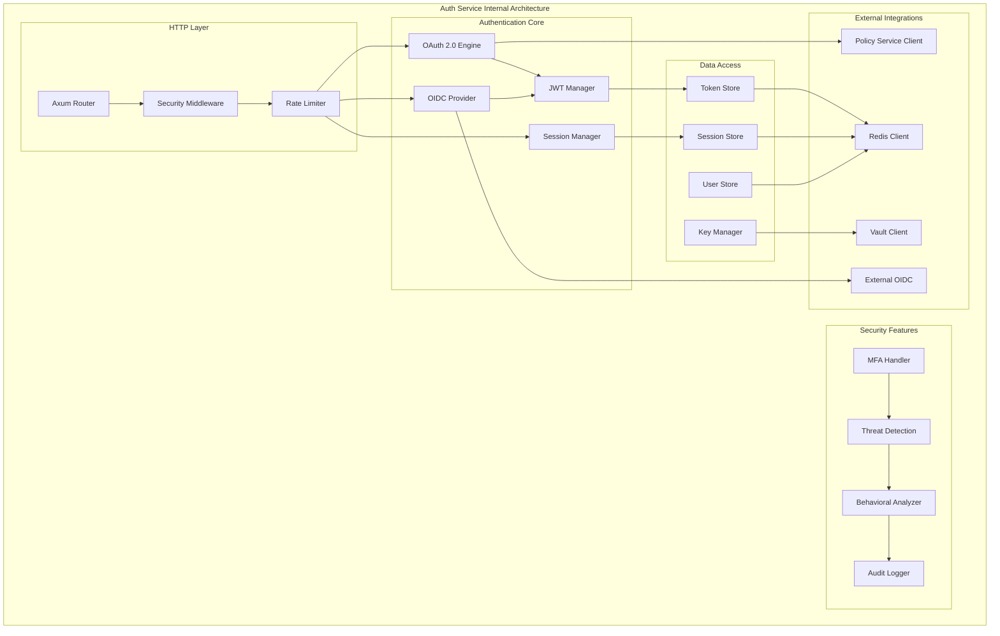
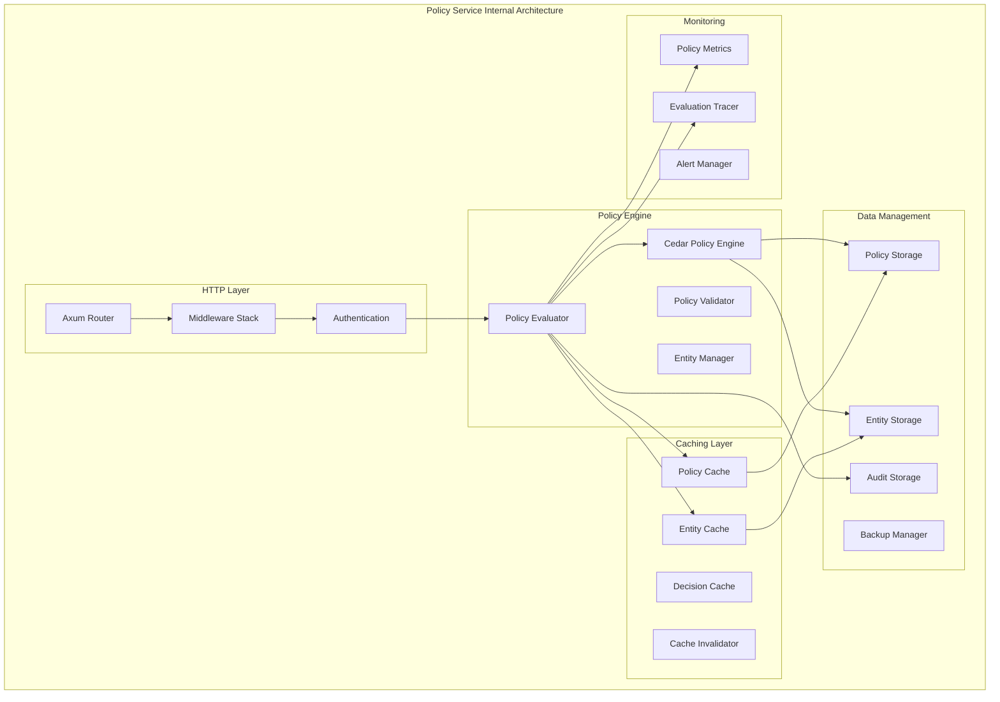
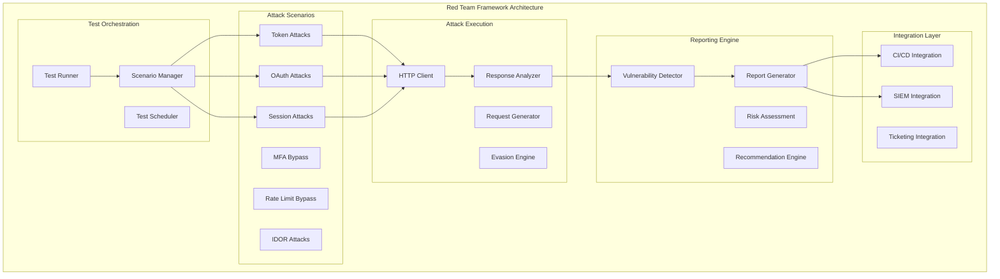
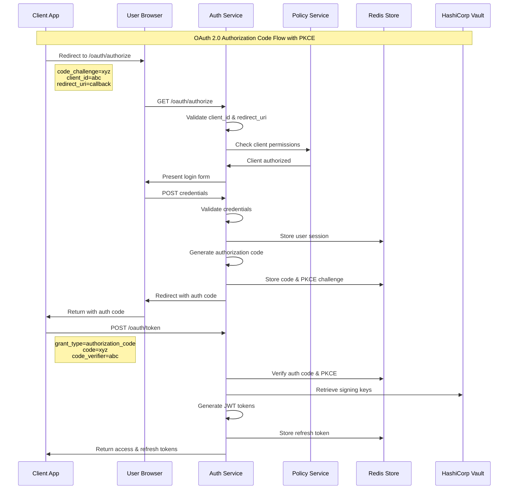
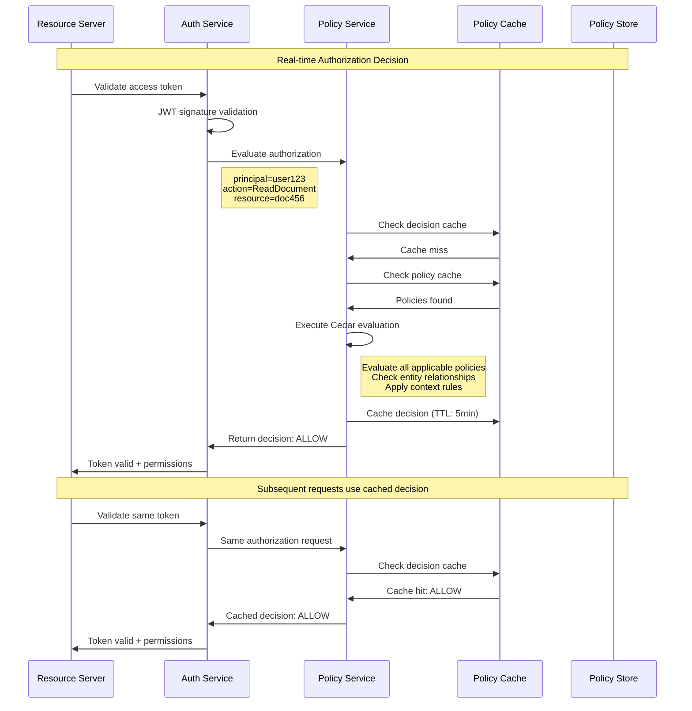
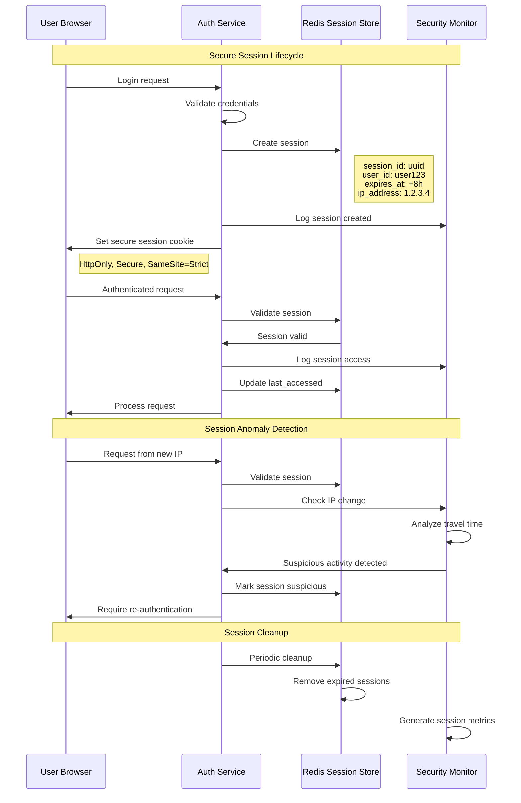

# System Architecture - Detailed Component Design

## Service Architecture Deep Dive

### Auth Service Architecture



#### Core Components

##### 1. OAuth 2.0 Engine
**Implements complete OAuth 2.0 authorization server**

```rust
#[derive(Debug, Clone)]
pub struct OAuthEngine {
    pub authorization_endpoint: AuthorizationEndpoint,
    pub token_endpoint: TokenEndpoint,
    pub introspection_endpoint: IntrospectionEndpoint,
    pub revocation_endpoint: RevocationEndpoint,
    pub client_manager: ClientManager,
    pub code_manager: AuthorizationCodeManager,
    pub token_manager: TokenManager,
}

// Authorization Flow Handler
pub struct AuthorizationEndpoint {
    pub response_type_handlers: HashMap<ResponseType, Box<dyn ResponseTypeHandler>>,
    pub pkce_validator: PkceValidator,
    pub redirect_uri_validator: RedirectUriValidator,
    pub scope_validator: ScopeValidator,
}

// Token Endpoint Handler  
pub struct TokenEndpoint {
    pub grant_type_handlers: HashMap<GrantType, Box<dyn GrantTypeHandler>>,
    pub client_authenticator: ClientAuthenticator,
    pub token_generator: TokenGenerator,
}
```

**Supported Grant Types:**
- Authorization Code (with PKCE)
- Client Credentials
- Refresh Token
- Device Flow (RFC 8628)
- Token Exchange (RFC 8693)

##### 2. OIDC Provider
**OpenID Connect 1.0 implementation**

```rust
#[derive(Debug, Clone)]
pub struct OidcProvider {
    pub discovery_document: DiscoveryDocument,
    pub userinfo_endpoint: UserinfoEndpoint, 
    pub jwks_endpoint: JwksEndpoint,
    pub id_token_generator: IdTokenGenerator,
    pub claims_mapper: ClaimsMapper,
}

// ID Token Structure
#[derive(Debug, Serialize, Deserialize)]
pub struct IdTokenClaims {
    pub iss: String,           // Issuer
    pub sub: String,           // Subject 
    pub aud: Vec<String>,      // Audience
    pub exp: i64,              // Expiration
    pub iat: i64,              // Issued at
    pub nonce: Option<String>, // Nonce for replay protection
    pub at_hash: Option<String>, // Access token hash
    pub c_hash: Option<String>,  // Code hash
    
    // Standard claims
    pub name: Option<String>,
    pub given_name: Option<String>,
    pub family_name: Option<String>,
    pub email: Option<String>,
    pub email_verified: Option<bool>,
    pub picture: Option<String>,
    pub locale: Option<String>,
}
```

##### 3. JWT Manager
**Complete JWT lifecycle management**

```rust
pub struct JwtManager {
    pub signing_keys: KeyPair,
    pub verification_keys: JwkSet,
    pub token_validator: TokenValidator,
    pub key_rotation_schedule: KeyRotationSchedule,
}

// JWT Validation Chain
pub struct TokenValidator {
    pub signature_validator: SignatureValidator,
    pub claims_validator: ClaimsValidator, 
    pub audience_validator: AudienceValidator,
    pub issuer_validator: IssuerValidator,
    pub expiration_validator: ExpirationValidator,
    pub not_before_validator: NotBeforeValidator,
}

// Key Rotation Strategy
pub struct KeyRotationSchedule {
    pub rotation_interval: Duration,
    pub key_overlap_period: Duration,
    pub automatic_rotation: bool,
    pub emergency_rotation: bool,
}
```

##### 4. Session Manager
**Secure session management with Redis backend**

```rust
pub struct SessionManager {
    pub session_store: Arc<RedisSessionStore>,
    pub session_config: SessionConfig,
    pub csrf_protection: CsrfProtection,
    pub session_analytics: SessionAnalytics,
}

#[derive(Debug, Clone, Serialize, Deserialize)]
pub struct SessionData {
    pub session_id: String,
    pub user_id: String,
    pub client_id: Option<String>,
    pub scopes: HashSet<String>,
    pub created_at: DateTime<Utc>,
    pub last_accessed: DateTime<Utc>,
    pub expires_at: DateTime<Utc>,
    pub ip_address: IpAddr,
    pub user_agent: String,
    pub mfa_verified: bool,
    pub device_fingerprint: Option<String>,
}

pub struct SessionConfig {
    pub session_timeout: Duration,
    pub idle_timeout: Duration,
    pub max_concurrent_sessions: u32,
    pub secure_cookies: bool,
    pub same_site_strict: bool,
    pub session_binding: SessionBinding,
}
```

### Policy Service Architecture



#### Core Components

##### 1. Cedar Policy Engine
**Amazon Cedar policy language implementation**

```rust
pub struct CedarPolicyEngine {
    pub policies: PolicySet,
    pub entities: EntityStore,
    pub authorizer: Authorizer,
    pub policy_validator: PolicyValidator,
}

// Policy Evaluation Request
#[derive(Debug, Clone, Serialize, Deserialize)]
pub struct AuthorizationRequest {
    pub principal: EntityUid,    // Who is making the request
    pub action: EntityUid,       // What action they want to perform
    pub resource: EntityUid,     // What resource they want to access
    pub context: Context,        // Additional context information
}

// Policy Evaluation Response
#[derive(Debug, Clone, Serialize, Deserialize)]
pub struct AuthorizationResponse {
    pub decision: Decision,      // Allow or Deny
    pub diagnostics: Diagnostics, // Policy evaluation details
    pub policies_evaluated: Vec<PolicyId>,
    pub evaluation_time_ms: u64,
    pub cache_hit: bool,
}

// Cedar Policy Example
/*
permit (
    principal in Group::"Admins",
    action == Action::"ReadUser",
    resource in Organization::"company"
) when {
    principal.department == "IT" &&
    resource.sensitive == false
};
*/
```

##### 2. Policy Cache System
**Multi-level caching with intelligent invalidation**

```rust
pub struct PolicyCacheSystem {
    pub l1_cache: InMemoryCache<PolicyId, Policy>,
    pub l2_cache: RedisCache<PolicyId, Policy>,
    pub decision_cache: DecisionCache,
    pub cache_metrics: CacheMetrics,
}

pub struct DecisionCache {
    pub cache: LruCache<AuthorizationKey, CachedDecision>,
    pub ttl: Duration,
    pub max_size: usize,
    pub hit_rate_threshold: f64,
}

#[derive(Debug, Clone, Hash, Eq, PartialEq)]
pub struct AuthorizationKey {
    pub principal_hash: u64,
    pub action_hash: u64, 
    pub resource_hash: u64,
    pub context_hash: u64,
}

pub struct CachedDecision {
    pub decision: Decision,
    pub cached_at: Instant,
    pub expires_at: Instant,
    pub policy_versions: Vec<(PolicyId, u64)>,
}
```

### Red Team Exercises Architecture



#### Core Attack Scenarios

##### 1. Token Manipulation Attacks
```rust
pub struct TokenAttackScenarios {
    pub jwt_algorithm_confusion: JwtAlgorithmConfusion,
    pub jwt_key_confusion: JwtKeyConfusion, 
    pub jwt_timing_attack: JwtTimingAttack,
    pub token_replay_attack: TokenReplayAttack,
    pub token_substitution: TokenSubstitution,
}

pub struct JwtAlgorithmConfusion {
    pub target_endpoints: Vec<String>,
    pub algorithms_to_test: Vec<JwtAlgorithm>,
    pub payload_mutations: Vec<PayloadMutation>,
}

// Example Attack Pattern
impl TokenAttackScenarios {
    pub async fn execute_jwt_none_attack(&self) -> AttackResult {
        let jwt_payload = json!({
            "sub": "admin@company.com",
            "exp": (Utc::now() + Duration::hours(1)).timestamp(),
            "iat": Utc::now().timestamp(),
            "scope": "admin write read"
        });
        
        // Create JWT with "none" algorithm
        let malicious_jwt = format!(
            "{}.{}.{}",
            base64_url_encode(&json!({"alg": "none", "typ": "JWT"})),
            base64_url_encode(&jwt_payload),
            "" // Empty signature for "none" algorithm
        );
        
        // Test against all protected endpoints
        let mut results = Vec::new();
        for endpoint in &self.target_endpoints {
            let response = self.http_client
                .get(endpoint)
                .header("Authorization", format!("Bearer {}", malicious_jwt))
                .send()
                .await?;
                
            results.push(AttackTestResult {
                endpoint: endpoint.clone(),
                attack_type: "JWT None Algorithm",
                success: response.status().is_success(),
                response_status: response.status(),
                vulnerability_detected: response.status() != 401,
            });
        }
        
        AttackResult {
            attack_name: "JWT None Algorithm Confusion",
            results,
            risk_score: self.calculate_risk_score(&results),
        }
    }
}
```

##### 2. OAuth Flow Attacks
```rust
pub struct OAuthAttackScenarios {
    pub authorization_code_injection: AuthCodeInjection,
    pub pkce_downgrade_attack: PkceDowngradeAttack,
    pub redirect_uri_manipulation: RedirectUriManipulation,
    pub state_csrf_attack: StateCsrfAttack,
    pub scope_elevation: ScopeElevation,
}

impl OAuthAttackScenarios {
    pub async fn execute_authorization_code_injection(&self) -> AttackResult {
        // Step 1: Legitimate authorization request
        let legitimate_auth_url = format!(
            "{}/oauth/authorize?response_type=code&client_id={}&redirect_uri={}&state={}",
            self.target_base_url,
            self.legitimate_client_id,
            urlencoding::encode(&self.legitimate_redirect_uri),
            generate_random_state()
        );
        
        // Step 2: Extract authorization code from victim's session
        // (In real attack, this would be done via XSS, phishing, etc.)
        let intercepted_code = self.simulate_code_interception().await?;
        
        // Step 3: Attempt to exchange code using attacker's client
        let malicious_token_request = TokenRequest {
            grant_type: "authorization_code",
            code: intercepted_code,
            client_id: self.attacker_client_id.clone(),
            client_secret: self.attacker_client_secret.clone(),
            redirect_uri: self.attacker_redirect_uri.clone(),
        };
        
        let response = self.http_client
            .post(&format!("{}/oauth/token", self.target_base_url))
            .json(&malicious_token_request)
            .send()
            .await?;
            
        AttackResult {
            attack_name: "Authorization Code Injection",
            success: response.status().is_success(),
            vulnerability_detected: response.status() == 200,
            impact: if response.status().is_success() {
                "High - Attacker can obtain access tokens for victim's account"
            } else {
                "None - Attack properly prevented"
            },
            remediation: vec![
                "Implement proper client authentication".to_string(),
                "Validate redirect_uri matches registered URI".to_string(),
                "Use PKCE for public clients".to_string(),
                "Implement authorization code binding".to_string(),
            ],
        }
    }
}
```

## Data Flow Architecture

### Authentication Flow (OAuth Authorization Code)



### Policy Evaluation Flow



### Session Management Flow



## Security Architecture Patterns

### Defense in Depth Implementation

#### 1. Network Layer Security
```yaml
# Istio Security Configuration
apiVersion: security.istio.io/v1beta1
kind: PeerAuthentication
metadata:
  name: default
  namespace: rust-security
spec:
  mtls:
    mode: STRICT
---
apiVersion: security.istio.io/v1beta1
kind: AuthorizationPolicy
metadata:
  name: auth-service-policy
  namespace: rust-security
spec:
  selector:
    matchLabels:
      app: auth-service
  rules:
  - from:
    - source:
        principals: ["cluster.local/ns/rust-security/sa/policy-service"]
  - to:
    - operation:
        methods: ["POST"]
        paths: ["/oauth/*", "/api/v1/auth/*"]
```

#### 2. Application Layer Security
```rust
// Security Headers Middleware
pub async fn security_headers(request: Request, next: Next) -> Response {
    let mut response = next.run(request).await;
    let headers = response.headers_mut();
    
    // XSS Protection
    headers.insert(
        "Content-Security-Policy",
        "default-src 'self'; script-src 'self' 'unsafe-inline'; style-src 'self' 'unsafe-inline'"
    );
    
    // Clickjacking Protection
    headers.insert("X-Frame-Options", "DENY");
    
    // MIME Type Sniffing Protection
    headers.insert("X-Content-Type-Options", "nosniff");
    
    // XSS Filter
    headers.insert("X-XSS-Protection", "1; mode=block");
    
    // HTTPS Enforcement
    headers.insert(
        "Strict-Transport-Security", 
        "max-age=63072000; includeSubDomains; preload"
    );
    
    // Referrer Policy
    headers.insert("Referrer-Policy", "strict-origin-when-cross-origin");
    
    // Permissions Policy
    headers.insert(
        "Permissions-Policy",
        "geolocation=(), microphone=(), camera=()"
    );
    
    response
}

// Input Validation Middleware
pub async fn validate_input(
    Json(payload): Json<Value>,
) -> Result<Json<Value>, AuthError> {
    // Size limits
    if payload.to_string().len() > MAX_REQUEST_BODY_SIZE {
        return Err(AuthError::PayloadTooLarge);
    }
    
    // Content validation
    validate_json_content(&payload)?;
    
    // XSS prevention
    let sanitized = sanitize_html_content(&payload)?;
    
    // SQL injection prevention  
    validate_no_sql_injection(&sanitized)?;
    
    Ok(Json(sanitized))
}
```

#### 3. Data Layer Security
```rust
// Encryption at Rest
pub struct SecureDataStore {
    pub encryption_key: Arc<EncryptionKey>,
    pub key_derivation: Arc<Argon2>,
    pub redis_client: Arc<RedisClient>,
}

impl SecureDataStore {
    pub async fn store_sensitive_data(
        &self,
        key: &str,
        data: &[u8]
    ) -> Result<(), StoreError> {
        // Encrypt data before storage
        let encrypted_data = self.encryption_key.encrypt(data)?;
        
        // Store with TTL
        self.redis_client
            .set_ex(key, encrypted_data, 3600)
            .await?;
            
        Ok(())
    }
    
    pub async fn retrieve_sensitive_data(
        &self,
        key: &str
    ) -> Result<Vec<u8>, StoreError> {
        // Retrieve encrypted data
        let encrypted_data: Vec<u8> = self.redis_client
            .get(key)
            .await?;
            
        // Decrypt before returning
        let decrypted_data = self.encryption_key.decrypt(&encrypted_data)?;
        
        Ok(decrypted_data)
    }
}

// Key Management with Vault
pub struct VaultKeyManager {
    pub vault_client: Arc<VaultClient>,
    pub key_cache: Arc<RwLock<LruCache<String, CachedKey>>>,
}

impl VaultKeyManager {
    pub async fn get_encryption_key(&self, key_id: &str) -> Result<EncryptionKey, VaultError> {
        // Check cache first
        if let Some(cached_key) = self.key_cache.read().await.get(key_id) {
            if !cached_key.is_expired() {
                return Ok(cached_key.key.clone());
            }
        }
        
        // Fetch from Vault
        let secret_response = self.vault_client
            .get_secret(&format!("secret/encryption/{}", key_id))
            .await?;
            
        let key = EncryptionKey::from_base64(&secret_response.data)?;
        
        // Cache the key
        self.key_cache.write().await.put(
            key_id.to_string(),
            CachedKey {
                key: key.clone(),
                expires_at: Utc::now() + Duration::hours(1),
            }
        );
        
        Ok(key)
    }
}
```

## Performance Optimization Patterns

### Caching Strategy Implementation

```rust
// Multi-Level Cache Architecture
pub struct MultiLevelCache<K, V> {
    pub l1_cache: Arc<RwLock<LruCache<K, V>>>,    // In-memory
    pub l2_cache: Arc<RedisClient>,               // Redis
    pub l3_cache: Arc<DatabasePool>,              // Database
    pub metrics: Arc<CacheMetrics>,
}

impl<K, V> MultiLevelCache<K, V> 
where 
    K: Hash + Eq + Clone + Serialize + for<'de> Deserialize<'de>,
    V: Clone + Serialize + for<'de> Deserialize<'de>,
{
    pub async fn get(&self, key: &K) -> Result<Option<V>, CacheError> {
        let start = Instant::now();
        
        // L1 Cache (fastest)
        if let Some(value) = self.l1_cache.read().await.get(key) {
            self.metrics.record_hit("l1", start.elapsed()).await;
            return Ok(Some(value.clone()));
        }
        
        // L2 Cache (fast)
        if let Ok(serialized) = self.l2_cache.get::<_, Vec<u8>>(key).await {
            let value: V = bincode::deserialize(&serialized)?;
            
            // Populate L1 cache
            self.l1_cache.write().await.put(key.clone(), value.clone());
            
            self.metrics.record_hit("l2", start.elapsed()).await;
            return Ok(Some(value));
        }
        
        // L3 Cache (slow)
        if let Some(value) = self.fetch_from_database(key).await? {
            // Populate upper caches
            let serialized = bincode::serialize(&value)?;
            self.l2_cache.set_ex(key, serialized, 3600).await?;
            self.l1_cache.write().await.put(key.clone(), value.clone());
            
            self.metrics.record_hit("l3", start.elapsed()).await;
            return Ok(Some(value));
        }
        
        self.metrics.record_miss(start.elapsed()).await;
        Ok(None)
    }
}
```

### Connection Pool Optimization

```rust
// Optimized Redis Connection Pool
pub struct OptimizedRedisPool {
    pub pool: deadpool_redis::Pool,
    pub config: RedisPoolConfig,
    pub metrics: Arc<ConnectionMetrics>,
}

#[derive(Clone)]
pub struct RedisPoolConfig {
    pub max_size: usize,
    pub min_idle: Option<usize>,
    pub max_lifetime: Option<Duration>,
    pub idle_timeout: Option<Duration>,
    pub connection_timeout: Duration,
    pub recycle_timeout: Duration,
}

impl Default for RedisPoolConfig {
    fn default() -> Self {
        Self {
            max_size: num_cpus::get() * 4,     // 4x CPU cores
            min_idle: Some(num_cpus::get()),   // Keep minimum connections
            max_lifetime: Some(Duration::from_secs(30 * 60)), // 30 minutes
            idle_timeout: Some(Duration::from_secs(10 * 60)), // 10 minutes  
            connection_timeout: Duration::from_secs(5),
            recycle_timeout: Duration::from_secs(5),
        }
    }
}

impl OptimizedRedisPool {
    pub async fn get_connection(&self) -> Result<Object, PoolError> {
        let start = Instant::now();
        
        let connection = self.pool.get().await?;
        
        self.metrics.record_connection_acquired(start.elapsed()).await;
        
        Ok(connection)
    }
}
```

This detailed system architecture provides the foundation for understanding how each component interacts within the Rust Security Platform, enabling enterprise-grade security and performance characteristics.