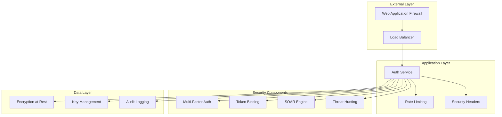

# Security Guide

This guide covers the comprehensive security features and best practices for the Rust Authentication Service.

## Table of Contents

- [Security Architecture Overview](#security-architecture-overview)
- [Core Security Features](#core-security-features)
  - [Authentication Security](#1-authentication-security)
  - [Multi-Factor Authentication (MFA)](#2-multi-factor-authentication-mfa)
  - [Authorization Security](#3-authorization-security)
  - [Rate Limiting and DDoS Protection](#4-rate-limiting-and-ddos-protection)
  - [Security Monitoring and Logging](#5-security-monitoring-and-logging)
  - [SOAR (Security Orchestration, Automation, and Response)](#6-soar-security-orchestration-automation-and-response)
  - [Threat Hunting and Behavioral Analysis](#7-threat-hunting-and-behavioral-analysis)
  - [Cryptographic Security](#8-cryptographic-security)
  - [Secure Configuration](#9-secure-configuration)
  - [Input Validation and Sanitization](#10-input-validation-and-sanitization)
- [Security Best Practices](#security-best-practices)
  - [Deployment Security](#1-deployment-security)
  - [Client Security](#2-client-security)
  - [Security Monitoring](#3-security-monitoring)
  - [Incident Response](#4-incident-response)
  - [Compliance and Auditing](#5-compliance-and-auditing)
- [Security Testing](#security-testing)
  - [Automated Security Testing](#1-automated-security-testing)
  - [Red Team Exercises](#2-red-team-exercises)
  - [Vulnerability Management](#3-vulnerability-management)
- [Security Contacts](#security-contacts)
  - [Reporting Security Issues](#reporting-security-issues)
  - [Security Team Structure](#security-team-structure)
- [Conclusion](#conclusion)

## Security Architecture Overview

The authentication service implements defense-in-depth with multiple security layers:



## Core Security Features

### 1. Authentication Security

#### OAuth2/OIDC Compliance
- **RFC 6749** (OAuth 2.0) compliant
- **RFC 7636** (PKCE) enforcement
- **RFC 7517** (JWK) key management
- **RFC 7662** (Token Introspection)
- **RFC 7009** (Token Revocation)

#### PKCE (Proof Key for Code Exchange)
```rust
// PKCE is mandatory for all authorization code flows
// Only S256 challenge method is supported
pub enum CodeChallengeMethod {
    S256, // SHA256 with Base64-URL encoding
    // Plain method removed for security
}
```

**PKCE Flow:**
1. Client generates code verifier (43-128 chars)
2. Client creates SHA256 hash of verifier
3. Client sends challenge in authorization request
4. Server stores challenge with authorization code
5. Client sends verifier in token exchange
6. Server validates verifier against stored challenge

#### Token Security
- **JWT with RS256** signing
- **Token binding** to client characteristics
- **Automatic token rotation**
- **Refresh token reuse detection**
- **Token revocation** support

### 2. Multi-Factor Authentication (MFA)

#### TOTP (Time-based One-Time Password)
```rust
// TOTP with replay protection
async fn verify_totp_with_replay_protection(
    user_id: &str,
    code: &str,
    time_window: u64,
) -> Result<bool, MfaError> {
    // Check for replay attacks
    if !track_totp_nonce(user_id, code, time_window).await {
        return Err(MfaError::ReplayAttack);
    }
    
    // Verify TOTP code
    verify_totp_code(user_id, code, time_window)
}
```

**Features:**
- SHA-1 based TOTP (RFC 6238)
- 30-second time windows
- ±1 window tolerance for clock skew
- Replay attack prevention (120-second nonce tracking)
- Backup codes with Argon2 hashing
- Rate limiting (5 attempts per minute)

#### WebAuthn
- **FIDO2/WebAuthn** support
- Hardware security keys
- Biometric authentication
- Phishing-resistant authentication

#### SMS OTP
- Twilio integration
- Rate limiting (3 SMS per hour)
- Fallback for TOTP unavailability

### 3. Authorization Security

#### IDOR Protection
```rust
// Session-based authorization prevents IDOR attacks
async fn get_session_endpoint(
    headers: HeaderMap,
    state: State<AppState>,
    path: Path<String>,
) -> Result<Json<Session>, AuthError> {
    let requesting_user = extract_user_from_token(&headers, &state).await?;
    let session = SESSION_MANAGER.get_session(&session_id).await?;
    
    // Enforce ownership check
    if session.user_id != requesting_user {
        log_unauthorized_access_attempt();
        return Err(AuthError::UnauthorizedClient("Access denied"));
    }
    
    Ok(Json(session))
}
```

#### ABAC (Attribute-Based Access Control)
```json
{
  "principal": {
    "type": "User",
    "id": "user123",
    "attributes": {
      "department": "engineering",
      "clearance_level": "secret"
    }
  },
  "action": "read",
  "resource": {
    "type": "Document",
    "id": "doc456",
    "attributes": {
      "classification": "confidential",
      "owner": "user123"
    }
  },
  "context": {
    "time": "2023-10-01T12:00:00Z",
    "ip_address": "192.168.1.100",
    "mfa_verified": true
  }
}
```

### 4. Rate Limiting and DDoS Protection

#### Multi-Tier Rate Limiting
```rust
pub struct RateLimitConfig {
    pub requests_per_window: u32,      // 100 requests
    pub window_duration_secs: u64,     // 60 seconds
    pub burst_allowance: u32,          // 20 additional requests
    pub cleanup_interval_secs: u64,    // 300 seconds
}
```

**Rate Limiting Tiers:**
- **Per-IP**: 100 requests/minute (burst: 20)
- **Per-Client**: 300 requests/minute (burst: 50)
- **Per-User**: 1000 requests/minute (burst: 100)
- **Admin**: 10000 requests/minute (burst: 500)

#### DDoS Protection
- Sharded rate limiting for performance
- Exponential backoff for repeated violations
- Automatic IP blocking for severe violations
- Geographic rate limiting

### 5. Security Monitoring and Logging

#### Comprehensive Audit Logging
```rust
pub struct SecurityEvent {
    pub event_type: SecurityEventType,
    pub severity: SecuritySeverity,
    pub timestamp: DateTime<Utc>,
    pub source: String,
    pub message: String,
    pub user_id: Option<String>,
    pub client_id: Option<String>,
    pub ip_address: Option<String>,
    pub user_agent: Option<String>,
    pub session_id: Option<String>,
    pub request_id: Option<String>,
    pub resource: Option<String>,
    pub action: Option<String>,
    pub outcome: Option<String>,
    pub details: HashMap<String, serde_json::Value>,
}
```

**Event Types:**
- `AuthenticationAttempt` - Login attempts (success/failure)
- `AuthenticationSuccess` - Successful authentications
- `AuthenticationFailure` - Failed authentications
- `TokenOperation` - Token issuance/refresh/revocation
- `DataAccess` - API endpoint access
- `PrivilegeEscalation` - Admin operation attempts
- `SecurityViolation` - Security policy violations
- `SessionEvent` - Session management events
- `UnauthorizedAccess` - IDOR/unauthorized access attempts

#### Real-time Security Monitoring
```rust
pub struct SecurityMonitor {
    alerts: Arc<RwLock<Vec<SecurityAlert>>>,
    config: Arc<RwLock<MonitoringConfig>>,
    threat_detector: ThreatDetector,
}

impl SecurityMonitor {
    pub async fn process_event(&self, event: &SecurityEvent) {
        // Real-time threat detection
        if let Some(threat) = self.threat_detector.analyze_event(event).await {
            self.trigger_alert(threat).await;
        }
        
        // Pattern analysis
        self.analyze_patterns(event).await;
        
        // Automated response
        self.execute_automated_response(event).await;
    }
}
```

### 6. SOAR (Security Orchestration, Automation, and Response)

#### Automated Threat Response
```rust
pub struct SoarEngine {
    workflows: HashMap<String, Workflow>,
    executors: HashMap<String, Box<dyn WorkflowExecutor>>,
    correlation_engine: CorrelationEngine,
    case_manager: CaseManager,
}

// Example workflow: Suspicious login detection
pub async fn handle_suspicious_login(
    event: &SecurityEvent,
    context: &WorkflowContext,
) -> Result<WorkflowResult, WorkflowError> {
    // 1. Analyze login pattern
    let risk_score = analyze_login_pattern(event).await?;
    
    // 2. If high risk, trigger multi-step response
    if risk_score > 0.8 {
        // Block IP temporarily
        block_ip_address(&event.ip_address, Duration::minutes(15)).await?;
        
        // Require additional MFA
        require_step_up_auth(&event.user_id).await?;
        
        // Create security case
        create_security_case(&event, risk_score).await?;
        
        // Send alert to security team
        send_security_alert(&event, risk_score).await?;
    }
    
    Ok(WorkflowResult::Success)
}
```

#### Automated Playbooks
- **Brute Force Attack**: IP blocking, account lockout
- **Credential Stuffing**: Rate limiting, CAPTCHA
- **Suspicious Location**: MFA requirement, notification
- **Token Abuse**: Token revocation, session invalidation
- **IDOR Attempts**: Access logging, pattern analysis

### 7. Threat Hunting and Behavioral Analysis

#### Machine Learning-based Detection
```rust
pub struct ThreatDetector {
    behavioral_analyzer: BehavioralAnalyzer,
    pattern_detector: PatternDetector,
    anomaly_detector: AnomalyDetector,
    ml_models: HashMap<String, MLModel>,
}

impl ThreatDetector {
    pub async fn analyze_event(&self, event: &SecurityEvent) -> Option<ThreatIndicator> {
        // Behavioral analysis
        let behavior_score = self.behavioral_analyzer.analyze(event).await;
        
        // Pattern detection
        let pattern_score = self.pattern_detector.detect(event).await;
        
        // Anomaly detection
        let anomaly_score = self.anomaly_detector.detect(event).await;
        
        // Combine scores
        let combined_score = (behavior_score + pattern_score + anomaly_score) / 3.0;
        
        if combined_score > THREAT_THRESHOLD {
            Some(ThreatIndicator::new(event, combined_score))
        } else {
            None
        }
    }
}
```

#### Advanced Analytics
- **User Behavior Analytics (UBA)**
- **Entity Behavior Analytics (EBA)**
- **Network Traffic Analysis**
- **Geographical Anomaly Detection**
- **Time-based Pattern Analysis**

### 8. Cryptographic Security

#### Key Management
```rust
pub struct KeyManager {
    current_key: Arc<RwLock<SigningKey>>,
    key_history: Arc<RwLock<Vec<SigningKey>>>,
    rotation_schedule: Duration,
}

impl KeyManager {
    // Automatic key rotation
    pub async fn rotate_keys(&self) -> Result<(), KeyError> {
        let new_key = generate_rsa_key(2048)?;
        let kid = format!("{}", Utc::now().format("%Y-%m-%d"));
        
        // Update current key
        let mut current = self.current_key.write().await;
        let old_key = current.clone();
        *current = SigningKey::new(kid, new_key)?;
        
        // Archive old key
        let mut history = self.key_history.write().await;
        history.push(old_key);
        
        // Keep only last 3 keys for verification
        if history.len() > 3 {
            history.remove(0);
        }
        
        Ok(())
    }
}
```

#### Encryption Standards
- **RSA 2048-bit** keys for JWT signing
- **AES-256-GCM** for secret encryption
- **ChaCha20-Poly1305** alternative cipher
- **Argon2** for password hashing
- **HMAC-SHA256** for request signing

#### Post-Quantum Cryptography (Future-Ready)
```rust
#[cfg(feature = "post-quantum")]
pub mod post_quantum {
    use pqcrypto_kyber::kyber768;
    use pqcrypto_dilithium::dilithium3;
    
    pub struct HybridKeyPair {
        classical: RsaKeyPair,
        quantum_resistant: (kyber768::PublicKey, kyber768::SecretKey),
    }
}
```

### 9. Secure Configuration

#### Environment Security
```env
# Secure defaults
TOKEN_EXPIRY_SECONDS=900          # 15 minutes
REFRESH_TOKEN_EXPIRY_SECONDS=86400 # 24 hours
RATE_LIMIT_REQUESTS_PER_MINUTE=60  # Conservative rate limiting
MFA_REQUIRED=true                  # Enforce MFA
PKCE_REQUIRED=true                 # Enforce PKCE
REQUEST_SIGNING_REQUIRED=false     # Optional for high-security
LOG_LEVEL=info                     # Avoid debug in production
```

#### Security Headers
```rust
pub async fn add_security_headers(
    request: Request,
    next: Next,
) -> Result<Response, StatusCode> {
    let mut response = next.run(request).await;
    
    // Add security headers
    response.headers_mut().insert(
        "Strict-Transport-Security",
        "max-age=31536000; includeSubDomains".parse().unwrap(),
    );
    response.headers_mut().insert(
        "X-Content-Type-Options",
        "nosniff".parse().unwrap(),
    );
    response.headers_mut().insert(
        "X-Frame-Options",
        "DENY".parse().unwrap(),
    );
    response.headers_mut().insert(
        "X-XSS-Protection",
        "1; mode=block".parse().unwrap(),
    );
    response.headers_mut().insert(
        "Referrer-Policy",
        "strict-origin-when-cross-origin".parse().unwrap(),
    );
    
    Ok(response)
}
```

### 10. Input Validation and Sanitization

#### Comprehensive Validation
```rust
pub fn validate_token_input(token: &str) -> Result<(), ValidationError> {
    // Length check
    if token.len() > 2048 {
        return Err(ValidationError::TokenTooLong);
    }
    
    // Format check (JWT or opaque token)
    if token.starts_with("eyJ") {
        // JWT validation
        validate_jwt_format(token)?;
    } else {
        // Opaque token validation
        validate_opaque_token_format(token)?;
    }
    
    // Character set validation
    if !token.chars().all(|c| c.is_ascii_alphanumeric() || c == '.' || c == '_' || c == '-') {
        return Err(ValidationError::InvalidCharacters);
    }
    
    Ok(())
}
```

#### Request Size Limits
- Maximum request body: 1MB
- Maximum header size: 8KB
- Maximum URL length: 2048 characters
- Maximum token length: 2048 characters

## Security Best Practices

### 1. Deployment Security

#### Production Checklist
- [ ] Enable HTTPS with TLS 1.3
- [ ] Configure proper CORS policies
- [ ] Set secure environment variables
- [ ] Enable request signing for critical operations
- [ ] Configure rate limiting appropriately
- [ ] Set up monitoring and alerting
- [ ] Enable audit logging
- [ ] Configure backup procedures
- [ ] Test disaster recovery

#### Network Security
```yaml
# Recommended firewall rules
ingress:
  - port: 443  # HTTPS only
    protocol: TCP
    source: 0.0.0.0/0
  - port: 6379 # Redis (internal only)
    protocol: TCP
    source: 10.0.0.0/8

egress:
  - port: 443  # HTTPS outbound
    protocol: TCP
    destination: 0.0.0.0/0
```

### 2. Client Security

#### Client Registration
```json
{
  "client_id": "webapp_client",
  "client_secret": "securely_generated_secret",
  "redirect_uris": [
    "https://app.example.com/callback"
  ],
  "allowed_scopes": ["openid", "profile", "email"],
  "pkce_required": true,
  "token_endpoint_auth_method": "client_secret_basic"
}
```

#### Secure Client Implementation
```javascript
// Example secure client implementation
class AuthClient {
  constructor(config) {
    this.clientId = config.clientId;
    this.redirectUri = config.redirectUri;
    this.authEndpoint = config.authEndpoint;
    this.tokenEndpoint = config.tokenEndpoint;
  }
  
  // Generate PKCE parameters
  generatePKCE() {
    const codeVerifier = this.generateRandomString(128);
    const codeChallenge = this.base64URLEncode(
      this.sha256(codeVerifier)
    );
    return { codeVerifier, codeChallenge };
  }
  
  // Secure authorization request
  authorize(scopes = ['openid']) {
    const { codeVerifier, codeChallenge } = this.generatePKCE();
    const state = this.generateRandomString(32);
    
    // Store PKCE verifier and state
    sessionStorage.setItem('codeVerifier', codeVerifier);
    sessionStorage.setItem('state', state);
    
    const params = new URLSearchParams({
      response_type: 'code',
      client_id: this.clientId,
      redirect_uri: this.redirectUri,
      scope: scopes.join(' '),
      state: state,
      code_challenge: codeChallenge,
      code_challenge_method: 'S256'
    });
    
    window.location.href = `${this.authEndpoint}?${params}`;
  }
}
```

### 3. Security Monitoring

#### Metrics to Monitor
```prometheus
# Authentication metrics
auth_attempts_total{status="success|failure"}
auth_mfa_verifications_total{method="totp|webauthn|sms"}
auth_token_operations_total{operation="issue|refresh|revoke"}

# Security metrics
security_events_total{type="violation|attempt|success"}
security_alerts_total{severity="low|medium|high|critical"}
rate_limit_violations_total{tier="ip|client|user"}

# Performance metrics
http_request_duration_seconds{endpoint="/oauth/token"}
redis_operations_total{operation="get|set|del"}
```

#### Alerting Rules
```yaml
groups:
- name: auth_security
  rules:
  - alert: HighAuthFailureRate
    expr: rate(auth_attempts_total{status="failure"}[5m]) > 10
    labels:
      severity: warning
    annotations:
      summary: High authentication failure rate detected
      
  - alert: SecurityViolation
    expr: security_events_total{type="violation"} > 0
    labels:
      severity: critical
    annotations:
      summary: Security violation detected
      
  - alert: RateLimitViolation
    expr: rate_limit_violations_total > 100
    labels:
      severity: warning
    annotations:
      summary: High rate limit violation rate
```

### 4. Incident Response

#### Security Incident Playbook
1. **Detection**: Automated monitoring or manual report
2. **Assessment**: Determine scope and severity
3. **Containment**: Isolate affected systems
4. **Eradication**: Remove threat and vulnerabilities
5. **Recovery**: Restore normal operations
6. **Lessons Learned**: Document and improve

#### Automated Response Actions
```rust
pub enum AutomatedResponse {
    BlockIP { ip: String, duration: Duration },
    RevokeTokens { user_id: String },
    RequireMFA { user_id: String },
    InvalidateSessions { user_id: String },
    EscalateToHuman { severity: Severity },
    NotifySecurityTeam { alert: SecurityAlert },
}
```

### 5. Compliance and Auditing

#### GDPR Compliance
- Data minimization principles
- User consent management
- Right to erasure (forget user)
- Data portability support
- Privacy by design

#### SOC 2 Compliance
- Access controls
- Encryption standards
- Audit logging
- Change management
- Incident response

#### HIPAA Compliance (if applicable)
- PHI protection
- Access logging
- Encryption requirements
- Business associate agreements

## Security Testing

### 1. Automated Security Testing

#### Static Analysis
```bash
# Rust security auditing
cargo audit

# Dependency vulnerability scanning
cargo deny check

# Security-focused linting
cargo clippy -- -D warnings
```

#### Dynamic Testing
```bash
# Integration security tests
cargo test security_tests

# Penetration testing simulation
cargo test --features red-team-exercises

# Load testing with security focus
cargo test --features load-testing
```

### 2. Red Team Exercises

Regular security assessments including:
- Social engineering attempts
- Network penetration testing
- Application security testing
- Physical security assessment

### 3. Vulnerability Management

#### Regular Security Reviews
- Monthly dependency updates
- Quarterly security assessments
- Annual penetration testing
- Continuous monitoring

#### Vulnerability Response Process
1. **Discovery**: Automated scanning or responsible disclosure
2. **Assessment**: Evaluate impact and exploitability
3. **Prioritization**: Rank based on CVSS score and business impact
4. **Remediation**: Develop and deploy fixes
5. **Verification**: Confirm vulnerability is addressed

## Security Contacts

### Reporting Security Issues

**Security Email**: security@yourcompany.com
**PGP Key**: Available at https://yourcompany.com/.well-known/security.txt

### Security Team Structure
- **CISO**: Overall security strategy
- **Security Engineers**: Implementation and monitoring
- **Incident Response Team**: 24/7 security incident handling
- **Security Architects**: Design and review

## Conclusion

The Rust Authentication Service implements comprehensive security controls across all layers of the application stack. Regular security reviews, testing, and monitoring ensure that security remains effective against evolving threats.

For specific security questions or to report vulnerabilities, please contact the security team through the channels listed above.