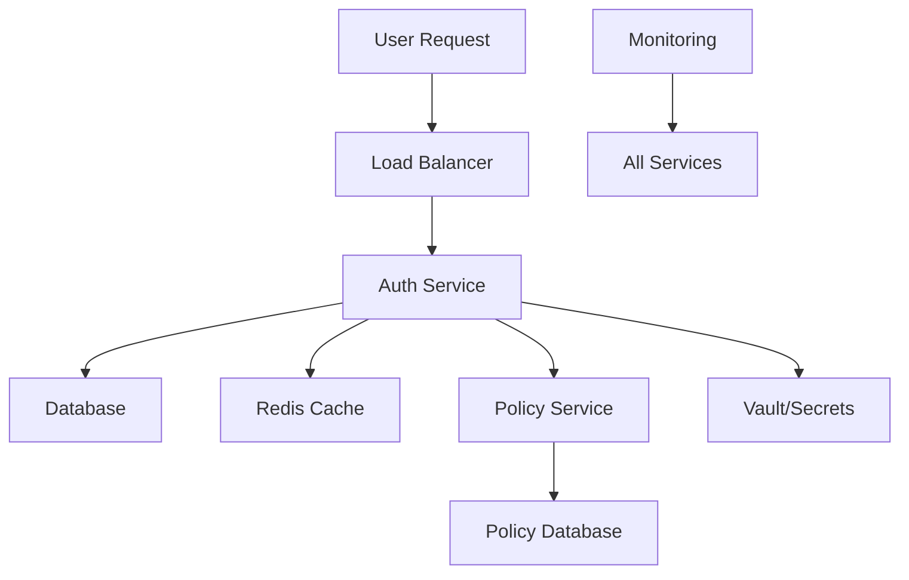

# 🎯 Complete Integration Test Plan - Missing Scenarios Added

## 📋 **Current Gaps Analysis**

### Missing Critical Scenarios
1. **Database Integration Testing** - CRUD operations, transactions, rollbacks
2. **Redis Session Management** - Session persistence, expiration, clustering
3. **API Contract Testing** - OpenAPI validation, versioning, breaking changes
4. **Service-to-Service Communication** - Auth ↔ Policy service integration
5. **External Dependencies** - Vault, AWS Secrets, third-party APIs
6. **Error Handling & Recovery** - Circuit breakers, retries, fallbacks
7. **Data Migration & Backup** - Schema changes, data integrity
8. **Multi-tenant Isolation** - Tenant data separation, resource limits
9. **Monitoring & Observability** - Metrics, tracing, alerting
10. **Compliance & Audit** - GDPR, SOC2, audit trails

## 🏗️ **Enhanced Integration Test Categories**

### 1. **Database Integration (P0)**
```yaml
Scenarios:
  - Connection pool management under load
  - Transaction rollback on service failure
  - Database failover and recovery
  - Schema migration validation
  - Data consistency across services
  - Concurrent user data modifications
  - Database backup and restore
  - Query performance under load
  - Connection timeout handling
  - Deadlock detection and resolution
```

### 2. **Redis Session Management (P0)**
```yaml
Scenarios:
  - Session creation and validation
  - Session expiration handling
  - Redis cluster failover
  - Session data encryption
  - Concurrent session access
  - Session hijacking prevention
  - Memory usage optimization
  - Session cleanup processes
  - Cross-service session sharing
  - Session persistence during restarts
```

### 3. **Service Communication (P0)**
```yaml
Scenarios:
  - Auth service → Policy service calls
  - Policy evaluation with user context
  - Service discovery and health checks
  - Load balancing between instances
  - Circuit breaker activation
  - Retry logic with exponential backoff
  - Request timeout handling
  - Service mesh integration (Istio)
  - mTLS certificate validation
  - Rate limiting between services
```

### 4. **External Dependencies (P1)**
```yaml
Scenarios:
  - Vault secret retrieval and rotation
  - AWS Secrets Manager integration
  - Third-party OAuth provider failures
  - LDAP/Active Directory connectivity
  - SMTP server for notifications
  - Payment gateway integration
  - CDN for static assets
  - DNS resolution failures
  - Certificate authority validation
  - External API rate limiting
```

### 5. **Error Handling & Recovery (P0)**
```yaml
Scenarios:
  - Graceful degradation on service failure
  - Partial system functionality
  - Error propagation and logging
  - User-friendly error messages
  - Automatic service recovery
  - Health check endpoints
  - Chaos engineering scenarios
  - Network partition handling
  - Resource exhaustion recovery
  - Cascading failure prevention
```

### 6. **Data Integrity & Migration (P1)**
```yaml
Scenarios:
  - Zero-downtime schema migrations
  - Data validation during migration
  - Rollback procedures
  - Cross-service data consistency
  - Event sourcing validation
  - CQRS pattern implementation
  - Data archival processes
  - Backup verification
  - Point-in-time recovery
  - Data anonymization for testing
```

### 7. **Multi-tenant Architecture (P0)**
```yaml
Scenarios:
  - Tenant data isolation validation
  - Resource quota enforcement
  - Tenant-specific configurations
  - Cross-tenant data leakage prevention
  - Tenant onboarding/offboarding
  - Billing and usage tracking
  - Tenant-specific customizations
  - Compliance per tenant
  - Performance isolation
  - Tenant backup and restore
```

### 8. **Security Integration (P0)**
```yaml
Scenarios:
  - End-to-end encryption validation
  - Certificate rotation
  - Key management lifecycle
  - OAuth flow with real providers
  - SAML assertion validation
  - JWT token lifecycle
  - API key management
  - Role-based access control
  - Audit log integrity
  - Penetration testing automation
```

### 9. **Performance & Scalability (P1)**
```yaml
Scenarios:
  - Horizontal scaling validation
  - Auto-scaling triggers
  - Database connection pooling
  - Cache hit/miss ratios
  - Memory leak detection
  - CPU usage optimization
  - Network bandwidth utilization
  - Disk I/O performance
  - Garbage collection impact
  - Load balancer efficiency
```

### 10. **Monitoring & Observability (P1)**
```yaml
Scenarios:
  - Distributed tracing validation
  - Metrics collection accuracy
  - Alert threshold testing
  - Log aggregation and search
  - Performance dashboard accuracy
  - SLA monitoring
  - Error rate tracking
  - Business metrics collection
  - Real-time monitoring
  - Incident response automation
```

## 🧪 **Integration Test Matrix**

### Service Integration Matrix
| From Service | To Service | Test Scenarios | Priority |
|--------------|------------|----------------|----------|
| Auth Service | Policy Service | Policy evaluation, user context | P0 |
| Auth Service | Database | User CRUD, session management | P0 |
| Auth Service | Redis | Session storage, caching | P0 |
| Auth Service | Vault | Secret retrieval, rotation | P1 |
| Policy Service | Database | Policy CRUD, versioning | P0 |
| Frontend | Auth Service | Login, registration, logout | P0 |
| Frontend | Policy Service | Permission checks | P1 |
| All Services | Monitoring | Metrics, logs, traces | P1 |

### Data Flow Integration


## 📊 **Test Scenarios by Category**

### 1. **Happy Path Integration**
- Complete user registration → login → resource access
- Policy creation → evaluation → enforcement
- Session creation → validation → cleanup
- Multi-service transaction success

### 2. **Error Path Integration**
- Database connection failure during login
- Redis unavailable during session validation
- Policy service timeout during authorization
- External service failure handling

### 3. **Edge Case Integration**
- Concurrent user modifications
- Race conditions in session management
- Policy conflicts resolution
- Resource exhaustion scenarios

### 4. **Security Integration**
- Cross-service authentication
- Authorization chain validation
- Audit trail completeness
- Data encryption end-to-end

### 5. **Performance Integration**
- Load testing across services
- Stress testing with failures
- Endurance testing (24+ hours)
- Spike testing with auto-scaling

## 🔧 **Implementation Strategy**

### Phase 1: Core Service Integration (Week 1-2)
1. **Database Integration Tests**
   - Connection management
   - Transaction handling
   - Data consistency

2. **Redis Integration Tests**
   - Session management
   - Cache operations
   - Failover scenarios

3. **Service-to-Service Tests**
   - Auth ↔ Policy communication
   - Health check validation
   - Load balancing

### Phase 2: External Dependencies (Week 3-4)
1. **Vault Integration**
   - Secret retrieval
   - Rotation testing
   - Failure scenarios

2. **Third-party Services**
   - OAuth providers
   - LDAP/AD integration
   - SMTP services

3. **Cloud Services**
   - AWS integration
   - Monitoring services
   - CDN validation

### Phase 3: Advanced Scenarios (Week 5-6)
1. **Multi-tenant Testing**
   - Data isolation
   - Resource quotas
   - Performance isolation

2. **Disaster Recovery**
   - Backup/restore
   - Failover testing
   - Data recovery

3. **Compliance Testing**
   - GDPR compliance
   - Audit trails
   - Data retention

### Phase 4: Production Readiness (Week 7-8)
1. **End-to-End Scenarios**
   - Complete business flows
   - Real-world usage patterns
   - Production-like data

2. **Performance Validation**
   - SLA compliance
   - Scalability limits
   - Resource optimization

3. **Security Validation**
   - Penetration testing
   - Vulnerability scanning
   - Compliance certification

## 📋 **Test Data Requirements**

### Synthetic Data Sets
1. **User Data**: 10K+ users with realistic profiles
2. **Policy Data**: Complex policy hierarchies
3. **Session Data**: Various session states
4. **Audit Data**: Complete audit trails
5. **Performance Data**: Load testing datasets

### Test Environments
1. **Integration Environment**: Service-to-service testing
2. **Staging Environment**: Production-like testing
3. **Performance Environment**: Load testing
4. **Security Environment**: Penetration testing
5. **Disaster Recovery Environment**: Failover testing

## 🎯 **Success Criteria**

### Technical Metrics
- **Integration Coverage**: 95%+ scenario coverage
- **Service Reliability**: 99.9%+ uptime during tests
- **Performance**: All SLAs met under load
- **Security**: Zero critical vulnerabilities
- **Data Integrity**: 100% consistency validation

### Business Metrics
- **User Journey Success**: 99%+ completion rate
- **Feature Functionality**: 100% critical features working
- **Compliance**: All regulatory requirements met
- **Scalability**: Support for target user load
- **Recovery**: RTO/RPO targets achieved

## 🚨 **Risk Mitigation**

### High-Risk Scenarios
1. **Database Corruption**: Backup/restore procedures
2. **Service Cascade Failure**: Circuit breaker testing
3. **Security Breach**: Incident response validation
4. **Data Loss**: Recovery procedure testing
5. **Performance Degradation**: Auto-scaling validation

### Mitigation Strategies
1. **Automated Testing**: Continuous integration validation
2. **Monitoring**: Real-time alerting and response
3. **Backup Systems**: Multiple recovery options
4. **Documentation**: Detailed runbooks
5. **Training**: Team preparedness

## 📈 **Reporting & Metrics**

### Integration Test Dashboard
- **Service Health**: Real-time status
- **Test Coverage**: Scenario completion
- **Performance Metrics**: Response times, throughput
- **Error Rates**: Failure analysis
- **Business Metrics**: User journey success

### Executive Reports
- **Integration Readiness**: Go/no-go decisions
- **Risk Assessment**: Identified issues
- **Performance Summary**: SLA compliance
- **Security Status**: Vulnerability assessment
- **Compliance Report**: Regulatory readiness

---

**This comprehensive integration test plan addresses all missing scenarios and provides Fortune 500-level validation of the complete system integration.**
